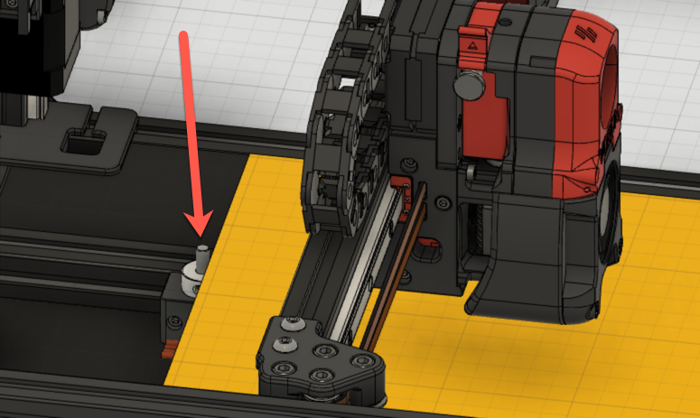
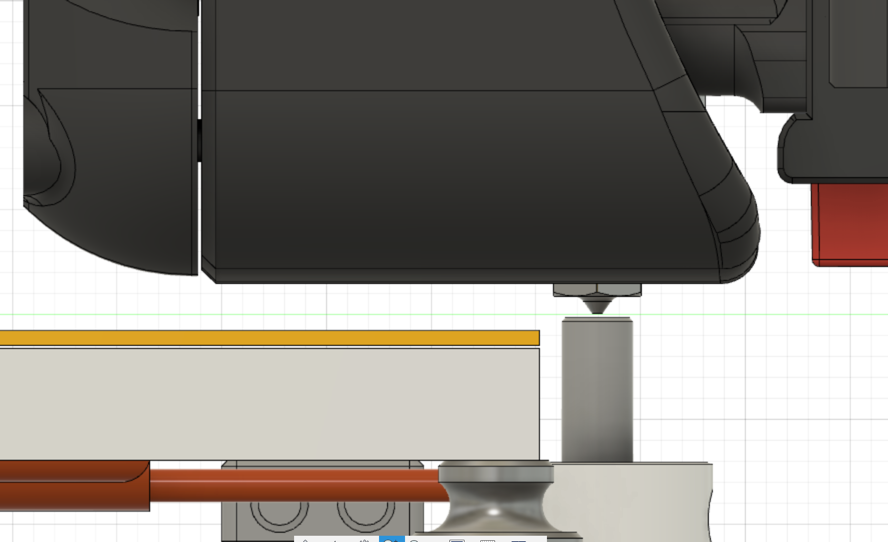
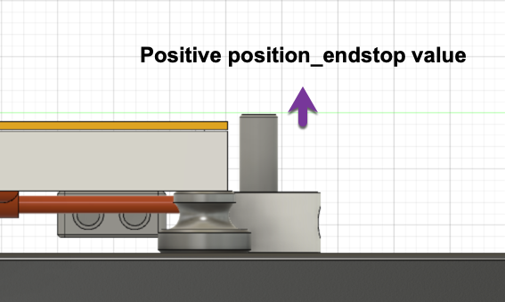
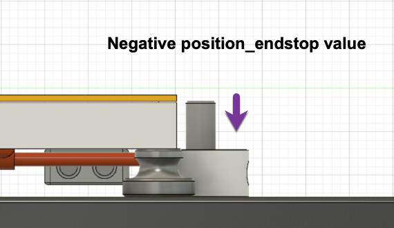

Setting the Z offset is a a key step in the process of configuring and tuning any FDM printer.  Because of how the V2 is designed, this process may be slightly different than most other printers.  The Z endstop sensor is a mechanical switch that is located at the back / top edge of the base plate.  The switch activation is extended to an approximate level of the bed by an extension made of 5mm rod.  This physical switch is used instead of the inductive probe for consistency regardless of temperature or variances in nozzle length.

## Tools Needed:

* Piece of paper -or- 0.1 mm feeler gauge
* Digital calipers (recommended)

## Pre-Flight

The Z endstop position value is defined in the printer.cfg file that Klipper reads.  It is labeled as "position\_endstop" and can be found in the [stepper\_z] section of the configuration file.

The default for the value for the endstop position is -0.5 as a safety factor to prevent crashing the nozzle into the print surface during initial operations.  This value should be set to the exact distance that the z endstop triggers relative to the print surface.

The Z endstop position must already be set in Klipper.  The endstop much be functioning and trigger appropriately during all homing operations.

The Z endstop calibration process can be performed with the printer (both hot end and build surface) either hot or cold.  Klipper is written that the Z endstop calibration is performed cold. While it is calibrated using a 0.1 mm gap, it expects movement from thermal expansion to take up that space.

## Initial Calibration

1. Decide if the calibration will performed hot or cold.  If the calibration is to be performed cold then ensure that the nozzle is completely clean of filament.  If you are preforming the calibration hot, then ensure that the build surface has heat soaked and come up to a stable temperature and ceased thermal expansion using the PROBE_ACCURACY macro.
2. Run a G28 to wake up the motion systems.
3. Run a BED\_MESH\_CLEAR to clear out any bed mesh calibrations that may be loaded.  Any offest in the bed mesh will affect the Z positioning.
4. Run a QUAD\_GANTRY\_LEVEL to level the gantry.
5. Run a G28 again to home and center the nozzle, and establish a new known Z value.  The nozzle should be at the center of the bed or at whatever point is used for reference for the bed mesh.
6. Enter the calibration mode by running Z\_ENDSTOP\_CALIBRATE.  The nozzle will to go to an estimated 20mm above the print surface based on the previous value of z\_position\_endstop.
7. To move the head, run TESTZ Z=(value in mm).  A negative value (-) will move the nozzle closer to the print surface and a positive value (+) will move the nozzle away from the print surface.
8. Move the nozzle down until there is noticeable drag on the paper or feeler gauge but is not difficult to move.  Adjustments of +/- 0.01mm are not unusual and are noticeable.  Adjust until satisfied.
9. __If calibrating hot:__ Remove the paper or feeler gauge and move the TESTZ down (-) an additional 0.1mm to compensate for the thickness of the paper or feeler gauge.
10. Complete the routine by running ACCEPT, then SAVE\_CONFIG.

## Sanity Check

1. The MCUs will reset after a SAVE\_CONFIG.  Once the MCUs are online run a G28 to re-home.  If the process is being done hot be sure to re-enable the heaters, otherwise turn on the bed heat to cause the thermal expansion and allow the bed to heat up sufficiently.
2. Run QUAD\_GANTRY\_LEVEL again in case your gantry slid down during the reset, and re-home again (G28)
3. Run 'G90' to switch to absolute mode.
4. Run 'G0 Z1' to move to 1 mm above the print surface.  Visually verify that the distance is close to 1mm.
5. Run 'G0 Z10', then 'G0 Z0.2' to move the nozzle to 0.2 mm above the print surface.  The paper or feeler gauge should move underneath with no resistance.  If not, go back and check and/or re-run the calibration.
6. Run 'G0 Z10', then 'G0 Z0.1' to move the nozzle to 0.1 mm above the surface.  The paper or feeler gauge should have the same drag as before.  If not, go back and check and/or re-run the calibration.
7. Run 'G0 Z10', then 'G0 Z0' to move the nozzle to touch the surface.  The paper or feeler gauge should not be able to go under.  If not, go back and check and/or re-run the calibration.

## Verification

1. Preheat the bed as normal.
2. Load up and begin printing a Voron Cube, preferably with at least 2-3 rounds of a skirt.
3. Just before the first layer completes, cancel the print.
4. After sufficient cooling remove the skirt and first layer.
5. Measure the thickness of the first layer with both the part and the skirt.
6. Compare the measured thickness to the intended thickness of the first layer in the slicer.

## Printing

Be sure that the nozzle is clean when starting prints.  If there is filament stuck to the nozzle during the G28 process, it will cause the Z height to be set incorrectly.  A common procedure is to add code to the startup process to run the nozzle across a brush once the nozzle is hot to ensure it is clean, if you have equipped your printer with such things.

## Manual Adjustments

If desired, the position\_endstop can be manually changed in the Klipper printer.cfg.  During the SAVE\_CONFIG the new value will be written at the bottom of the file on a line starting with #*#.  If the value is changed manually, be sure to follow the process in the 'Sanity Check' to avoid crashing the nozzle.  A larger (or less negative) value of postition\_endstop will increase the calculated height of the endstop and make the nozzle closer to the bed.  A smaller (or more negative) number will decrease the calculated height of the endstop and make the nozzle farther away.  Change this value in very small increments.

The initial Z offset can also be set using gcode or be adjusted using the front panel, typically during the skirt passes, to fine tune the first layer.

**_Making either the position\_endstop value or Z offset value larger / more positive will move the nozzle closer to the print surface._**
