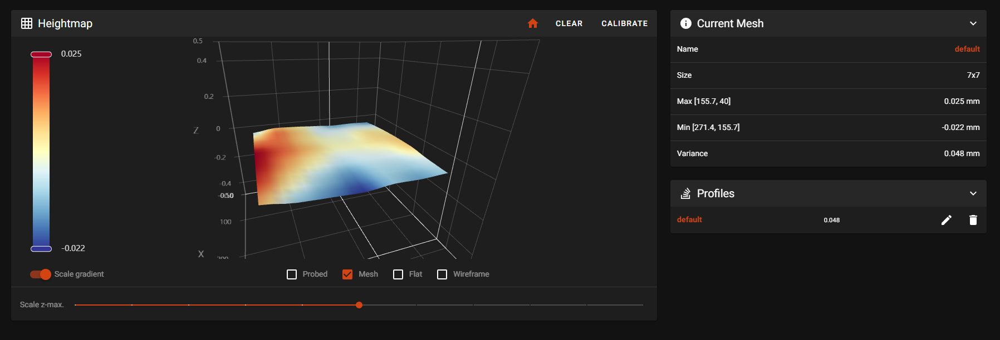

# Magnets avoidance

This configuration allow owners of mandalaroseworks mag bed to avoid probe right over them during bed mesh calibration.

It was done in mind to use with klicky or euclid, but omron probe users can probably also use this to avoid magnets (might be useful to increase the avoidance zone in such case).

## Bed supported

So far only the 355 x 355 bed is supported. Feel free to use the same computation as I did to make your own avoidance zone.

## Exclusions zones

The exclusions zones are squares of 28mm x 28mm on the center of each magnets.
If you feel the voidances zones are not big enough, use the attached xls to do some change.

## How to

Use the content of `magnets_avoidance.txt` to create your own `[bed_mesh]` section in klipper according to your config.
You can generate new or your own avoidance zone by using the attached xls file.

## Results

