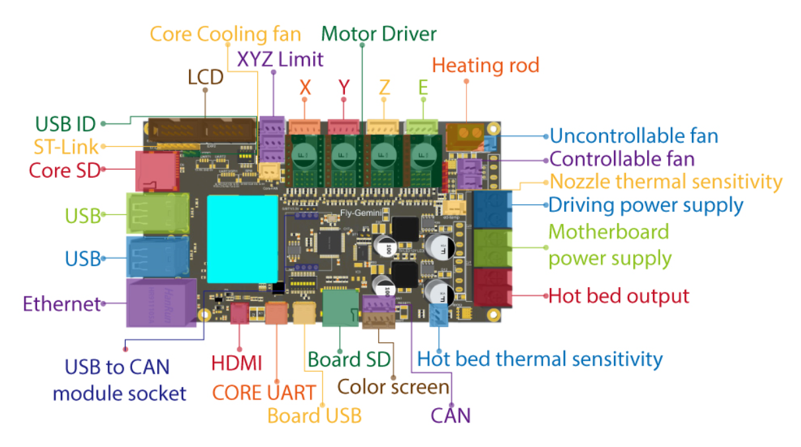

Fly-Gemini motherboard Klipper configuration for Voron0.1
=========

## instruction

Gemini is equipped with a core that can run Linux, eliminating the need for Raspberry Pi, and playing Klipper with just one motherboard.

Gemini supports TMC5160 and 48V drive power supply, which can achieve high-speed printing.

For more support, please go to 3dmellow in Voron Community (Discord)

## Bracket

The [V0_Fly-Gemini](/printer_mods/Mellow/V0_Fly-Gemini) folder has a fixed bracket for v0.1

## Wiring Diagram

## Physical map

