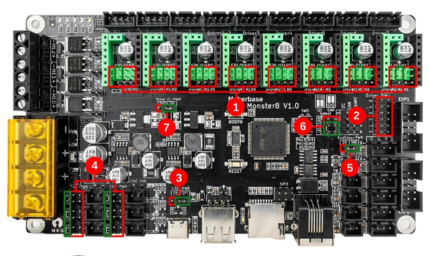
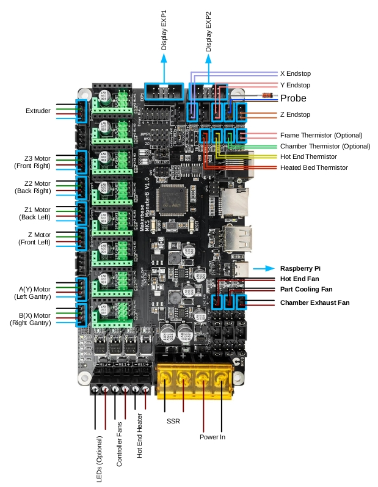

# Voron V2 / Trident - MKS Makerbase Monster8 Wiring

## Initial Preparation 

Set jumpers as shown:

* Green – Add Jumper
* Red – Remove Jumper
1. Insert only the jumper in the Green and remove all other jumpers in the Red in order to use TMC2209 UART mode.
2. Remove all the jumpers of DIAG to avoid the influence of TMC2209 DIAG on the endstop.
3. Set the USB-PWR jumper to off to avoid the interaction between the USB 5V of raspberry pi and the DC-DC 5V of the motherboard.
4. Set the six jumpers to VIN to set the fan voltage to the system supply voltage.
5. Set the jumper to VIN to set the probe voltage to the system supply voltage.
6. Set the two jumpers into I2C to enable the I2C output pins.
7. Set the jumper to 5V to set the driver power.

## Wiring

* Connect 24V and GND (V+ and V-) from the PSU to POWER (marking on rear of board)
* Connect the B Motor (gantry left) to Driver0
* Connect the A Motor (gantry right) to Driver1
* Connect the Z motor (front-left) to Driver2-2 (leaving an empty connector between A and Z)
* Connect the Z1 motor to Driver3
* Connect the Z2 motor to Driver4
* Connect the Z3 motor to Driver5 (v2 only)
* Connect the extruder motor to Driver7 (leaving an empty connector between Z3 and E)
* Connect the hot end heater to HE0
* Connect the bed SSR (DC Control Side) to H-BED (marking on rear of board)
* Connect the hot end fan to FAN0
* Connect the part cooling fan to FAN1
* Connect the chamber exhaust fan to FAN2
* Connect the controller fans to HE1
* Connect the hot end thermistor to TH0
* Connect the bed thermistor to TB
* Connect the X endstop to X+
* Connect the Y endstop to Y+
* Connect the Z endstop to Z-
* Connect the probe with BAT85 to Z+
* if using a mini12864 display, connect to EXP1 & EXP2, only after completing the steps shown [below](#mini-12864-Display)

## mini 12864 Display
* See [the mini12864 guide](https://docs.vorondesign.com/build/electrical/mini12864_klipper_guide.html)

## Other
* example config is located [here](Voron2_Monster8_Config.cfg)
* full pinout, and other MKS Makerbase documentation is located [here](https://github.com/makerbase-mks/MKS-Monster8/)
* Monster8 v1.0_003 pinout is located [here](https://github.com/makerbase-mks/MKS-Monster8/blob/main/hardware/MKS%20Monster8%20V1.0_003/MKS%20Monster8%20V1.0_003%20PIN.pdf)
* DIN rail mount for Monster8 is located [here](https://github.com/makerbase-mks/MKS-Monster8/tree/main/STL/MKS%20Monster8%20fixed%20bracket)
* Display bracket for MKS mini12864 V3.0 is located [here](https://github.com/makerbase-mks/MKS-Monster8/tree/main/STL/MKS%20Mini12864%20V3.0%20STL)
