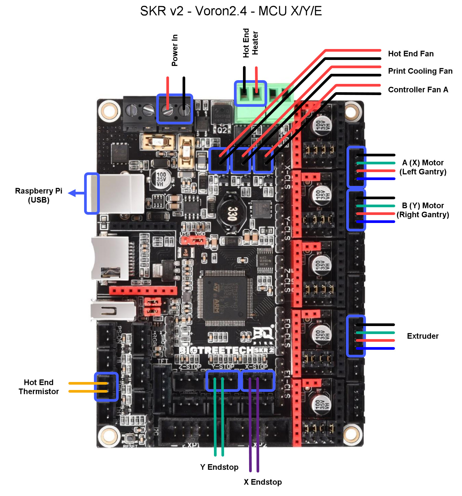
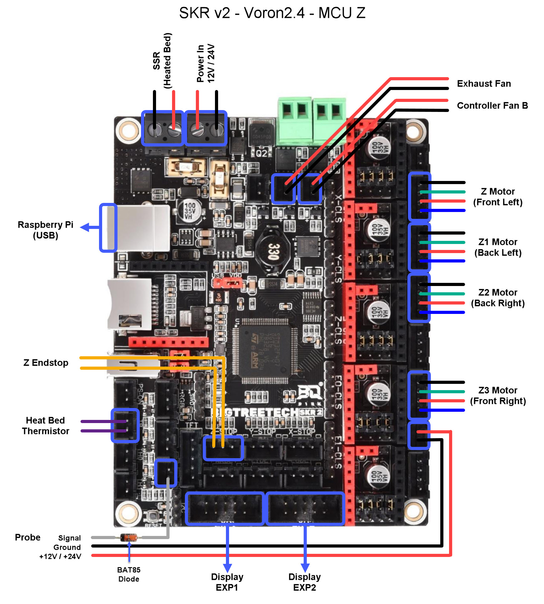

<B>Voron V2.4 SKR 2 Config</b>

This config file is for using two BigTreeTech SKR v2 boards on the Voron V2.4. For additional reference material, please reference BigTreeTech's Github page:

https://github.com/bigtreetech/SKR-2/

## Design goals ##
* Provide working configuration for Big Tree Tech SKR v2 mainboard
* Use SKR v2 connections as they were intented when possible
* Use same connections as SKR v1.4 when possible

## Additional instructions ##

When building the Klipper firmware image, select the correct processor options as follow:
* Micro-controller Architechture: STMicroelectronics STM32
* Processor Model: STM32F407
* Bootloader offset: 32KiB bootloader
* Clock Reference: 8Mhz crystal

## IMPORTANT NOTES ##

* The SKR v2 Board does not require cutting any pins on the drivers for sensorless homing.

* It is recommended to always remove power to the SKR Boards before adding/removing a stepper driver daughterboard.

* Please make sure that you have Rev.B board since BTT released a bad board initially and there is a revision on the initial SKR v2 board.

  BTT apparently offers full refund for the bad boards, or you can also fix it yourself.

  This guy Chris knows his stuff and explain this in details in this video.
  https://www.youtube.com/watch?v=1PPBHn-jU0k

  Thanks Chris !

## Wiring Instructions ##

