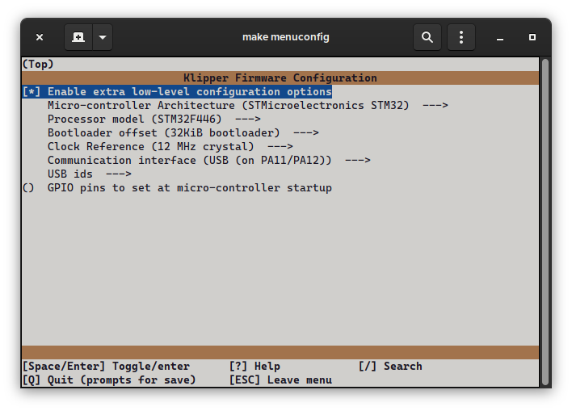

# Fysetc S6 v2.1 config for Voron V0.1 (and maybe others)

This klipper configuration uses pin aliases. See below settings for the Fysetc S6 V2.1 menuconfig options that worked for me.

The S6 V2.1 can be flashed via `make flash FLASH_DEVICE=0483:df11` if you place a jumper connecting BOOT0 to 3.3V while it's powering up. Otherwise, you can also flash via microSD card. MBR partition table, FAT32. Make sure to name your new firmware image `firmware.bin` or else it won't flash.

Ping `@clee#1337` on Discord if you have issues. 
