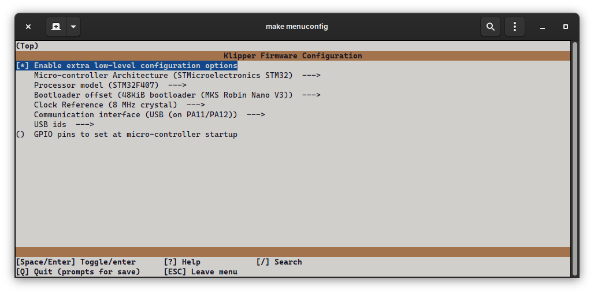

# clee's MKS Eagle V1.0 / Robin Nano V3.1 klipper config

This klipper configuration uses pin aliases. See below for the menuconfig options that worked for me.

The Eagle can be flashed with `make flash FLASH_DEVICE=0483:df11` if you hold the BOOT0 button while it's powering up. Otherwise, you can also flash the Eagle via microSD card or USB drive. MBR partition table, FAT32. Make sure to name your new firmware image `mks_eagle.bin` or else it won't flash.

The Robin Nano V3.1 cannot be flashed with `make flash` but instead requires you to flash via microSD card or USB drive. MBR partition table, FAT32. Make sure to name your new firmware image `robin_nano_v3.bin` or else it won't flash.

