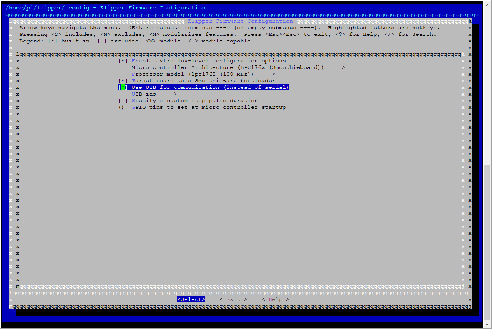

# Installing BetterBootLoader on a SKR board

First and foremost, I would like to thank Arksine for this great tool. When I installed BetterBootLoader I thought it was a lot more complicated, partly because I was unable to find any detailed installation instructions, especially on how to flash Klipper through USB. So I have decided to write this very short step-by-step installation instructions, in the hope it might help somebody installing this excellent tool in the future.

**A word of warning:** This potentially can brick (soft-brick) your SKRs if something goes wrong. If you have the propper programming tool, you might be able to reflash the original firmware back to the SKRs, but most of us won't have these. Be careful!

BetterBootLoader is a replacement to the stock firmware of the SKR or, for that matter, any LPC17xx-Board. The most important difference to the original firmware is that it allows installing Klipper on the SKR from the Pi through the USB connection without physical access to the SKR's SD card.

## Prerequisites
This guide is written with a VoronDesign v2 printer in mind, which usually has two SKRs as controllers, but it will also work for other printers with the same control board. The described firmware will only install on compatible controllers that use a LPC17xx MCU. This includes the SKR 1.3 or 1.4 used in the Voron v1 and v2. Do not attempt this on your SKR E3 mini in case you have a Voron v0 or switchwire!
In addition, a Klipper environment that is set up and configured to operate properly is assumed. After going through this guide you will be able to flash new Klipper versions to your SKRs without accessing the SD cards.

Things you need to prepare:
- Turn off your printer
- Get access to the SD cards of your SKRs (for the last time, hopefully!)


## Installing

It does not matter if you do both SKRs at the same time or if you do them one at a time.

1. Download betterbootloader.bin (only this one file) from the [latest release](https://github.com/Arksine/LPC17xx-DFU-Bootloader/releases).
Copy the just downloaded betterbootloader.bin to the root directory of your SKRs' SD cards and rename them to "firmware.bin". Leave the "firmware.cur" file in there if it exists.

2. Put the SD cards back into your SKRs and power your printer. Leave it powered for about 10 seconds. Then cut the power again. Do not cut it earlier, you might risk soft-bricking your SKR. You can now flip your printer back into a upright position. After all LEDs have turned off, power your printer back up.

3. Connect to the Raspberry Pi in your printer through SSH.

4. Go to your Klipper directory and update it

```bash
cd ~/klipper
git pull
```

5. Most people will not have USB communication enabled for their SKRs, which must be done at this point, otherwise Klipper will not be able to communicate with the SKRs after a system restart. To enable USB communication, klipper needs to be reconfigured:

```bash
make menuconfig
```

Enable USB communication (see image below) and Exit the configuration dialog.


6. After updating and reconfiguring your local repository remove any existing binaries or compiled object files and recompile Klipper:

```bash
make clean
make
```
7. In the next step, flashing Klipper through the USB connection to the SKRs, the filesystem paths to the two SKRs must be known. My two SKRs are accessible through the following paths:
```
/dev/serial/by-path/platform-3f980000.usb-usb-0:1.3:1.0
/dev/serial/by-path/platform-3f980000.usb-usb-0:1.5:1.0
```

A list of full paths for your SKRs can be shown by executing
```bash
ls -d1 /dev/serial/by-path/*
```

Or simply take them from your existing printer.cfg.

With these paths at hand, Klipper can now be flashed to the SKRs:

```bash
make flash FLASH_DEVICE=<path to first SKR>
make flash FLASH_DEVICE=<path to second SKR>
```

As an example, for my two SKRs it would look like this:

```bash
make flash FLASH_DEVICE=/dev/serial/by-path/platform-3f980000.usb-usb-0:1.3:1.0
make flash FLASH_DEVICE=/dev/serial/by-path/platform-3f980000.usb-usb-0:1.5:1.0
```

Make sure to replace the paths with those of your SKRs, if they are different.
In the future you will be able to update Klipper on your SKRs with the steps shown above, starting from step 3.

Have fun and enjoy!

-kage-chan
