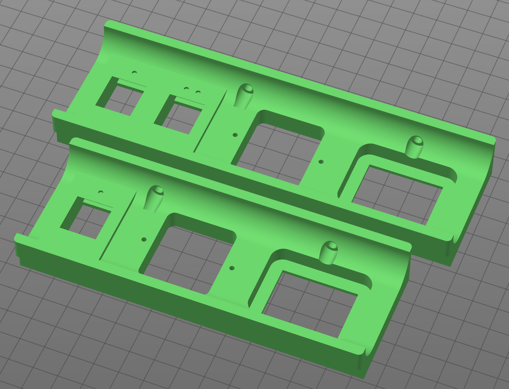

# Single and Double Keystone Power Panels for Voron 2

## Images

These keystone power panels replace the standard Voron 2 power panel and allow you either one or two keystone jacks for any keystone mount connections (Ethernet, HDMI, USB, etc.)

**NOTE:** As of now, there are NOT replacement skirts that fit these, so you will lose one skirt on the back side of the printer.  I will be working on matching skirts, but as of now they're unavailable.  If you are in need of them, please ping me on Discord and I'll see if I can speed up the process.  Thanks!

## Instructions
1. In your slicer of choice, insert the single or double keystone panel STL, and print with the standard Voron print settings.  Ensure the orientation is the same as the picture above, and keep supports turned OFF.