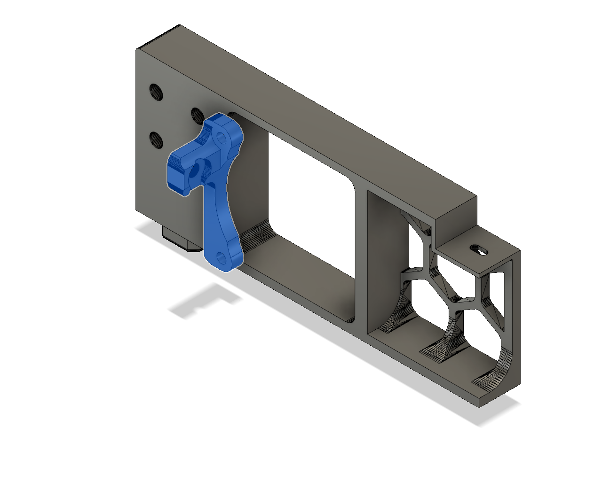
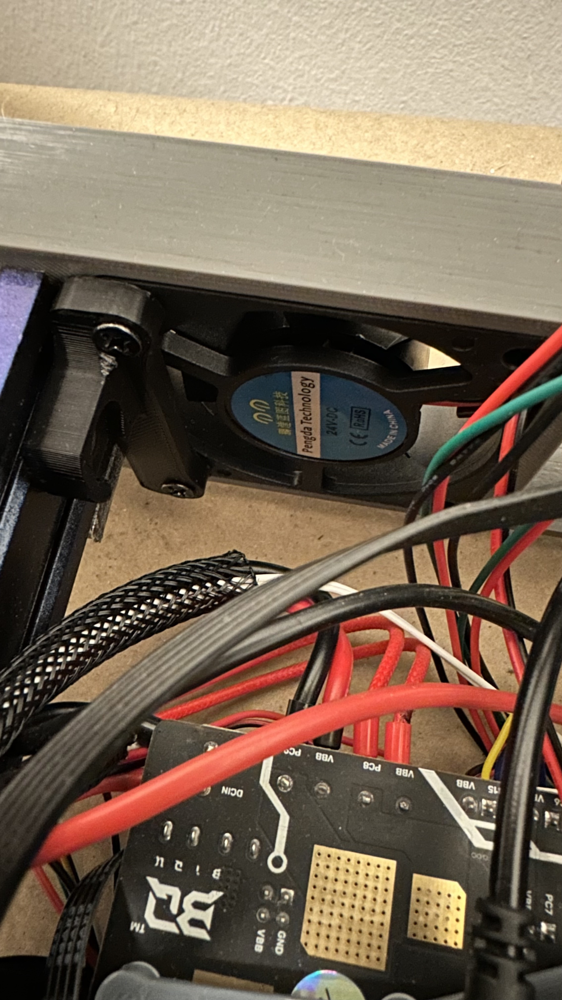

# 60mm fan support Triano - Ender_3Pro_Switchwire

Update for mod by `Triano` in the `Ender_3Pro_Switchwire` project is a clip for 60mm fan support.
it is screwed with pc type screws, and on the side of the 2020 profile, in case of Ender pro it is 4040 profile.

This part is missing in your design so surely if you are going to convert your Ender you are going to need it.

Original project: [Switchwire](https://github.com/VoronDesign/VoronUsers/tree/master/printer_mods/Triano/Ender_3Pro_Switchwire)

## Printing
    * Defautls settings
    * No supports needed

