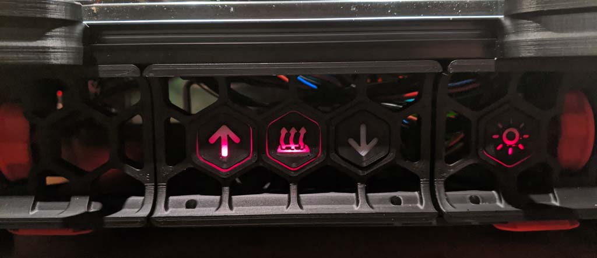

  

--------------------------------------------------------------------------------
Gcode Buttons
--------------------------------------------------------------------------------
Build your owns buttons to execute gcode without a webinterface or printer display.
I don't have a display on my small Voron (250³) and I only need 4 types of action in front of the printer so I wanted to add some buttons on my printer. This mod is my interpretation for buttons in the skirt.

--------------------------------------------------------------------------------
Functions of my gcode buttons
--------------------------------------------------------------------------------
- unload filament
... if the extruder temperature is higher than 190 degrees, it will unload your filament and unlock the load filament button.
- preheat
... heatup the heater_bed to 100 degrees and set your chamber temperature to 50 degrees. If your heater_bed is already heated, it will cooldown the heater_bed and set the chamber temperature to 45 degrees.
- load filament
... if your filament is unloaded (press the unload filament button before) this button loads your filament. If the filament is already loaded, this action will purge 20mm of filament with 5mm/s.
- light on/off
... with this button, your switch your case light on or off .

--------------------------------------------------------------------------------
How to build
--------------------------------------------------------------------------------

  

--------------------------------------------------------------------------------
Printing Guide
--------------------------------------------------------------------------------
- Print the base and lock with 4 Perimeters and 100% infill.
- Print the cover with a minimum of 5 solid top and bottom layers to get no infill pattern in it and change the filament to a transparent filament at the beginning of layer 5 (in my case it was ABS natural).

--------------------------------------------------------------------------------
Configure your Firmware
--------------------------------------------------------------------------------
Include the printer_buttons.cfg in your Klipper config.
If you use RRF, feel free to submit a config file for this mod. I don't use RRF so a cannot write a config file...

--------------------------------------------------------------------------------
Bill of Material
--------------------------------------------------------------------------------
- filament
- Cherry MX Buttons (my favorit type is the green version. hard respond with click sound)
- cables
- 3mm LEDs
- resistors
