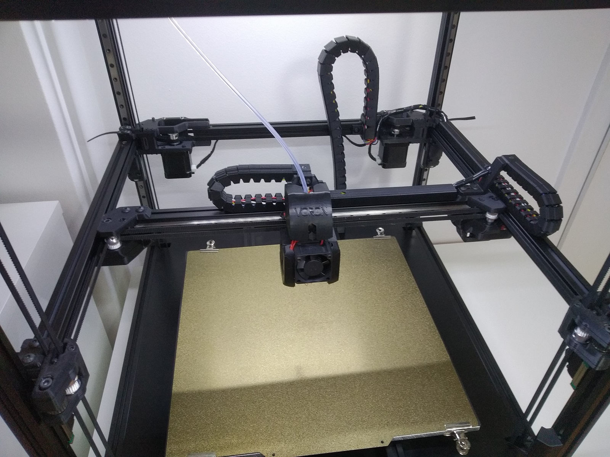

 ### Notes
 * This is a complete remake of the original V2.0 beltchain, the dimensions are completely different and there are a few new features.
 * Tested on a 350mm V2.2 #137
 * 350mm version used at least 21 links on X and Y
 * XY covers can be rescaled in the slicer to desired length
 * Z Beltchain End A might not work with stock V2.2, mine wasn't exactly stock
 * As an upgrade to the original design, these have a cut at the side of each link. Seger pliers can be used to create a gap to insert wires without needing to take the whole thing apart.
 
  ### Requirements
 * 6mm GT2 belt, steel core might be ideal
 * some M3 screws, washers, nuts and tnuts

