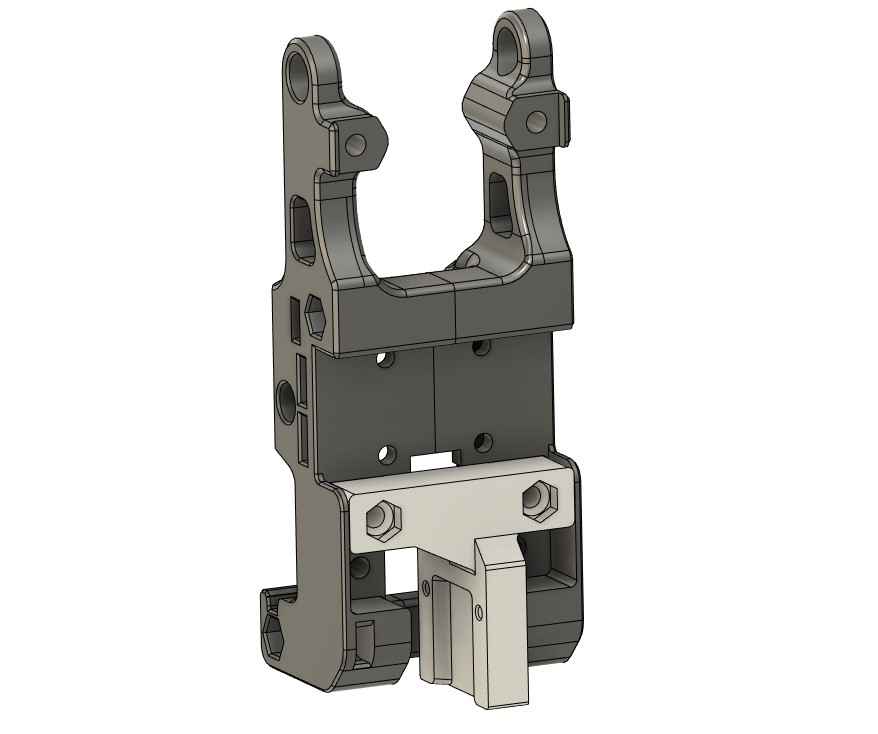

Works with the DUET type IR probe https://www.duet3d.com/IRProbe

The probe itself works pretty well with dark sufraces, buildtak like, some success with Energetic PEI. It's terrible with glass and raw aluminium platform plate.
Tested on a V2.2 #137

