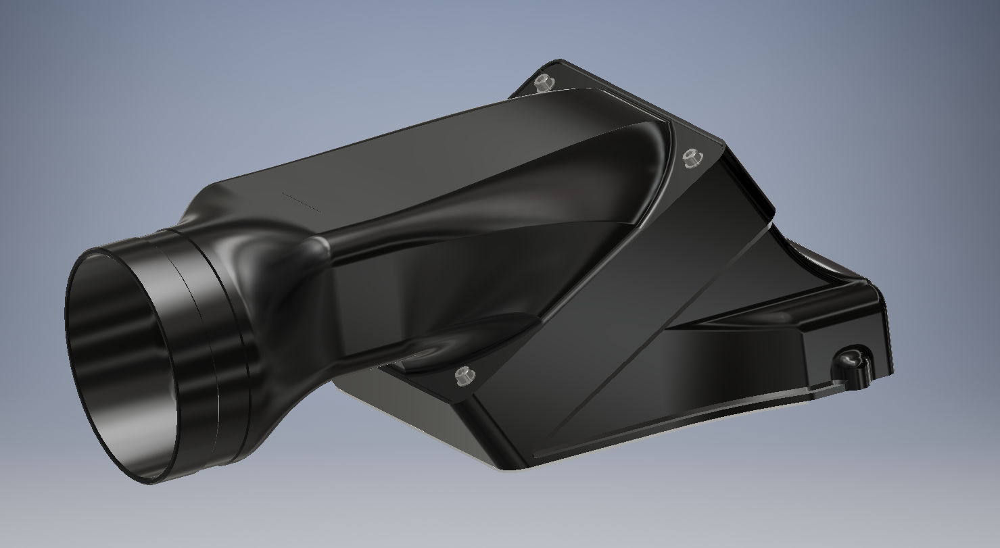
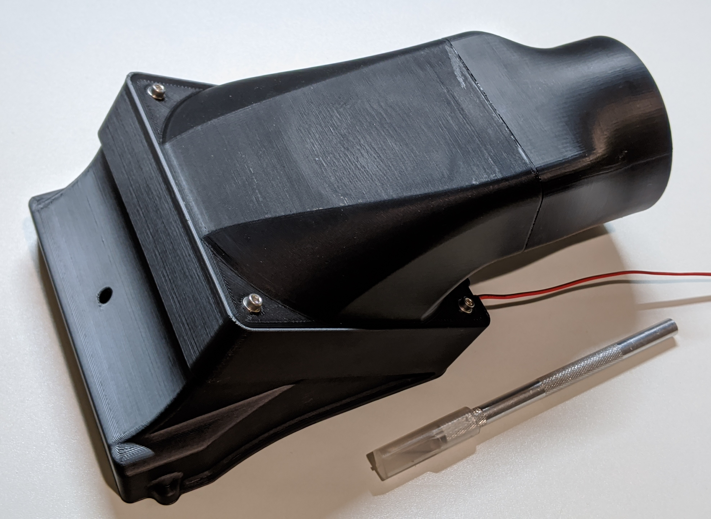
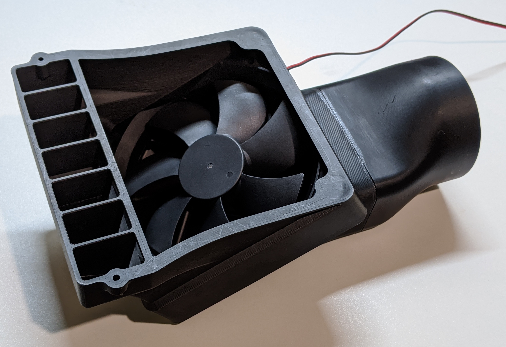
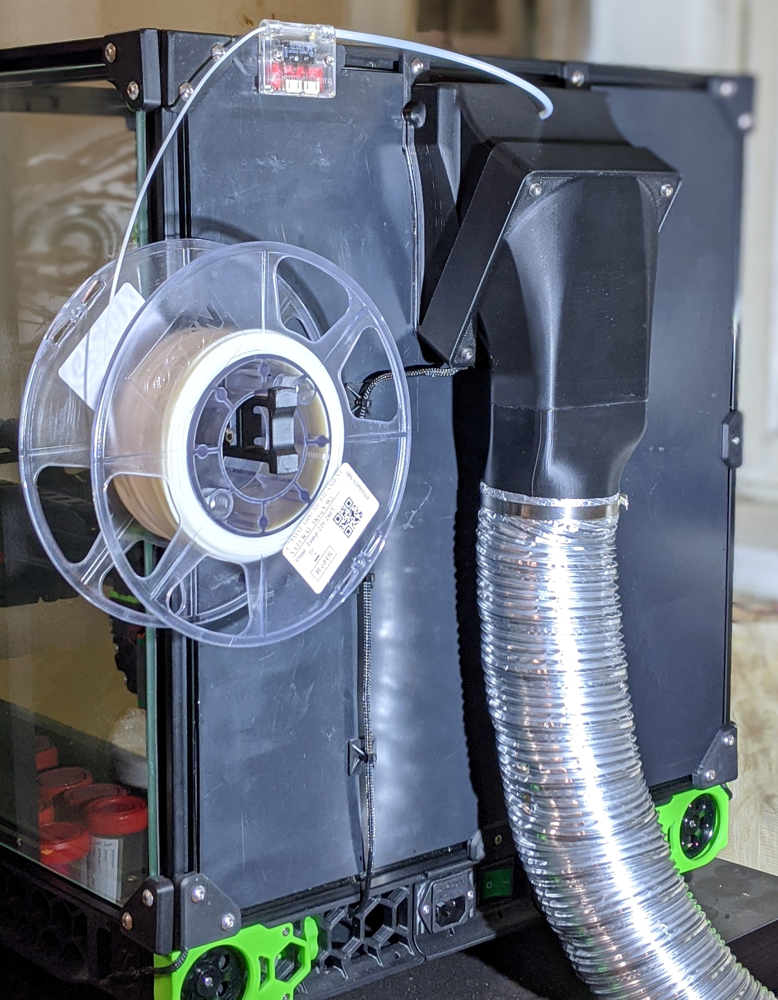
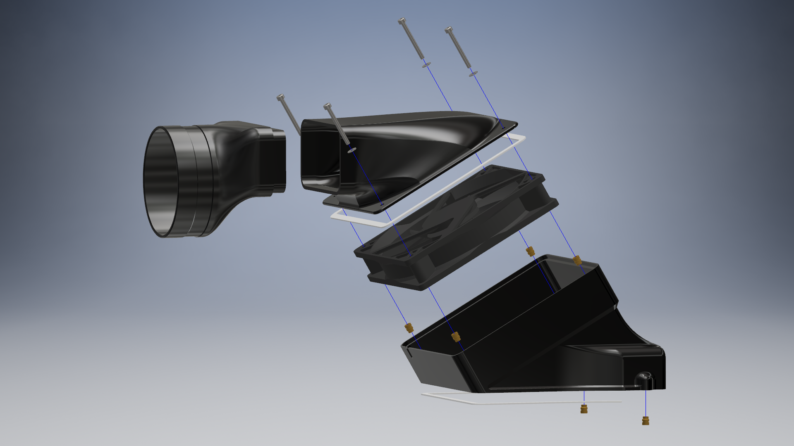

# Turbocharger - Alternative fumes extraction solution for Voron 2.x





## Overview
Do you like ABS smell in your room? I don't. That's why I designed Turbocharger - alternative fumes extractor for Voron. The main idea was to keep it cheap, simple, compact, effective and compatible with the stock Voron exhaust design. Unlike the stock design, no carbon filter elements were used. Exhaust should be connected to the ventilation system or somehow routed outside. Interesting idea of how to do that is [here](https://www.thingiverse.com/thing:4148187). 

This mod is a drop-in replacement, no other modifications to printer design are needed.

## BOM
* 1x 120x25mm fan
* 4x M3x30 Socket head screws
* 4x M3 Washers
* 6x [M3xD5xL6 Heat inserts](https://aliexpress.com/item/4000232858343.html)
* 5mm wide VHB tape
* 5mm wide Foam tape (optional - if you want to seal fan duct)
* Adhesive silicone sealant or similar
* 80mm or 100mm aluminum ventilation hose
* 70-90mm clamp for 80mm hose / 90-110mm clamp for 100mm hose

## Printing instructions
The model was designed around 0.6mm line width and 0.2mm layer height, no supports required. Adjust your slicer settings accordingly. The trickiest part to print is [fan_duct.stl](./fan_duct.stl) because of 30° overhang. Use enough cooling, otherwise the upper part could warp/deform. Two hose adapters are included - for 80mm and for 100mm hoses respectively. Choose one that fit your needs. If you need other diameter - just drop me PM.

## Installation instructions
1. Apply VHB tape to the base and mount it onto the back panel of printer.
2. Apply adhesive sealant to hose adapter and glue it in the fan duct.
3. Apply foam tape to fan facing flange of fan duct. This step is optional, used for better fan sealing.
4. Attach hose to the hose adapter.
5. Insert fan into the base. Pay attention to the air flow direction and fan wire position. Route fan wire though the small opening in the base.
6. Bolt fan duct to the base.



## Klipper configuration
If you have chamber temperature sensor, it is convenient to configure the exhaust fan as a temperature fan. This will allow to keep the chamber temp at the desired level and to control fan with extended gcode commands. Following section should be added to the Klipper configuration file:
```
[temperature_fan exhaust_fan]
pin: z:P2.4 # change to the pin where the exhaust fan is connected
sensor_type: NTC 100K beta 3950 # change to your chamber temp sensor type
sensor_pin: P0.25 # change to the pin where the chamber temp sensor is connected
min_temp: 0
max_temp: 70
target_temp: 45.0 # change to the desired chamber temperature
max_speed: 1.0
min_speed: 0.3
control: pid # alternatively watermark can be used
pid_Kp: 40
pid_Ki: 0.2
pid_Kd: 0.1
gcode_id: T1
```
To set desired chamber temperature level use the following external gcode command: `SET_TEMPERATURE_FAN_TARGET temperature_fan=ehxaust_fan target=<desired chamber temp>`. The command `SET_TEMPERATURE_FAN_TARGET temperature_fan=ehxaust_fan target=0` turns off the fan completely.

Alternatively if no chamber temperature sensor is installed the exhaust fan could be configured as a heater fan:
```
[heater_fan exhaust_fan]
pin: z:P2.4
max_power: 1.0
shutdown_speed: 0.0
kick_start_time: 5.0
heater: heater_bed
heater_temp: 30
fan_speed: 1.0
```
