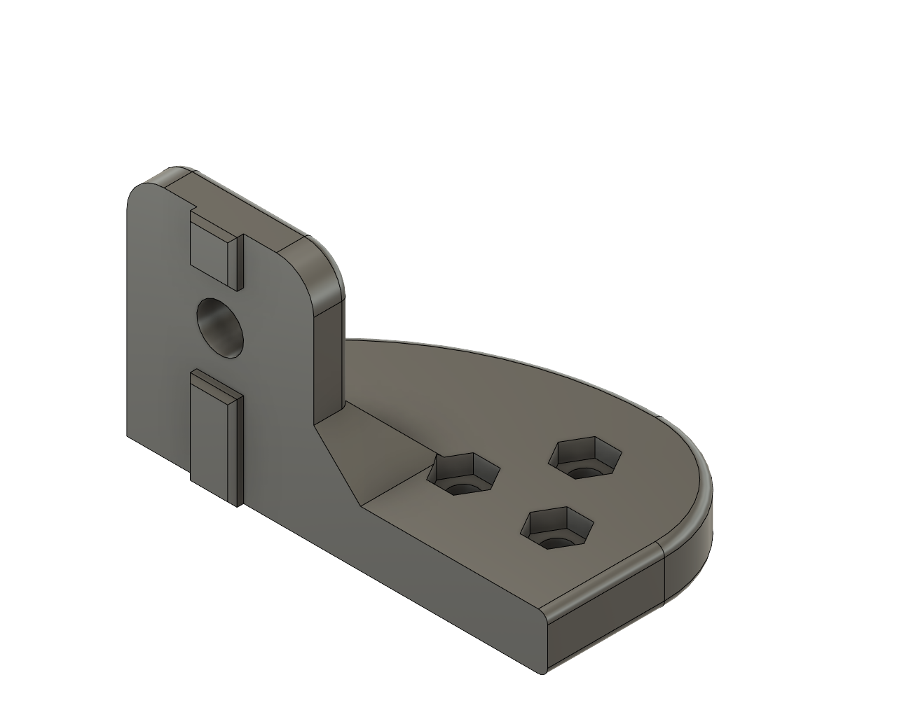
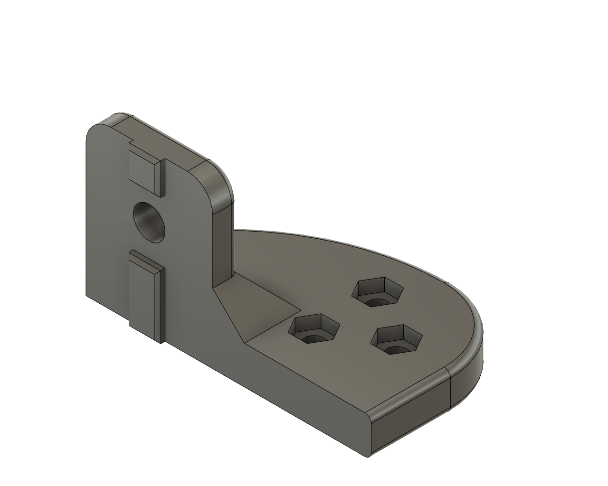
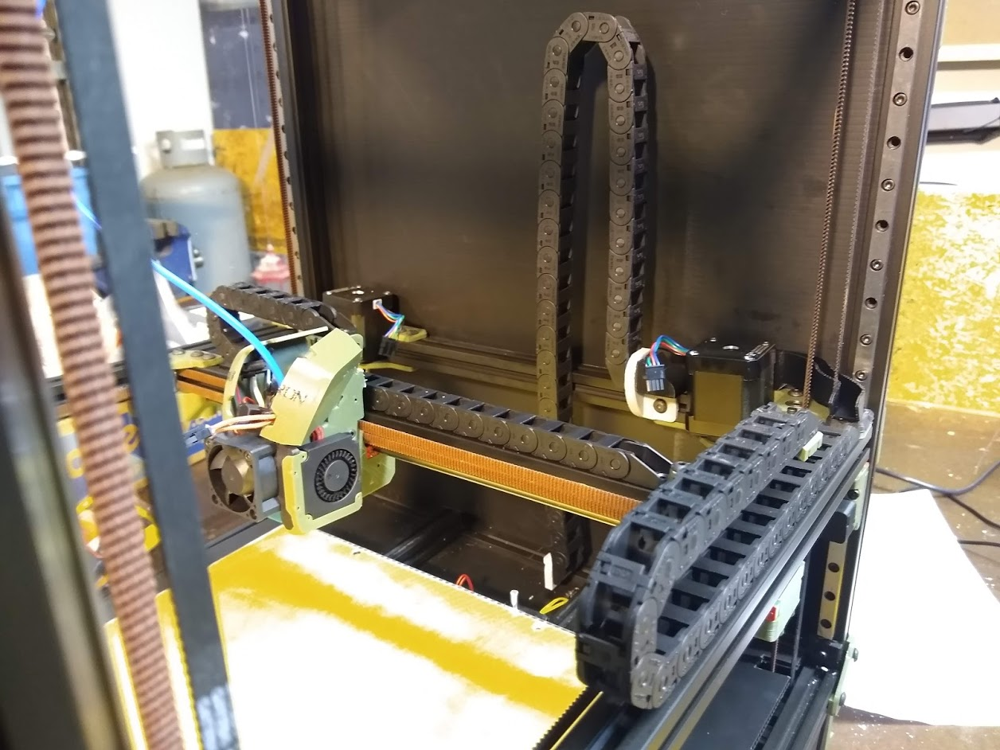

# 10x15 Drag Chain Z Mounts

These are anchor mounts for attaching 10x15 Befenybay Drag Chain avaible from [Amazon](https://www.amazon.com/gp/product/B07WJ4CPF5). They will probably work with 10x15 chain from Openbuilds and Alixpress.  Note that the hole orientations for mounting to the drag chain anchor are different for the upper and lower mounts.

## Hardware required

| Quantity | Description |
|:--------:|-------------|
| 6 | M3x8 FHCS (Flat Head Cap Screw) |
| 6 | M3 Locknut |
| 2 | M5x10 BHCS |
| 2 | M5 T-nut |

Lower Mount:

Upper Mount:

The gray parts are the mounts installed with the Z drag chain anchored to them.  The upper mount attaches to the front of the extrusion and the lower mount attaches to the top of the extrusion.
