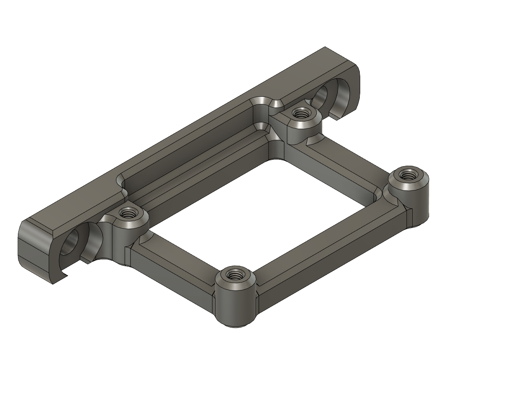

# 30A Relay Mount

This a mount for a 30A relay module available from [Amazon](https://www.amazon.com/gp/product/B07ZWJNRMX). I run my 24V power supply through this relay and control it with the Otcopi [PSU Control](https://plugins.octoprint.org/plugins/psucontrol/) and [Teamperature Failsafe](https://plugins.octoprint.org/plugins/temperaturefailesafe/) plugins.  My original intention was to run the bed through it as well, however the connectors and traces doesn't look like they would handle the current.  A good tutorial on setting this is up is available on [Youtube](https://www.youtube.com/watch?v=ozCqqlPJ3a0).

## Hardware required

| Quantity | Description |
|:--------:|-------------|
| 4 | M3x8 SHCS |
| 2 | M5x10 BHCS |
| 2 | M5 T-nut |

Mount:

Installed in a 300x300:
