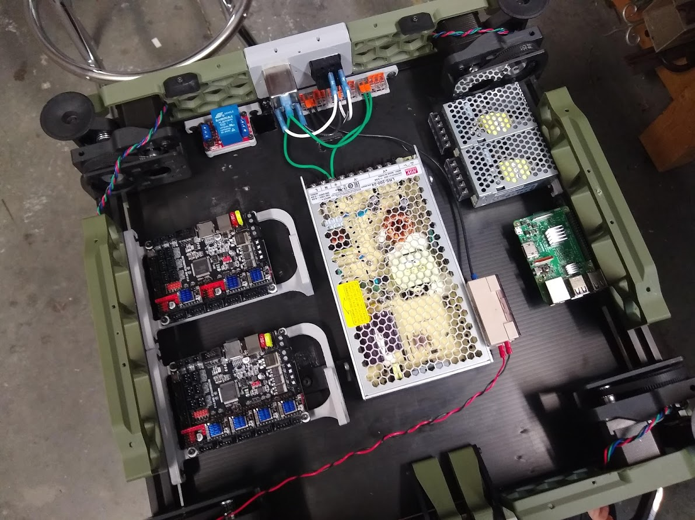

# Dual RS-25 Mount

This a mount for installing two Meanwell RS-25 form factor power supplies side by side. I personally use a 5V for the Pi and a 12V for accessories.

## Hardware required

| Quantity | Description |
|:--------:|-------------|
| 4 | M3x6 SHCS |
| 2 | M5x10 BHCS |
| 2 | M5 T-nut |

Mount:

Orientation:

Installed in a 300x300:
