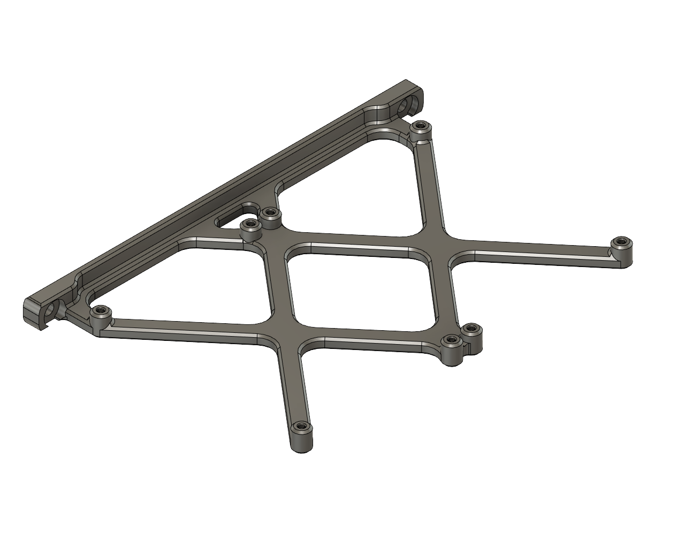
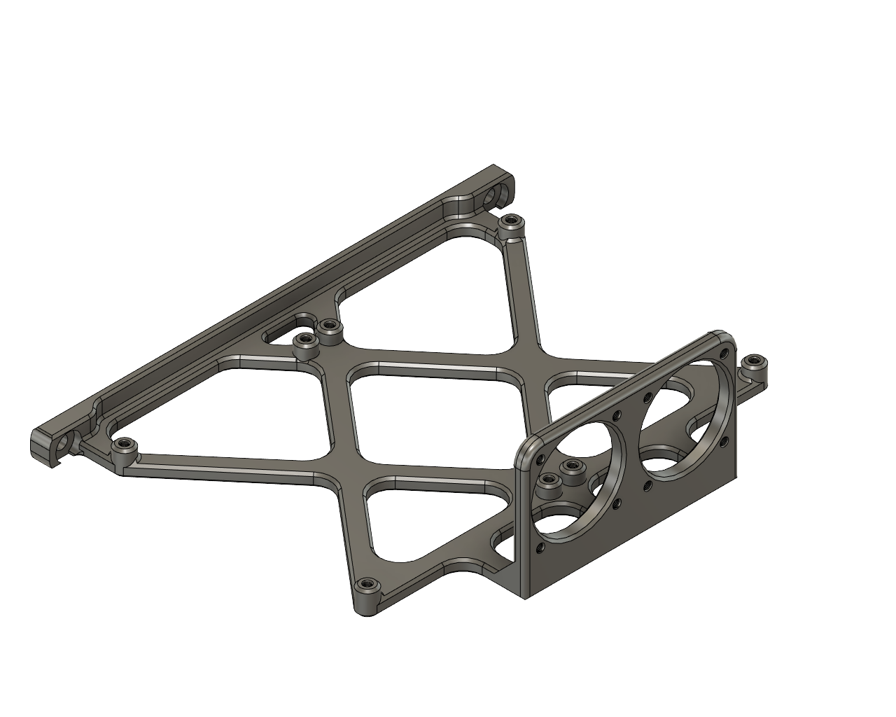
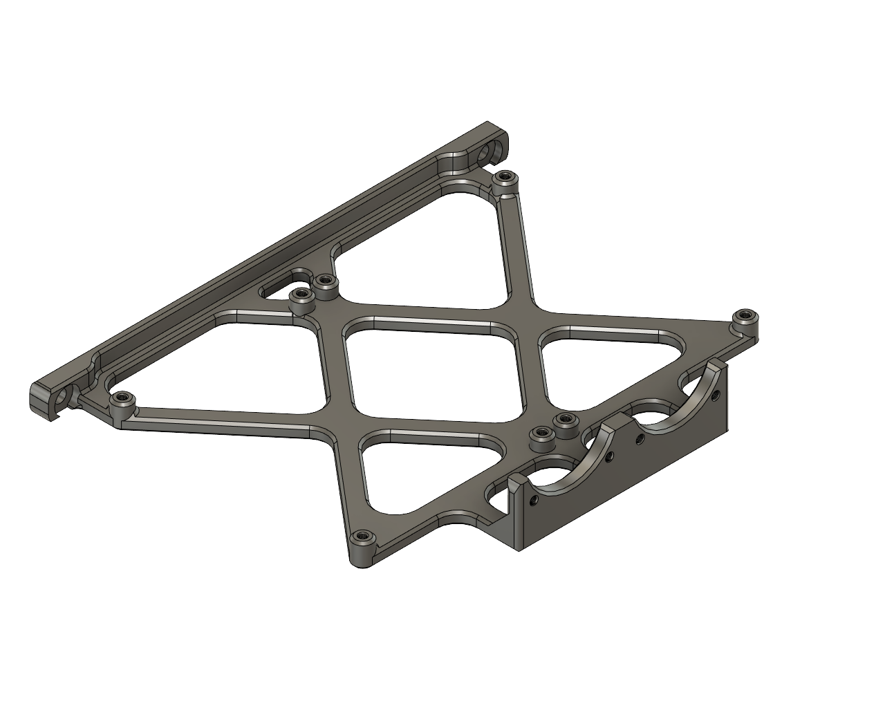
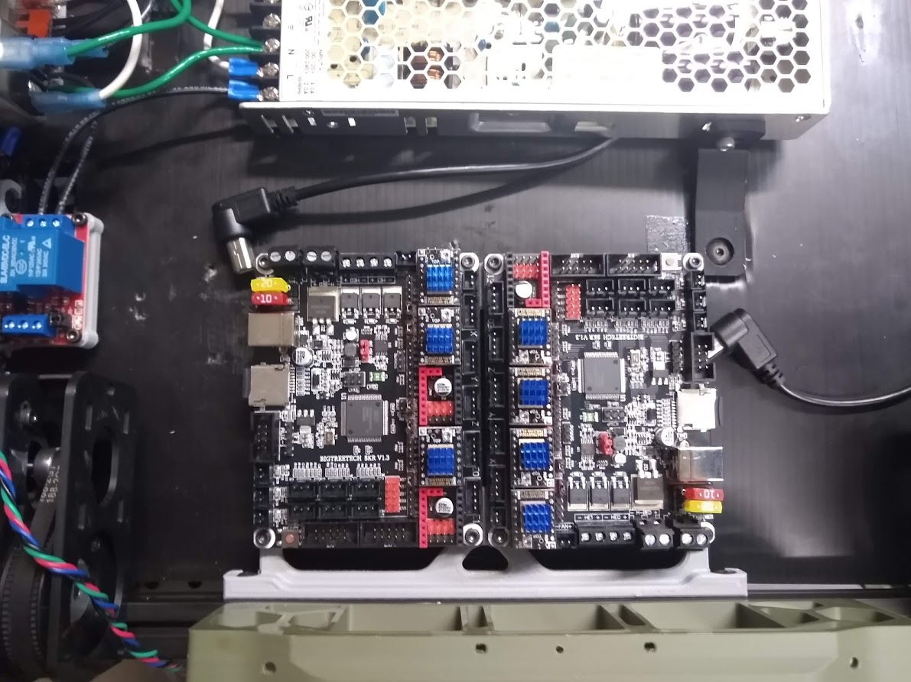
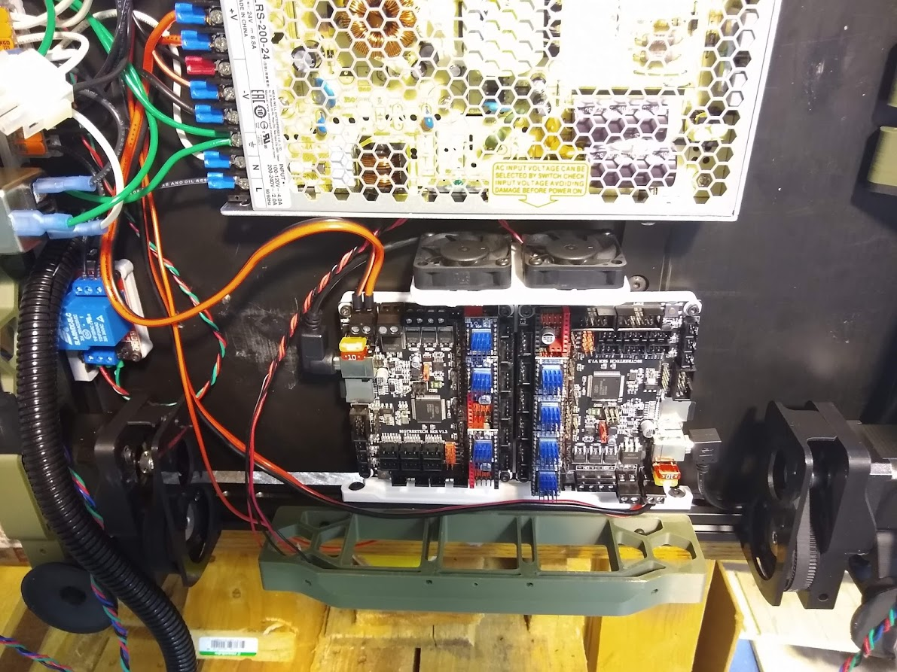

# Dual SKR 1.3 Mounts

These are a few Dual SKR 1.3 mounting options. These will fit on a 200mm bed, however you may have to adjust your skirt size. I had to use 1 skirt at 2mm on my 200x200 backup printer.

- Fanless
- Dual 40mm fans
- Dual 40mm fans without top mounts

## Hardware required

| Quantity | Description |
|:--------:|-------------|
| 0/4/8 | M3x16 SHCS (size these for your fans, mine required 16mm) |
| 8 | M3x8 SHCS (for mounting the boards, M3x6 will work as well |
| 2 | M5x10 BHCS |
| 2 | M5 T-nut |

Fanless Mount:

Dual 40mm Fan Mount:

Dual 40mm Fan Mount (Topless):

Fanless Installed in a 300x300:

Dual 40mm on 200x200 bed:

Dual 40mm Installed in a 300x300:

