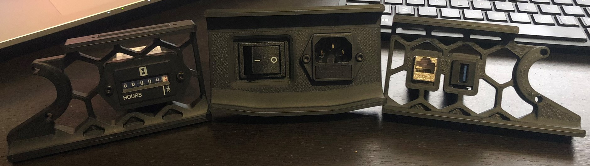
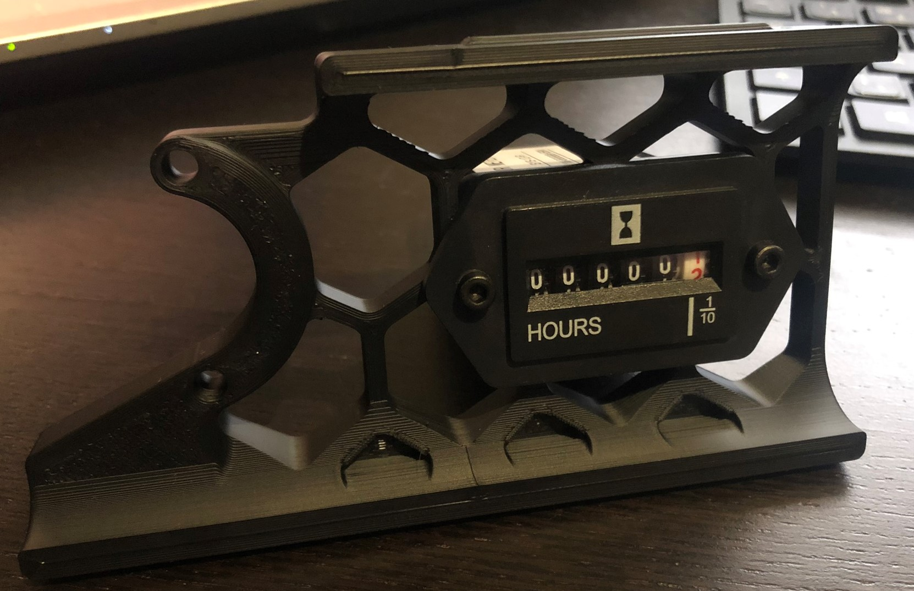
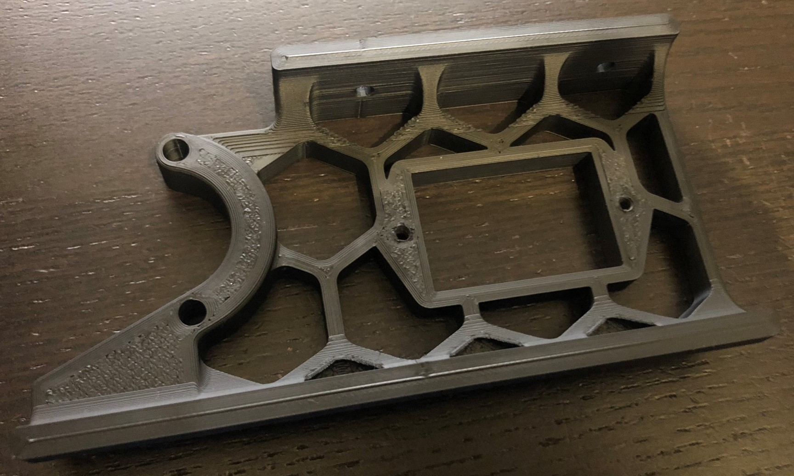
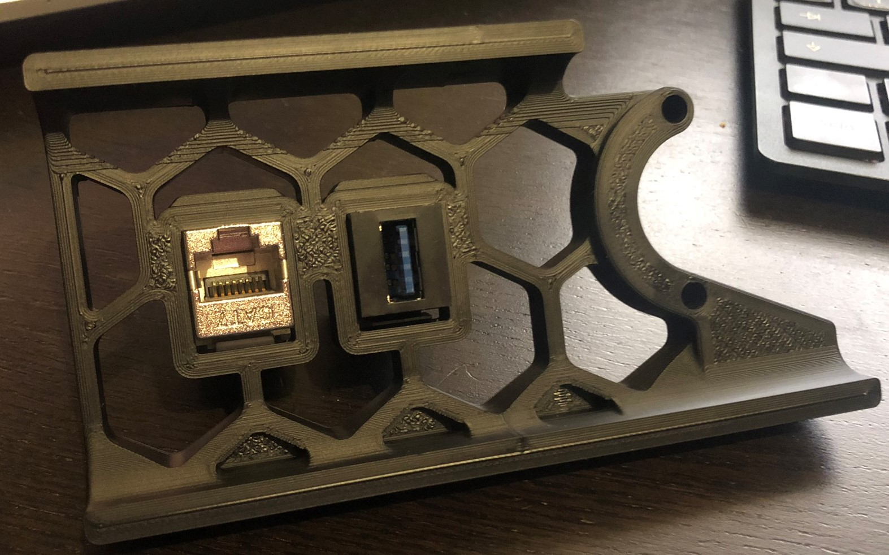
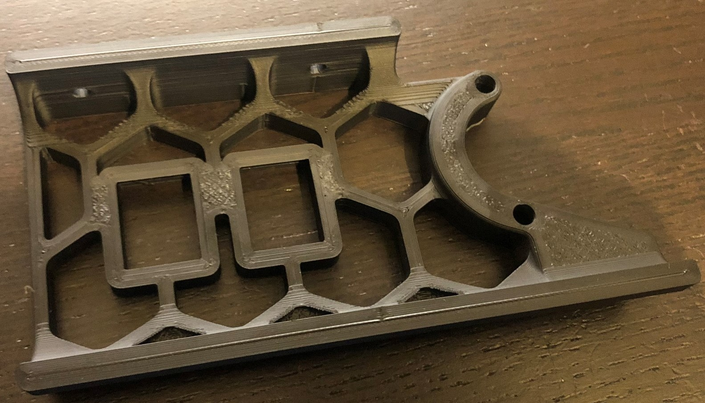

# MarcPot Skirt Mods


**WARNING I HAVE NOT TESTED THE 250 and 350 VERSIONS. PLEASE TELL ME IF YOU DID AND I'LL EDIT THIS WARNING.**

**WARNING to give the hour counter enough clearance in the 250 version the hour counter will overlap the plug panel, this should not matter. But again, I haven't tested it.**

I have checked them all in my slicer and they sliced correctly.

Also, if you think the keystones don't fit, try rotating them.
## Overview
These are my mods for the Voron V2.4 Skirts. They are modifications of [the official Voron V2.4 skirts](https://github.com/VoronDesign/Voron-2\STLs\VORON2.4\Skirts).

## BOM
* Keystone inserts.

**OR**

* M3x8 SHCS.
* [Hour Counter](https://aliexpress.com/item/33010541388.html?)

## Printing instructions
No special printing instructions. They are skirts.

## Assembly instructions
No special Assembly instructions. They are skirts.

## Configuration instructions
For the keystones there are no special configuration instructions. They are plug & play.

For the hour counter there are multiple ways to set it up. The simplest way is to add it to Klipper as a heater_fan. 

```
# Heater cooling fans (one may define any number of sections with a
# "heater_fan" prefix). A "heater fan" is a fan that will be enabled
# whenever its associated heater is active.
[heater_fan hour_counter]
pin: CHANGE THIS TO THE CONNECTED PIN NUMBER
#heater: extruder
#   Name of the config section defining the heater that this hour counter is
#   associated with. If a comma separated list of heater names is
#   provided here, then the fan will be enabled when any of the given
#   heaters are enabled. The default is "extruder".
heater_temp: 170
#   A temperature (in Celsius) that the heater must drop below before
#   the hour counter is disabled. The default is 50 Celsius.
#fan_speed: 1.0
#   This should be kept at 1.0
shutdown_speed: 0.0
#   The desired fan speed (expressed as a value from 0.0 to 1.0) if
#   the micro-controller software enters an error state. This is set
#	to 0.0 so that the counter won't go on while in error state.
```
Thanks to hernsl#8860 for showing there is an easier way than macro's.

When using a mains powered counter it should be set up using a relay, these relays can be controlled by the SKR's, then you don't have to change anything.
But when controlling the relay using the Raspberry Pi you need to setup the Pi as MCU.
Instructions on how to do this can be found at https://www.klipper3d.org/RPi_microcontroller.html

Other options are the [Octoprint Enclosure Plugin](https://plugins.octoprint.org/plugins/enclosure/) for the mains counter, and the enclosure plugin + gcode macro's for SKR controller counters.

## CAD
I uploaded the original 300 cad files I created because I did some really ugly things to get to the 250 and 350. So you're probably better of starting at the 300 if you want to edit them yourself. I did save them ofcourse so contact me if you want the files.

## Questions
Reach me in Voron's [Discord](https://discord.gg/xgXWctB) @MarcPot#3983 if you have any questions.

## Images




