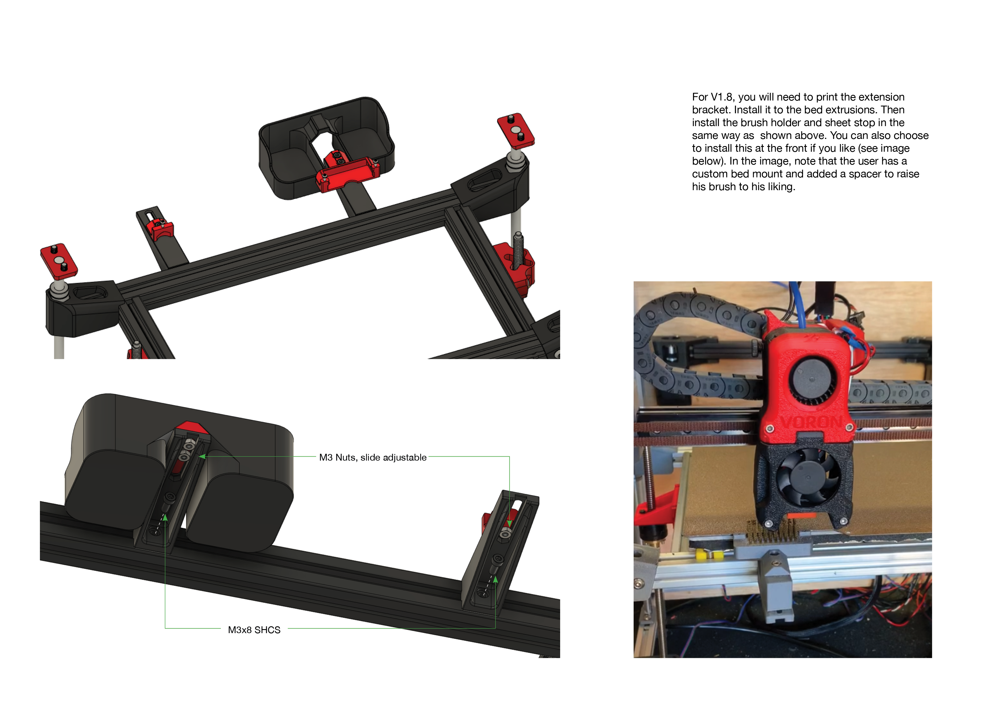
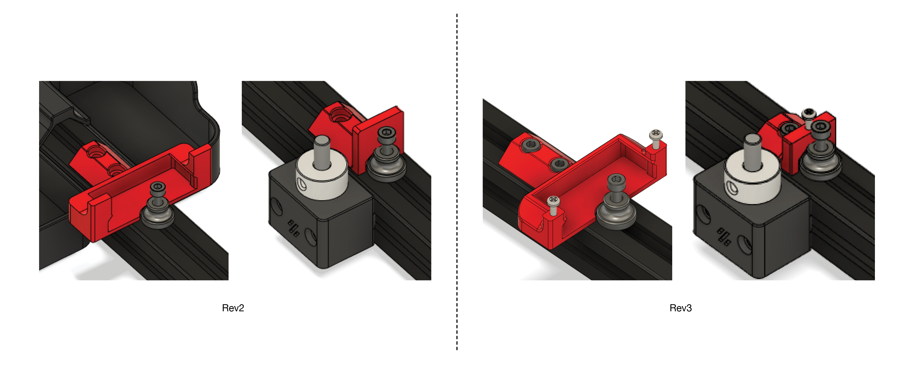
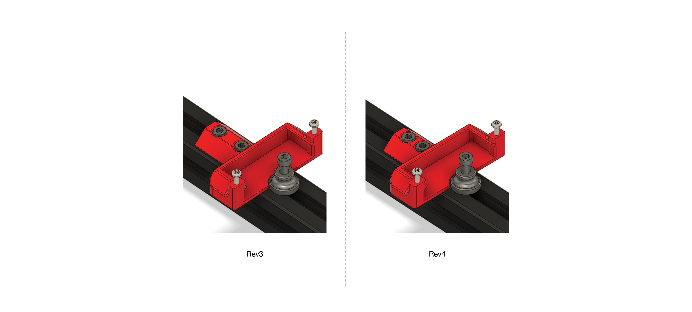

A Team Dropbear Production

# Decontaminator Purge Bucket & Nozzle Scrubber

This is a removable purge bucket with a nozzle scrubber. It is compatible with Voron 1.8 and Voron 2 printers (v2.4, v2.2 and v2.1). I noticed that the current nozzle scrubber design of the Voron was not very effective at containing filament debris and bits.

It was also not removeable, making it a pain to reach behind and clean it out with a vacuum. So, this design aims to solve all that by:

1) Making a larger and deeper purge bucket to hold more filament gunk.
2) Purge bucket is removeable and naturally clips onto the brush scrubber with its geometry. Magnets help secure it further with the added benefit of a satisfying 'clip' sound when attached.
3) A spring steel sheet stop/index is provided for convenience when putting your spring steel sheet back on the plate. These use M2x10 self tapping screws that allow you adjust the height so that they're flush with the print surface.

## Installation & Parts Required

Pictures shown are slightly older versions, however, installation is exactly the same. 

The geometry of the brush_holder is such that it clips and holds the brush in place through friction fit. As noted in the installation guide, do not try to force the brush in if it's the wrong size; it will break quite easily.

For V1.8, you will need to print extension_bracket_v1.8 (print 2x if you want to use the individual sheetstop). Some may opt to install it at the front.

You will need the following:

- 1x brass brush or whatever you prefer (I got the [TriangleLabs brass/copper brush](https://www.aliexpress.com/item/33053117369.html?spm=2114.12010615.8148356.2.315e106dfzI86U) and cut it down to length).
- For **V2.1, 2.2 & 2.4**: 2x M3x8mm SHCS (3x if you use the sheet stop option)
- For **V1.8**: 3x M3x8mm SHCS (5x if you use the sheet stop option).
- 2~3x M2x10(or 8, or longer)mm self tapping BHCS/SHCS (**optional** if you wish to use the sheet stop function). You should have these from the V1 and V2 BOM which are spec'ed for the microswitches.
- 2~3x M3 nuts (for V1.8 only)
- 2x 6x3mm round magnets

STLs are included here and CAD files as well if you wish to change the dimensions or modify to your liking. A purge and nozzle scrub macro that is plug and play is provided as well; you can find them under [Macros](./Macros). Shoutout to community member Hernsl for providing this macro!

**NOTE**: If you are using the z endstop from V2.2, there is a version of the stop that takes into account the locating bolt heads of the endstop. You can simply mirror the stop in your slicer if your endstop is on the other side of the extrusion.

# HISTORY OF REVISIONS

The purge bucket & nozzle scrubber has undergone many revisions within a short time, especially between Rev3 and Rev4. To avoid confusion and provide clarifications to current users of the purge bucket and prospective users, please read the following:

- Rev1+2 and Rev3 are intercompatible with each other. They only work on V2.2 and V2.4.
- Rev4 is a completely standalone revision (**only individual sheetstop remains unchanged, rest are not backwards compatible with Rev1+2 and Rev3 and vice versa**). This revision works on V1.8, V2.1, V2.2 and V2.4 and the same parts are shared across all platforms.

You will be able to find these older revisions under [Legacy_Revisions](./Legacy_Revisions).

## REV1+2 AND REV3

In Rev1+2, the brush holder was available as two options: a regular holder and one with fully printed sheet indexing stops. In Rev3, the brush holder became only available as a printed sheet stop option with M2X10 BCHS self tapping screws. Purge buckets were compatible across Rev1+2 and Rev3.

## REV4 (LATEST)

V1.8 support was added in this revision. Due to screw distances changing in V1.8 to allow clearance from the rear electronics panel, I made the decision to have this change apply to the V2 versions so that one part can be used across V1 and V2. This would minimise hunting for specific parts for each specific printer. However, this means that only the individual_sheetstop carries over from previous revisions (purge bucket dimensions have changed as well).

Future revisions may include the use of a silicone brush that is gentler on plated nozzles. Come back for updates!

-edwardyeeks (edwardyeeks#6042)