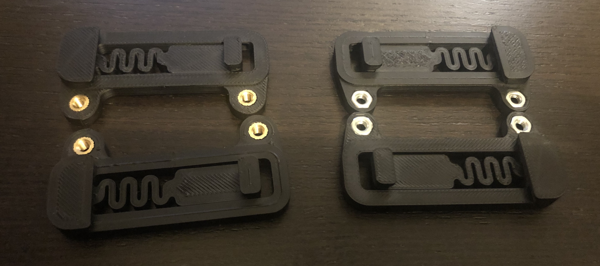
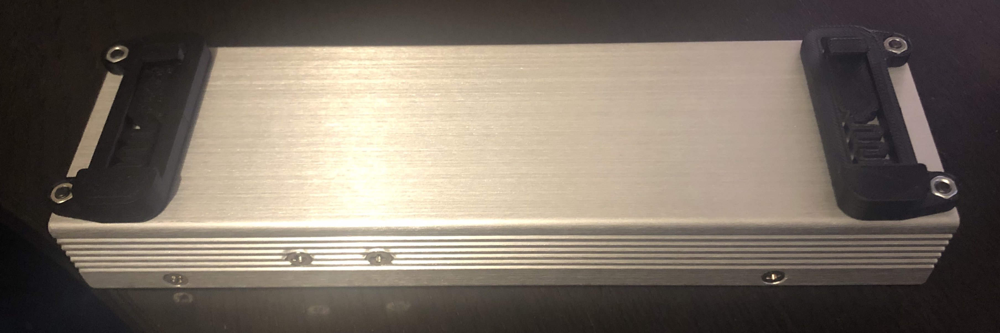
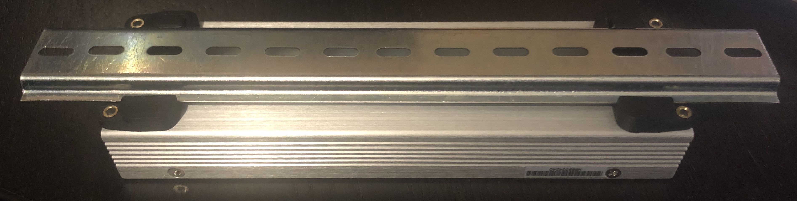

# UHP PSU Bracket

## Overview
This is a DIN 3 Rail (35mm W) bracket for the Mean Well UHP-200 series powersupply edited from [the official Voron Mean Well LRS series powersupply bracket](https://github.com/VoronDesign/Voron-2/blob/Voron2.4/STLs/VORON2.4/Electronics_Compartment/DIN_Brackets/lrs_psu_bracket_clip.stl). This design has 2 versions, one with an embedded nut and one with an heat-set insert.

The double rail version is made for the spec rail distance and doesn't work for other distances.

I added the CAD files so editing to other sizes should be wasy. If you can't do it yourself hit me up on Discord.

## BOM
* 4x M3x6 BHCS.
* 4x M3 Hexnut. **OR** 4x M3 Heat set inserts (M3x5x4).

## Printing instructions
No special printing instructions. Part doesn't have to carry much weight.

## Assembly instructions
Personally I added a little glue to the embedded nut to make it stick, but this is not needed.

For the double rail version you're supposed to screw the UHP to the last clip after attaching the clips to the rail.
Making a version that could be attached without this lost gripping strength or made the part harder than it needed to be.

## Questions
Reach me in Voron's [Discord](https://discord.gg/xgXWctB) @MarcPot#3983 if you have any questions.

## Images

