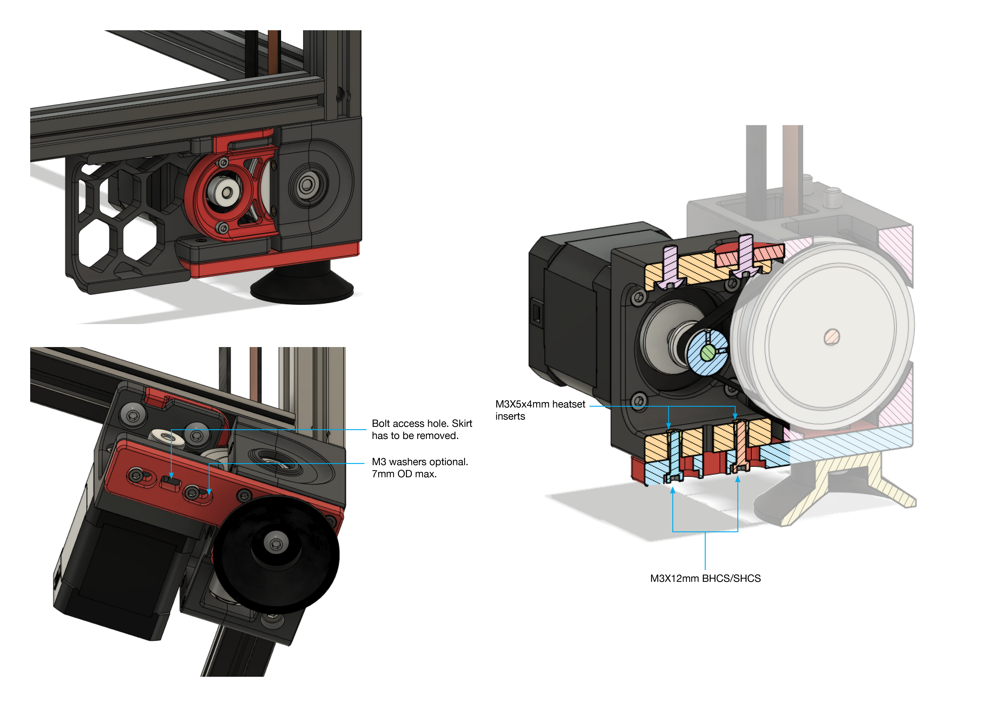

A Team Dropbear Production

# V2.4 Z-Drive Motor Tensioner Mod

Mod that replaces the motor tensioner assembly in the z drive to make it better braced and eliminates chance to rotate/twist when you tension and potentially when the drive operates. The stock motor tensioning had the tendency to flex if not tightened/installed carefully, causing the closed loop belt to easily rub against the pulley flanges. I prefer being able to lock down the entire z drive as a single unit, hence the design choices.

Unfortunately, the skirt geometry changes, so you will have to reprint the front skirts entirely. Besides that, you only need to reprint the motor bracket and the base plate for this mod.

For this reason, this mod is entirely OPTIONAL. Perhaps consider it if you are starting a new build or you wish to improve over the current z drives and are willing to print more plastic.

## Installation & Parts Required.

 In the image, the heatset inserts are inserted from the top of the motor mount; you can easily install this from the bottom as well.

Extra parts that you will need (2x per drive, therefore 8x in total):

- 8x M3X12mm bolts
- 8x M3X5X4mm heatset inserts (the specced ones in Vorons)
- 8x 1mm M3 washers/shims (7mm OD max, optional)

Tensioning process is the same as stock V2.4, with exception of needing to tighten down two more bolts once you are done. For the skirts, the hole placement for the bottom panel clips are shifted compared to the original; however, you only need to adjust the bottom clip position relative to the bottom panel. The bottom panel remains unchanged and does not need any tweaking. There are bolt access holes to allow you to reach the grub screws of the pulley from below, but note that due to the skirt and belt cover, you will need to remove those for access.

-edwardyeeks (edwardyeeks#6042)

## Change log
2022-05-10 - skohls - Added compatibility for v2.4r2 with updated versions of the bottom plates
