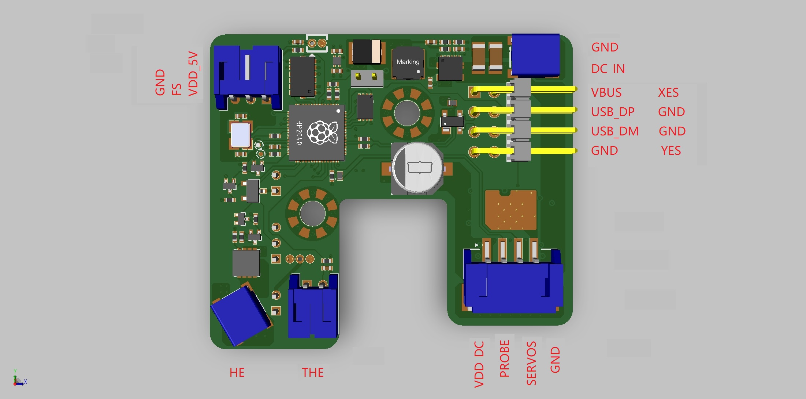
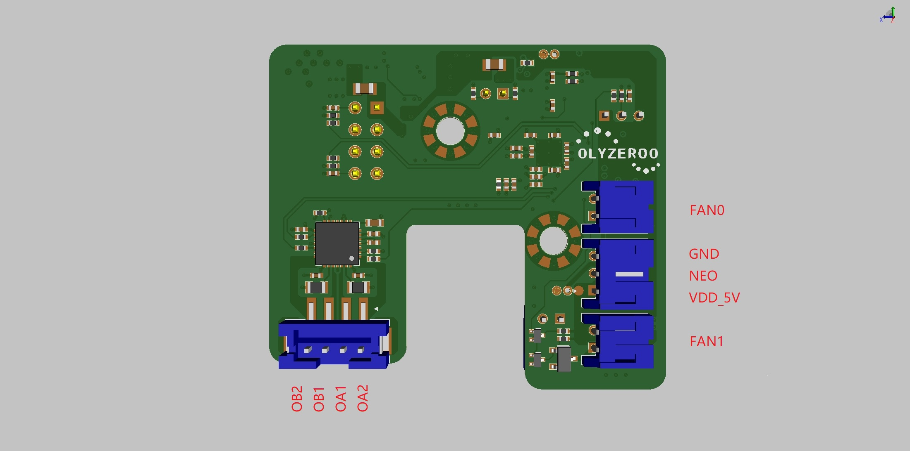
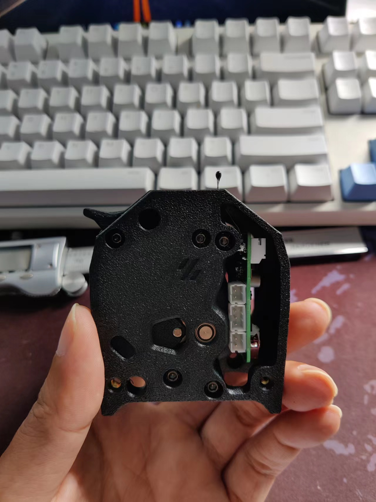
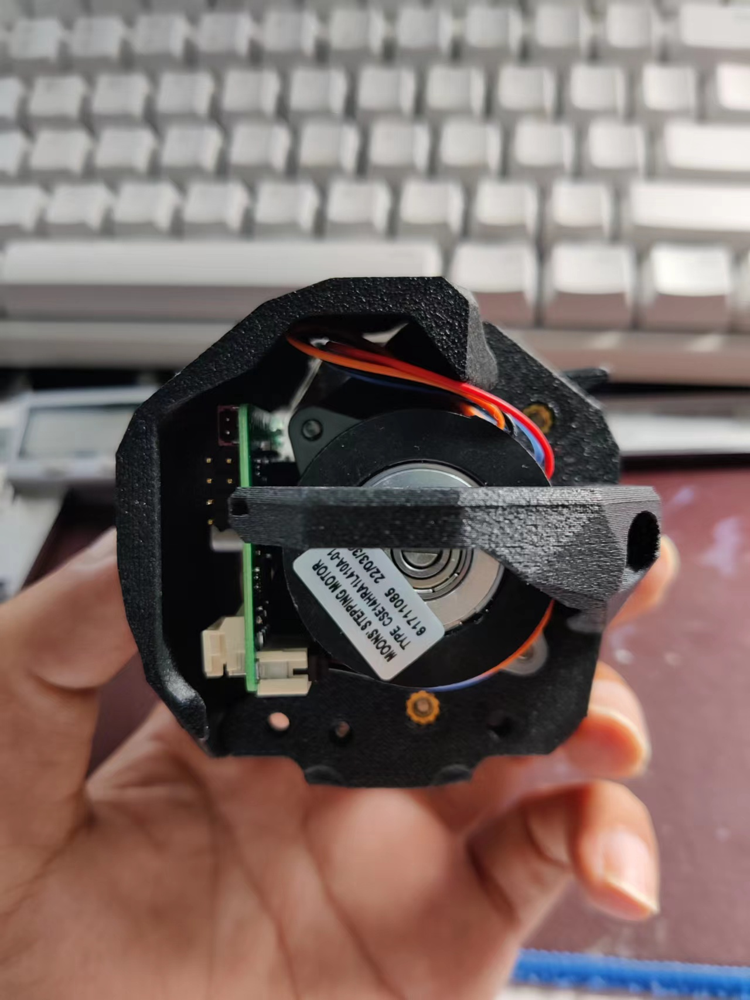

# CW2 USB Toolhead Board #
## VERSION 1.0

## The board has: ##
 - 2 pin JST SFH hearer for DC input
 - 8 pin 2.54mm header for usb and  X/Y Endstop Signal
 - 2/3/4 pin headers for most components on the toolhead
 - 2 pin JST SFH hearer for the heater
 - DIP thermistor to be used as a chamber temperature 
 - On board ADXL345
 - 22awg should be fine for 24v, GND, and HE0 and 24awg for everything else 
## Wiring Pic ##
 
 
  
 
## Here is how the board and PCB spacer get installed using 2 M3x8 SHCS ##

