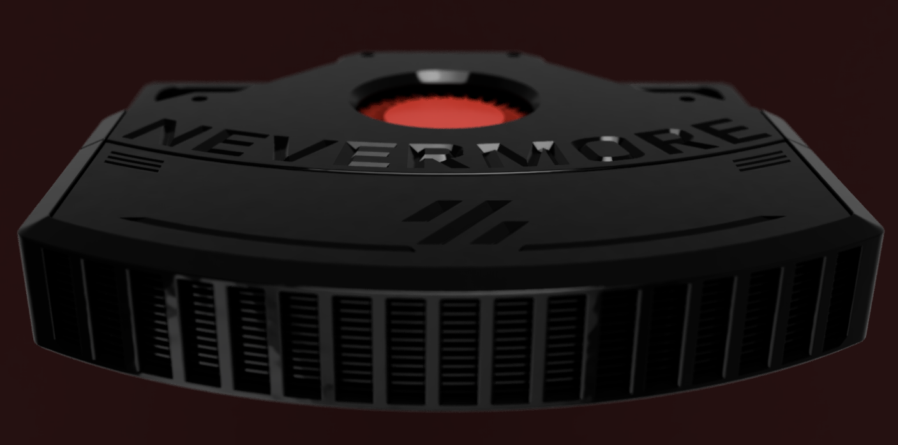
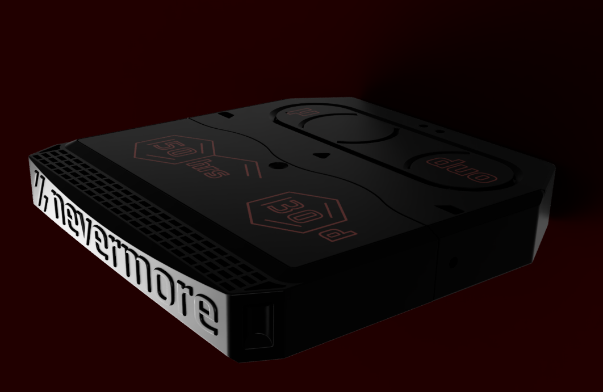
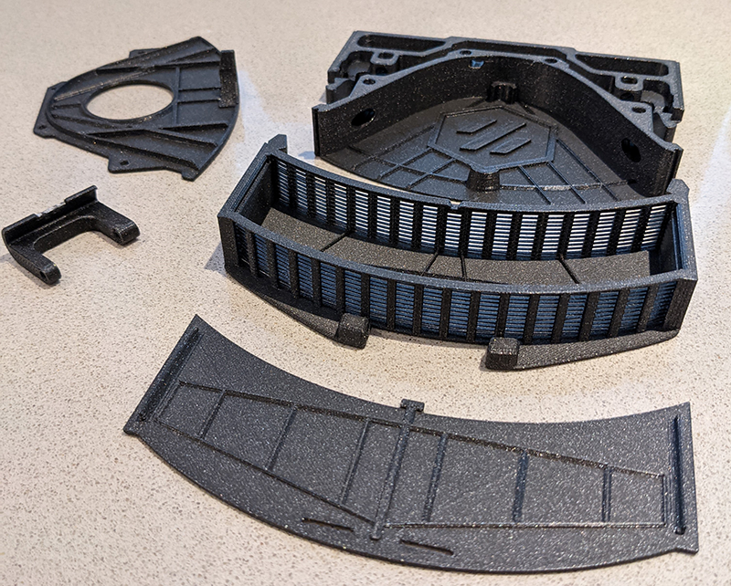
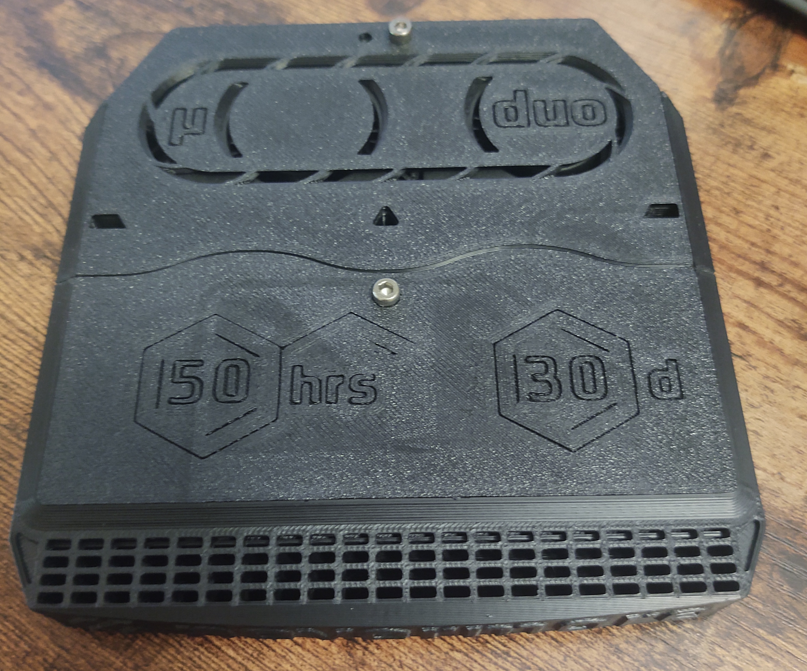
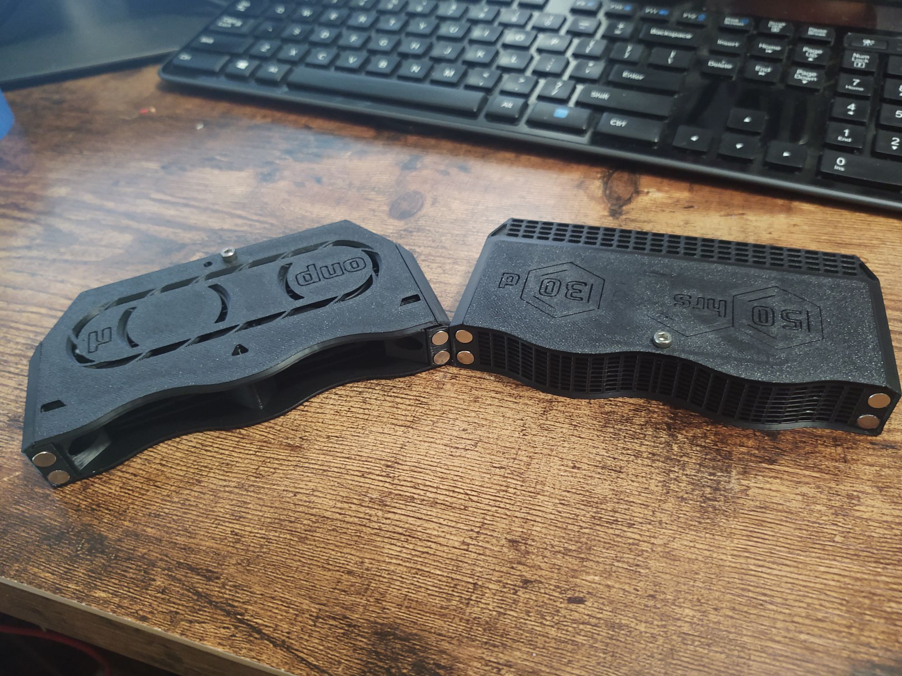

# Nevermore Activated Carbon Filters - Micro Edition

Originally intended as a carbon fume filter for Voron V2, it has found its way into a multitude of other machines including variants for V0, V1, V2, and more.

- [Nevermore Activated Carbon Filters - Micro Edition](#nevermore-activated-carbon-filters---micro-edition)
  - [Nevermore V4](#nevermore-v4)
  - [Nevermore V5 Duo](#nevermore-v5-duo)
- [Getting Started](#getting-started)
  - [BOM (V5)](#bom-v5)
  - [BOM (V4)](#bom-v4)
  - [Assembly](#assembly)
- [Credits](#credits)
  - [Contributing](#contributing)
  - [License](#license)
  - [Contact](#contact)
  - [Acknowledgements](#acknowledgements)
  - [Special Thanks](#special-thanks)

Nevermore Micro V4 (single fan)

Nevermore Micro V5 Duo (dual fan)

## Nevermore V4

Nevermore V4 is a refinement of the V3. V4 adds a air guides, as the previous versions had the majority of air flow on just one side of the filter (most recent version has all supports removed yet again!). The cartridge lid also mounts a bit sturdier, and V4 now has separate base pieces for use with Vorons other than 2.4.

The V4 was the first official release of the Nevermore Micro to the public.

## Nevermore V5 Duo

Following the V4, the V5 Duo was released that changes the direction of air flow, better suited for when the Nevermore Micro would be placed flat on the bottom or top of the printer.

The V5 Duo also adds an additional 5015.

_(Nevermore V5 Duo. used with permission from Tightwad(JT)#6055)_

This repository hosts both versions, as they the same in design and function.

# Getting Started

For the most up-to-date documentation, information on the toxicity of VOCs, HEPA filter options, and more, please refer to the latest Github repository for the Nevermore Micro:

<https://github.com/Nevermore3d/Nevermore_Micro>

> **_NOTE:_** MADE FOR ABS/PC/PETG - USE A DECENTLY HEAT RESISTANT FILAMENT !!

> **_NOTE:_**: Since you are committing to fan dissection, be aware a 5015 used for a NM Micro will most likely never find a different purpose!

## BOM (V5)

- 2x 5015 blowers (rating above 200Pa / 20mmH2O / 1 inH2O)
  - Sunon Maglev MF5015VX (high speed version, 6000 rpm. The 5000 rpm might be okay also)
  - or, the $4-6 GDStime 6000rpm Dual Ball bearing on Aliexpress
- 5x M3x0.5mm Heatset inserts (standard voron issue)
  - 2 for seating plenum to base
  - 2 for seating plenum lid to plenum
- 8x 6x3mm cylindrical magnets
- 1x 2 pin JST header
- 4x M3x16 BHCS
  - for heat inserts that go into the four fan tabs
- 1x M3x18 BHCS
  - ONLY for delta and v1.8 variants
- 1x M3x6 BHCS
- 1x M3x4 BHCS
  - for the extra hole in the plenum@lid for symmetry (it doesn’t attach to anything and is totally optional)

Acid-free Activated Carbon

- 4mm Active Carbon Air Filter Pellets

Optional for the cartridge closure

- 1x M3x0.5mm Heatset inserts
- 1x M3x6 BHCS

Optional for Vorons or any printer with 2020 extrusions

- 2x M3x12 SHCS
- 2x M3 2020 T-Nuts

## BOM (V4)

- 1x 5015 blowers (rating above 200Pa / 20mmH2O / 1 inH2O)
  - Sunon Maglev MF5015VX (high speed version, 6000 rpm. The 5000 rpm might be okay also)
  - or, the $4-6 GDStime 6000rpm Dual Ball bearing on Aliexpress
- 4x Heatset inserts (M3x0.5mm, standard voron issue)
  - 2 for seating plenum to base
  - 2 for seating plenum lid to plenum
- 8x 4x6 mm or 3x6 cylindrical magnets
- 1x 2 pin JST header
- 2x M3x10 SHCS
  - for seating plenum to base
- 2x M3x6 BHCS (any size, fits up to 20mm)
  - for seating plenum lid to plenum

Acid-free Activated Carbon

- 4mm Active Carbon Air Filter Pellets

Optional for Vorons or any printer with 2020 extrusions

- 2x M3x12 SHCS
- 2x M3 2020 T-Nuts

## Assembly

For the latest assembly instructions, pictures, guides, and modifications, please visit the Nevermore Micro github repository.

<https://github.com/Nevermore3d/Nevermore_Micro>

# Credits

The Nevermore Activated Carbon Filter was modelled in [Fusion 360](http://autodesk.com).

## Contributing

Please contribute! I'd like to incorporate VOC sensors, making the filter smart (running on low-noise mode at an acceptable VOC level, then ramp up at the end to clean more thoroughly before doors open).

<https://github.com/Nevermore3d/Nevermore_Micro>

## License

Distributed under GNU General Public License version 3.0 (GPLv3)

## Contact

- Discord: Nevermore Activated Carbon Filters - (<https://discord.gg/x6yggSpQgv>)
- Nevermore: [https://github.com/nevermore3d](https://github.com/nevermore3d)

## Acknowledgements

- [The Voron Dev Team](https://vorondesign.com/)

## Special Thanks

- [eduncan911#4852](https://github.com/eduncan911) as the Git Guru to publish all of this
