# V2.4 Handle

Carrying handle for Voron 2.4 with 6mm clearance for panel clamping. The design was heavily inspired by https://github.com/yanyixiang/Voron/tree/main/%E8%88%92%E6%9C%8D%E5%9D%9A%E5%9B%BA%E7%9A%84%E6%89%8B%E6%8A%8ABY_%E8%B7%AF%E6%98%93%E6%96%AF%E4%BA%9A%E7%BB%86%E4%BA%9A.

The handle is mounted on 2020 aluminium extrusions with 5 T-nuts. It should also fit on Trident and Voron 1.8.

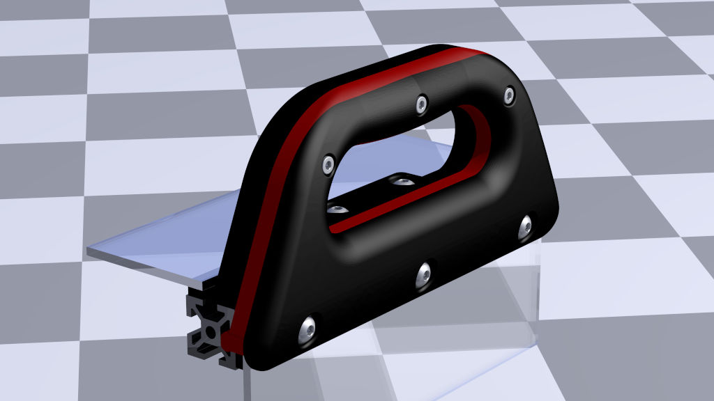
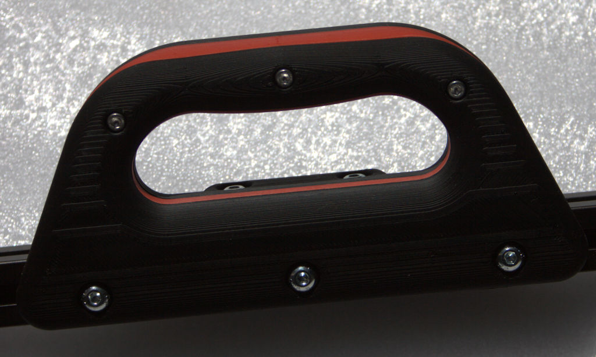

## Printing
  * default Voron print settings
  * no supports needed
  * use accent color for middle part

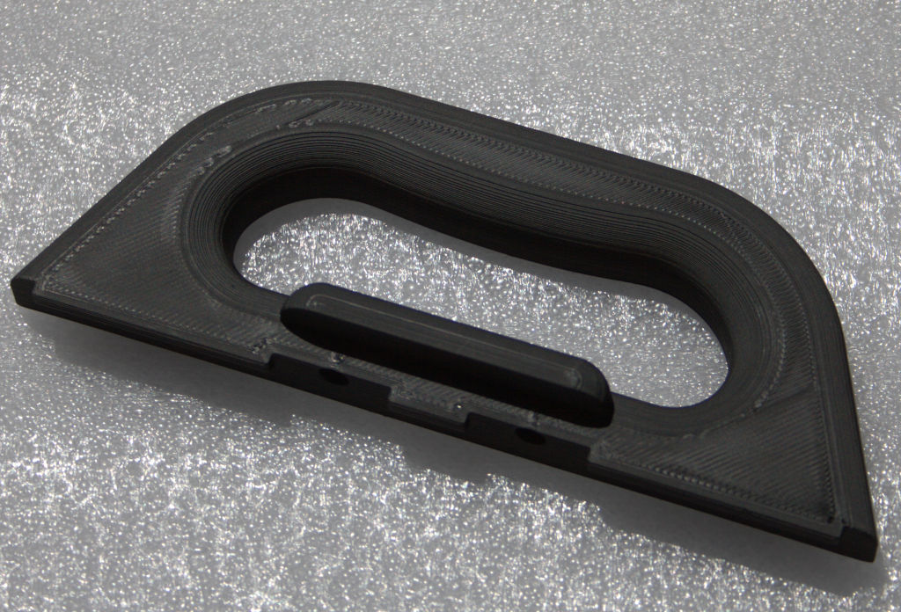
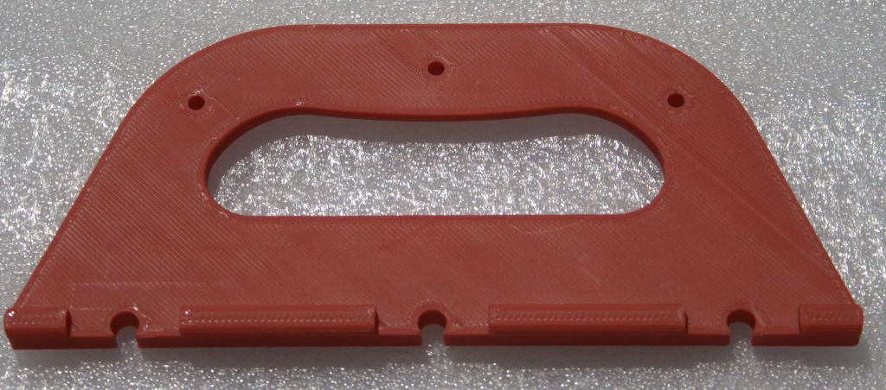
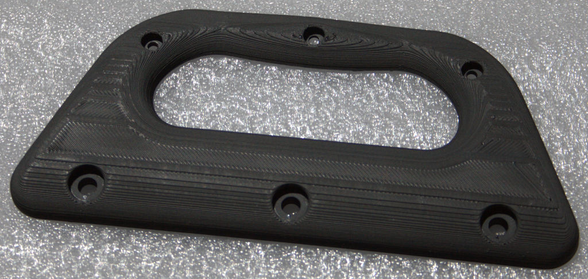

## BOM

Size | Qty
--- | ---
M3x12 SHCS | 3
M5x16 BHCS | 5
M5 T-Nut | 5
M3 heat set inserts | 3

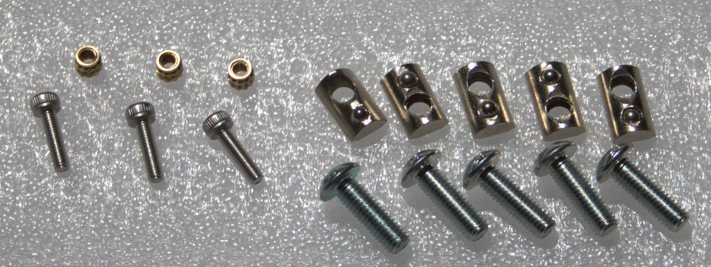

## Assembly instructions

1. put heat set inserts in inner handle part

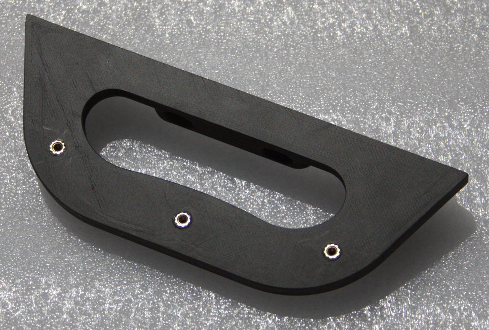

2. put T-nuts in aluminium extrusion (2 T-nuts in top slot, 3 T-nuts in side slot, coarsely adjust hole distances)

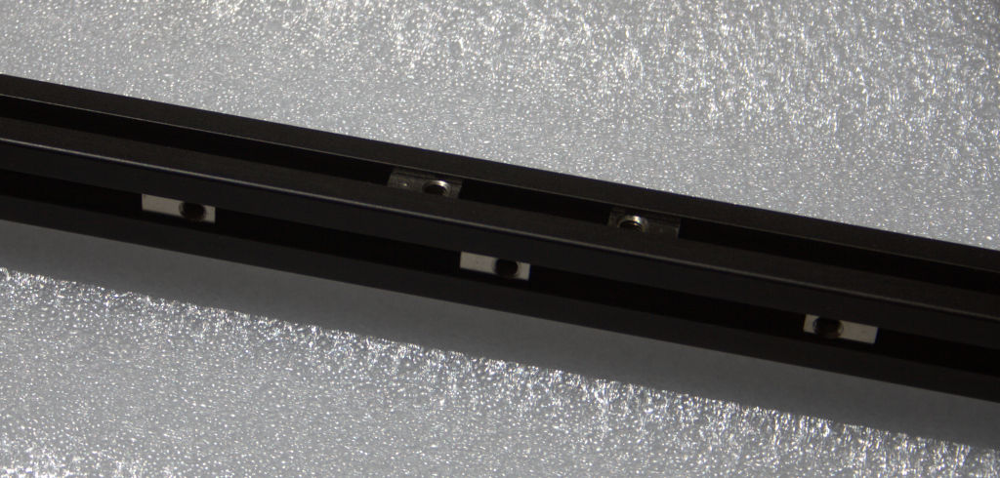

3. attach inner handle part to top side of the extrusion
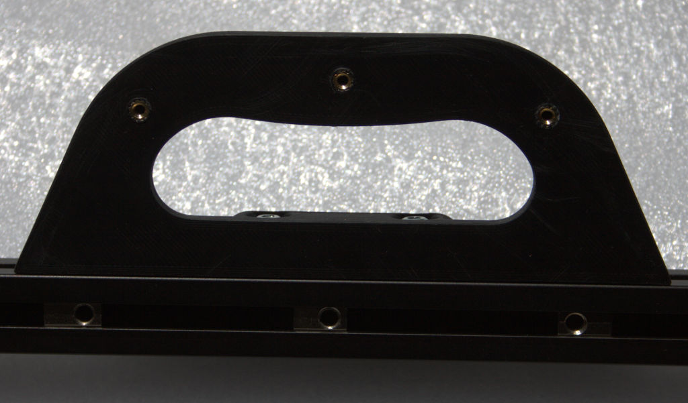

4. attach middle and outer handle part to the side of the extrusion; do not tighten M5 screws yet
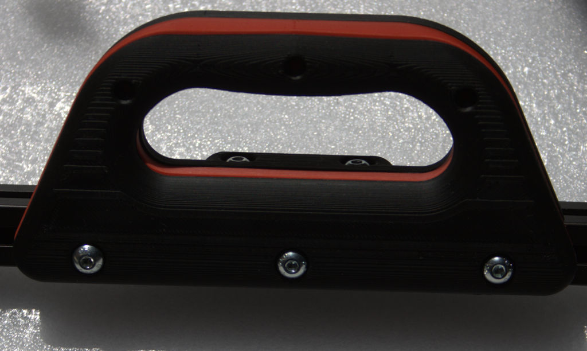

5. align parts and put in M3 screws; tighten all screws
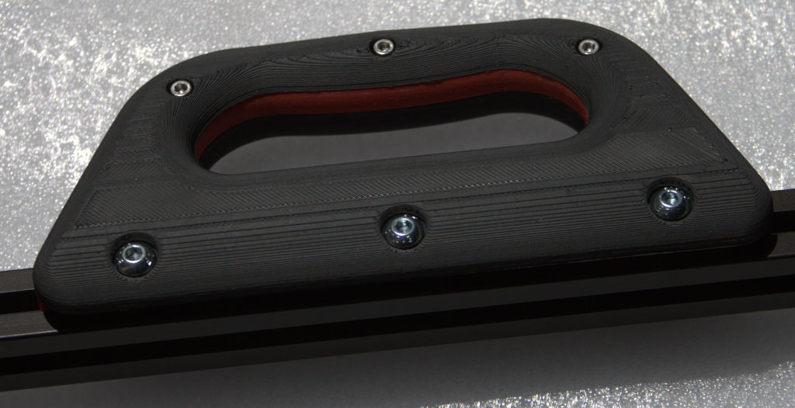
