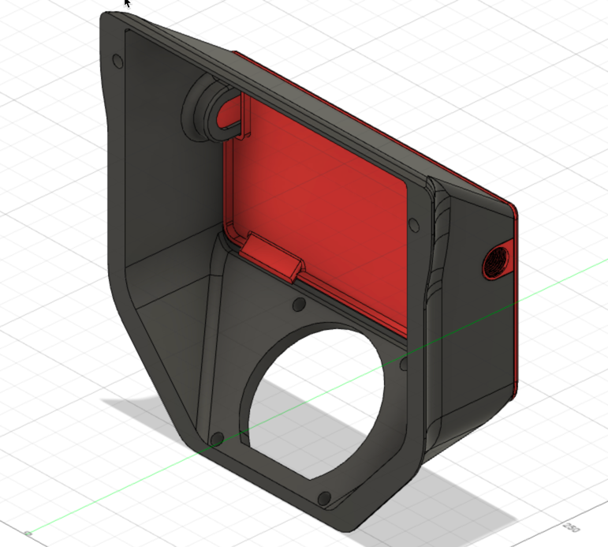
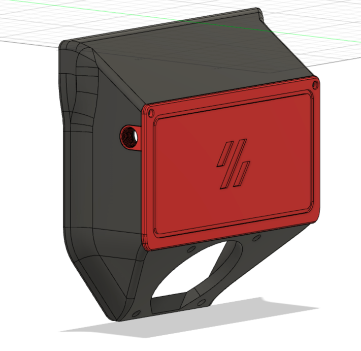

<h2>Side Entry Exhaust Housing</h2>

A modified version of the two-bolt cover Trident exhaust housing that removes the top reverse bowden and allows for one or two side entry ports for filament.  The inserts are printed in the strongest orientation and include a threaded insert and a blank insert for single routing through any chosen side, or dual entry if desired.  

Will also work on a V2.4 but the entire assembly must be replaced.

