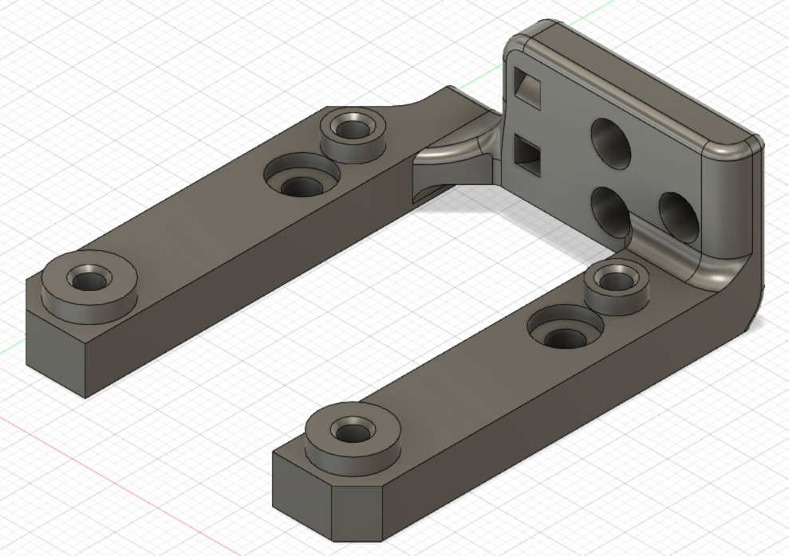
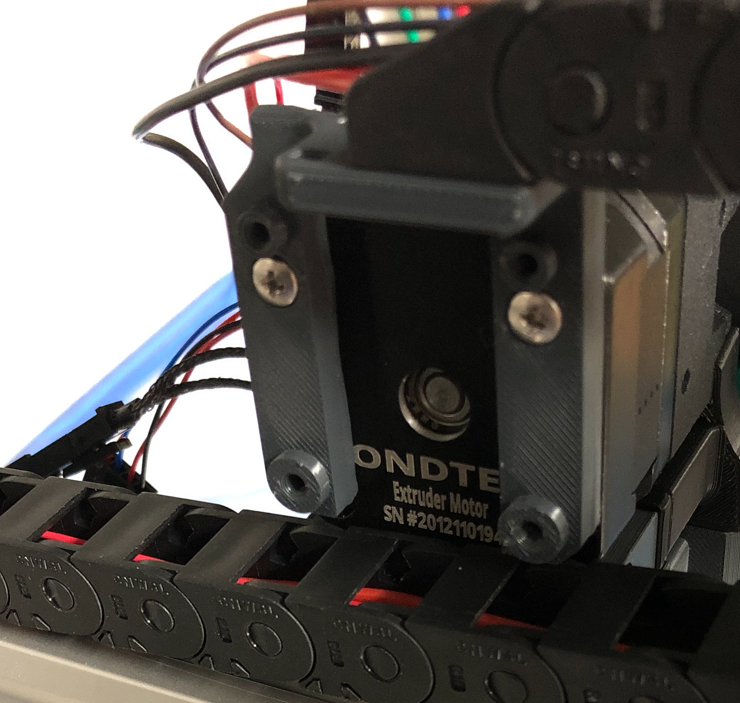
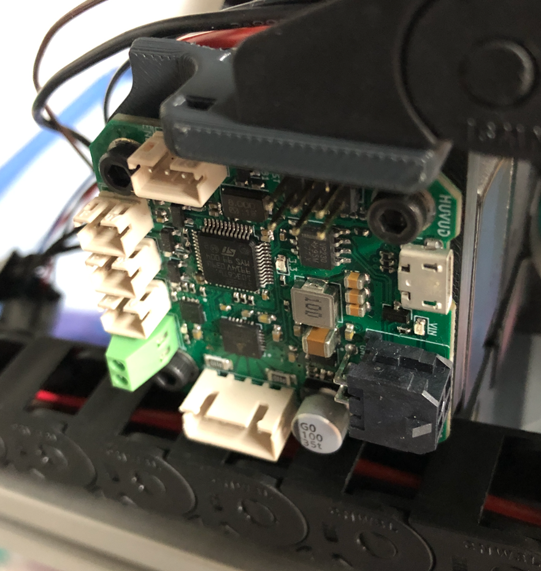

<h2>Huvud Cable Chain Mount</h2>

A mount for the Huvud toolhead board that mounts on the back for cleaner wiring but still allows for the use of a cable chain. Moves the assembly 6mm up to clear the chain at X0 as it rises onto the X joint.  Has space for airflow between the motor and the Huvud to keep temperatures reasonable and includes a wire tie spot for wires coming out of the chain.  Current only configured for 3-bolt generic chains. Works for both Clockwork and LGX.

Parts Required:

* (3) M3 heat set inserts for the chain
* (3) M3x6 FHCS to mount the chain
* (2) M3x25 BHCS to mount to the motor
* (4) M3x8 SHCS to mount the Huvud.

Installation:

* Remove the printed support.
* Install the 3 heat set inserts.
* Remove the upper two screws of the motor.
* Install the mount with the two M3x25 BHCS.
* Attach the Huvud with the four M3x8 SHCS.  The screws will thread into the plastic. _Be sure to check clearance between electrical components and the M3 BHCS screws underneath_
* Attach the chain with the three M3x6 FHCS.

Designed for the Trident but will also work on a V2.4, just be conscious of clearance to the Z chain.

