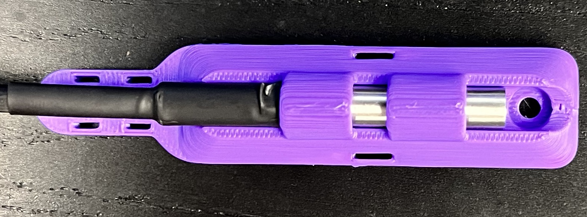

# DS18B20 Waterproof Mount
### For Voron 2.4

Attach anywhere on the 2020 extrusion using two M3x8mm screws.
Use a ziptie to secure the sensor to the mount, and two zipties to secure 
the cable.

### Printing:

Use standard Voron settings, print with the back on the bed
