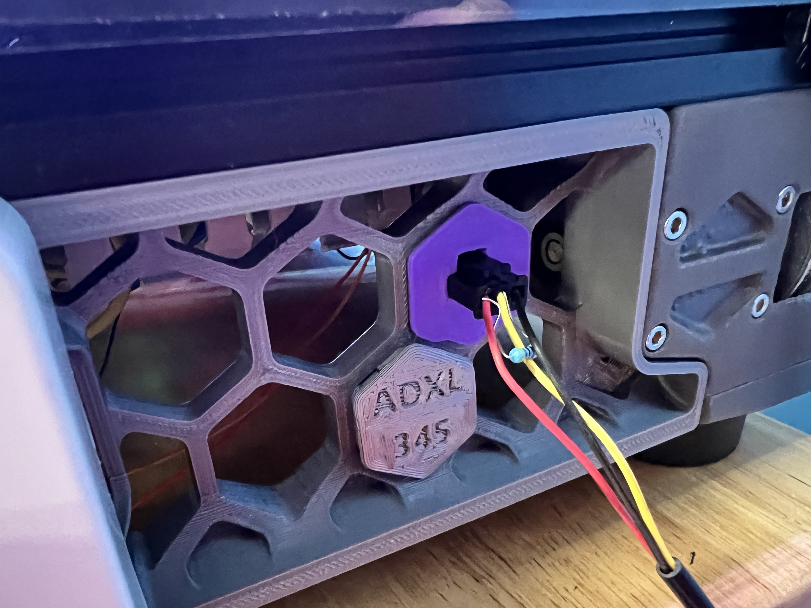

# MicroFit 3-pole Skirt Keystone
## For Voron 2.4

*This is a remix of [ADXL Mount for Voron 2.4 
Skirt](https://www.printables.com/en/model/215983-adxl-mount-for-voron-24-skirt) 
by Dragi2k*

I wanted a 3-pole MicroFit 3.0 connector in a nice spot for my DS18B20 
digital temperature meter, so I made this!

### Printing:

Please print with the face-side up. 
Can be printed VERY quickly. 
