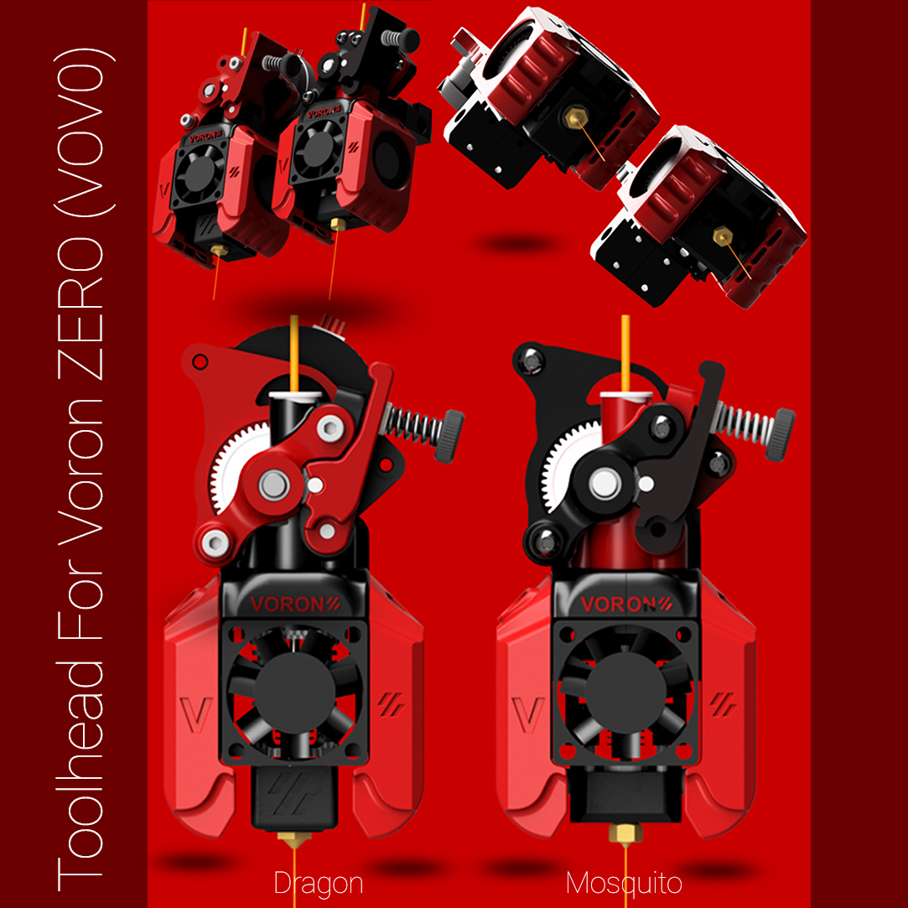
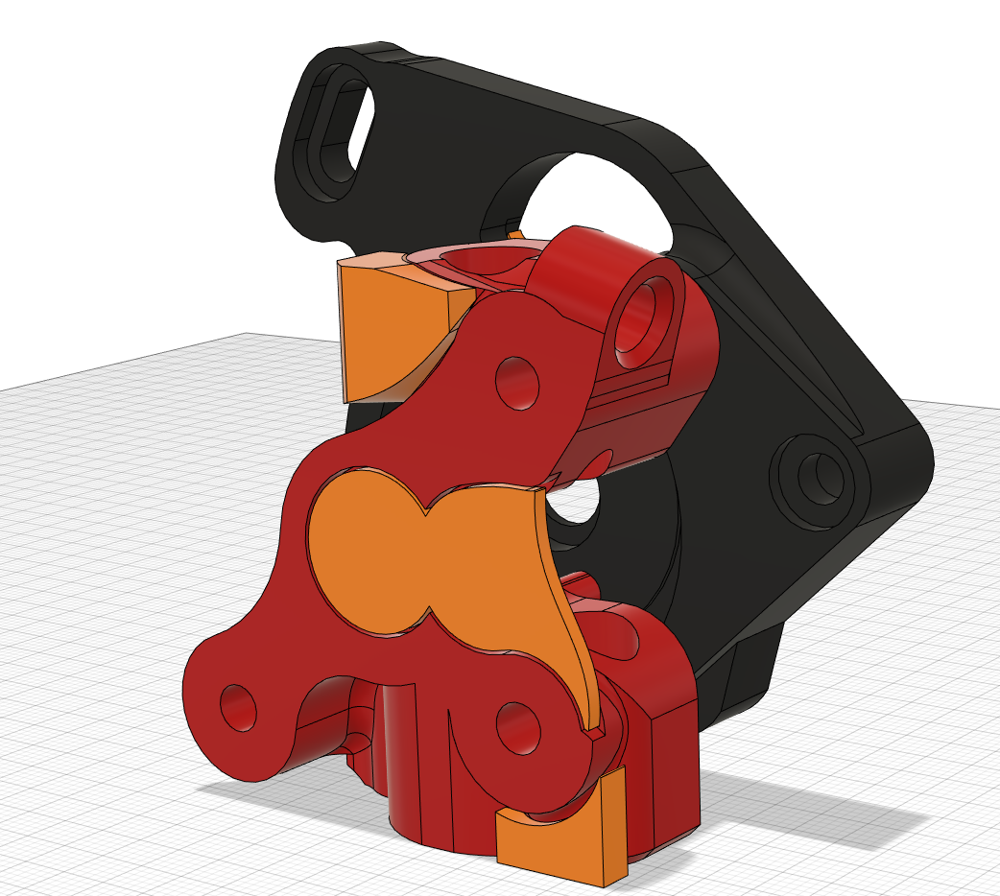
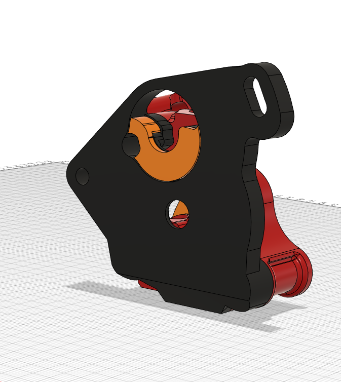

# Voron Zero (VOV0) toolhead 

## Dragon / Mosquito 

### Based on HeVort extruder( By MirageC with Big thanks to Him on this awesome design )

# Updated Version Re.01 
## AirFlow improvement for the fanDuct 

<<<<<<< HEAD
# Update 04/10/2021 
## pre-support files 

=======
>>>>>>> 9051082fbf0a41bcb708deccab0613bfcbd192c5

## How to print supported parts to VOV0 tool-head
https://www.youtube.com/watch?v=CkwsMm29IuA

Print Setting 
- download the pre-supported .3mf file 
- choose for support enforce only 
- 3 perimeters 
- 5 solid top 5 Bottom layers 

# Video assembly ! !

# BOM 

- BMG kit

- 2x M3X8mm

- 2x M3X10mm Button head

- 2x M3X40mm (FanDuct) 

- 2x M3X25mm 

- 1x M3X20mm

- 2x dragon / mosquito 2.5mm screws

- 7x heat brass insert (BOM insert)

/// LDO Nema 14 Motor 
https://fr.aliexpress.com/item/1005002900085330.html

/// BMG Kit with and without motor 
https://fr.aliexpress.com/item/1005002487451377.html

/// Plastic PTFE Bowden fitting
https://fr.aliexpress.com/item/1005002487819739.html
/// M3 Heat insert 
https://fr.aliexpress.com/item/4000761483243.html

## Appreciate my work ?

buy me a coffee 

https://www.paypal.com/donate/?hosted_button_id=9EL8CEDVY28DA

thank you and happy printing 
