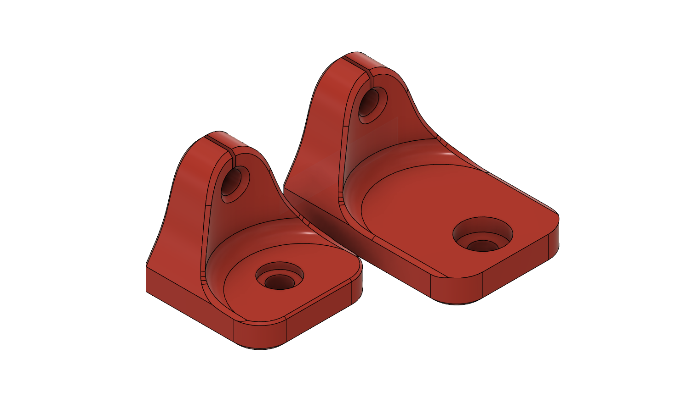
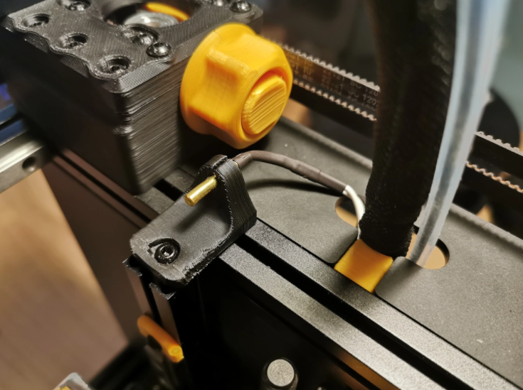

# Thermistor Holder Zero

This is a really simple remix of the thermistor holder by [samwiseg0](../../samwiseg0/extrusion_thermistor_mount/README.md). It increases the length of the flange to give clearance for the voron zero printhead and X axis. You can see a comparison of the original version vs my extended version. 

## Assembly

Linked products are an example, other brands work just fine! That said using the affiliate link helps support future developments and costs you nothing :)

BOM:
- 1x [cartridge thermistor affiliate link](https://s.click.aliexpress.com/e/_AYgKAl) / [cartridge thermistor normal](https://s.click.aliexpress.com/e/_AYgKAl)
- 1x M3x8mm screw
- 1x [printed thermistor holder zero](thermistor_holder_zero.stl) 

You may need to tap a m3 thread in the top end of the left hand vertical Z extrusion (aim for 10mm depth of thread). Once tapped bolt the printed thermistor holder on using the M3x8 screw. The thermistor can then be pushed into the holder and the wire poked through the hole into the electronics bay.

For info on wiring etc. please take a look at the guide I did [here](https://3dpandme.com/?p=406) as part of a general upgrade to my V0.1

## Feedback

Feel free to contact me - I'm Slzer#2881 on the discord.

