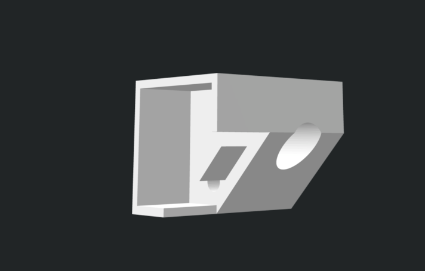
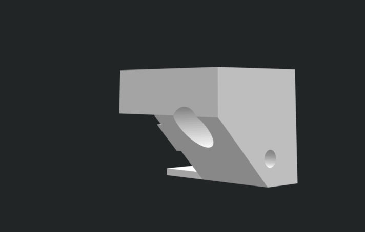
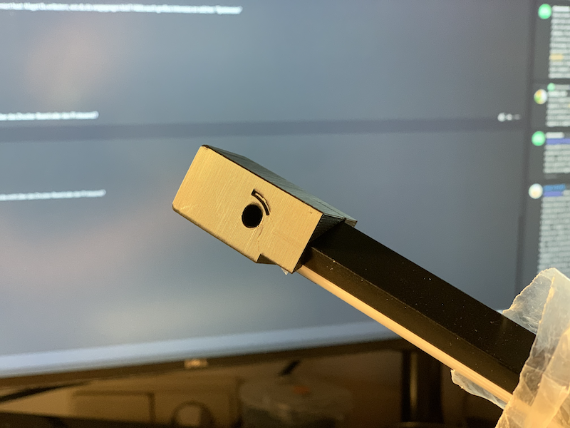
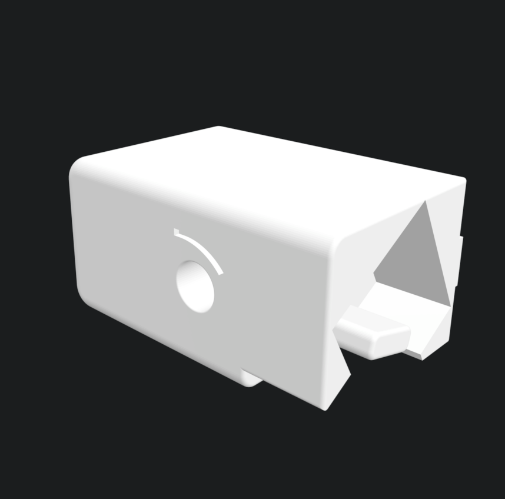
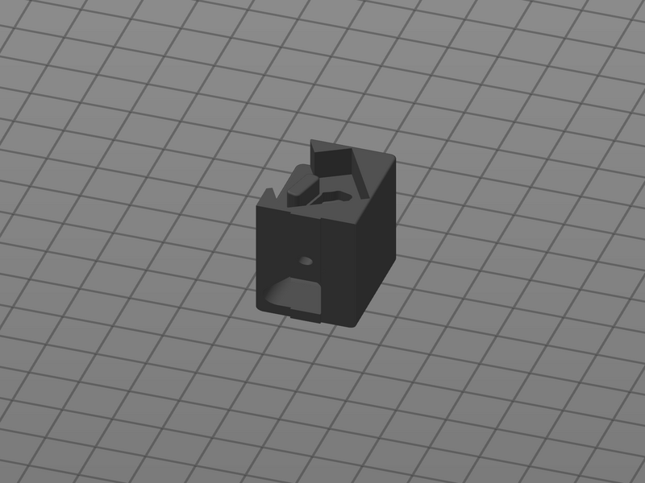

Simple LED-mount for [Lumentech LT3 profiles.](https://lumentec.eu/Aluminium-Eckig-LED-Profil-100cm-45-fuer-8-12mm-LED-Streifen-Profil-LT3-Abdeckung) 
Works with 8-12mm LED stripes 

v0.1 needs two M3x10 screws / set and T- or hammerhead nuts to mount on normal 2020 extrusions. 
v1.0 "AngryLED"  needs two M3x20 screws / set and T- or hammerhead nuts to mount on normal 2020 extrusions. 
 optimized cable path so that the cable goes into the extrusion nut
 
 
v0.1 

 
v1.0 

