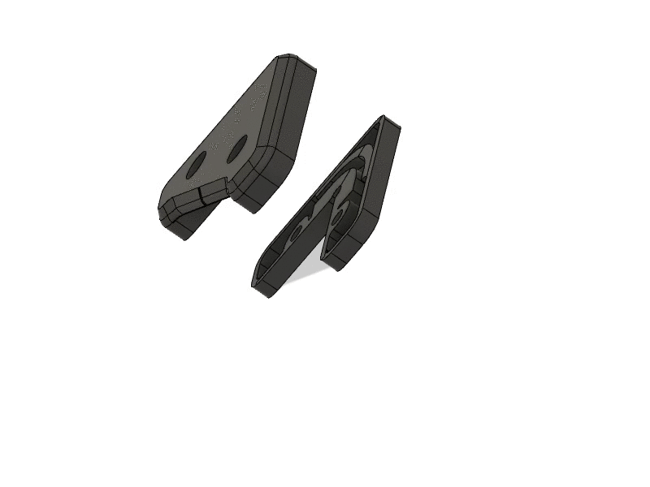
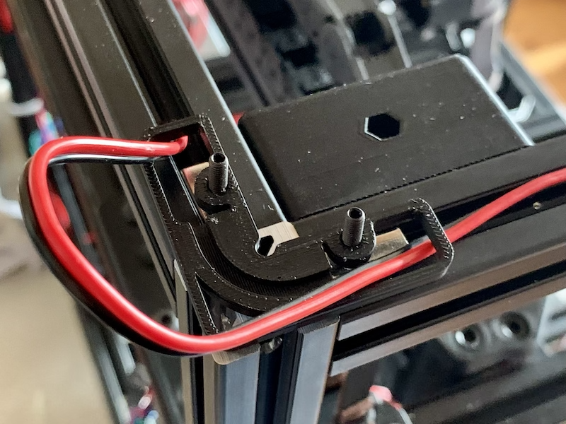
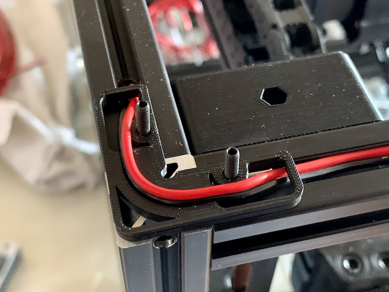

Corner panel clip with a internal cable path, so you can route the cables around the panel and corner. 
I use them to mount 6mm floatglas as top panel with 3mm foamtape 
 
corner_panel_clip_top_4mm.stl is 4mm and corner_panel_clip_bottom_3_5mm.stl is 3.5mm hight, so at the end there is 7.5mm space for the panel and foamtape. 
Needs 2x M3x12 screews to mount per clip. 

