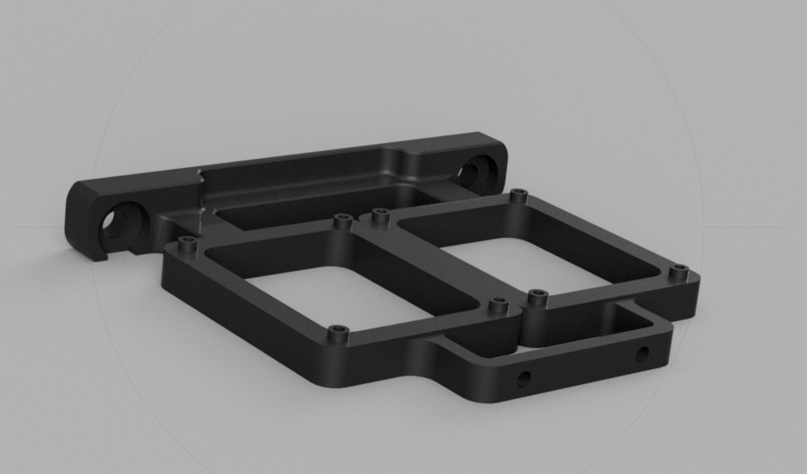
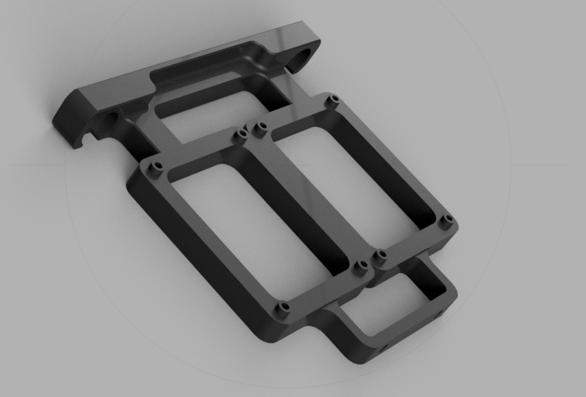

Simple relay-mount for 2x [2 channel relay modules](https://www.makershop.de/en/module/relais/2-kanal-relais/) - e.g. for [moonraker power plugin.](https://github.com/Arksine/moonraker/blob/master/docs/web_api.md#power-apis) 
Mount with two M5x8 screws and T- or hammerhead nuts to normal 2020 extrusions. 
4x or 8x M2x8 self tapping screws to mount the relay module.
 

 

version: 0.1 

