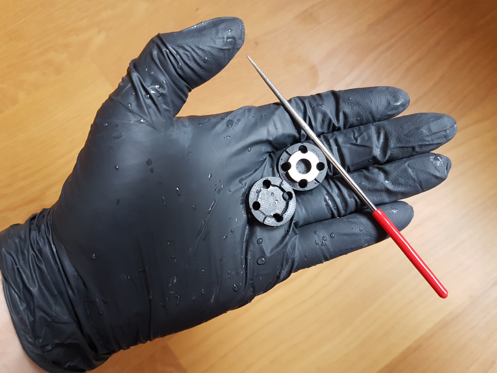

# Piezo probe for Stealthburner Dragon hotend

## Overview
This mod integrates a piezo sensor into the Stealthburner Dragon toolhead so that the nozzle can be used as Z probe. The electronics from https://www.precisionpiezo.co.uk, is needed to generate a trigger signal.

A mechanically modified piezo ring intended for ultrasonic welding or cleaning is used as sensor element.

__Advantages:__
- No Z-height adjustment needed because the nozzle is the probe.
- No XY probe offset.
- Accuracy reported by PROBE_ACCURACY is better than 3 µm.
- No compliance added by the sensor (piezo element is very rigid).

__Disadvantages:__
- Care is needed in filing the piezo rings. They are brittle and I slightly chipped my first ring, but succeeded on the second. Shipping the rings was costly but the rings are cheap, so I ordered a couple more.
- Adjustment of the electronics is needed on the trim pot until a good sensitivity balance is found.
- Cost

The documentation on the precisionpiezo website has lots of background information.

A piezo sensor ideally is located in a part that is stationary during probing, so that vibrations are less likely to trigger the probe. I marked this mod as compatible with the Trident only, but mechanically can be used in all SB capable printers. If the sensitivity is correctly adjusted and acceleration and jerk reduced for the probing, it should work for other printers as well.

## BOM
* 1x Piezoelectric Ceramics 15x7x3mm PZT8 from PZT / ebay / ali
* 4x M2.5x14 SHCS 
* Universal Piezo Z-Probe PCB v2.85 from precisionpiezo
* round Diamond file

## Printing instructions
Normal Voron print settings.

## Assembly instructions
The piezo disc is sandwiched between the two identical "tool_x2.stl" parts and the four breakouts are filed with the diamond file.

The brittleness of ceramics is especially critical on the edges. They need to be filed a small bevel by only stroking away from the silver plated flat so that no chips are generated.

Because piezo ceramics can contain lead, the dust needs not to be kept out of your body. I filed under running water wearing gloves. 

The modified piezo ring is placed on "washer.stl" and assembled as shown below. The wire can be knotted to make a cable strain relief.

The electronics can be placed in the wire_cover_extended of the extruder.

I needed to reverse the polarity of the sensor ring to the circuit (+ side on - pin). Polarity can be tested by slowly pressing on the nozzle and then quickly releasing the pressure. If the circuit triggers when pressure is released, the polarity is wrong.

When the sensitivity of the circuit is adjusted correctly, I can not see any deflection of the Stealthburner toolhead when probing.

On the Fysetc Spider board, the probing voltage needs to be jumpered to 5V instead of the default 24V that is used for inductive probe.

## Printer.cfg

My probe section in klipper printer.cfg is as follows:

[probe]
pin: ^!PA3
x_offset: 0
y_offset: 0
z_offset: 0
speed: 15.0
lift_speed: 25.0
samples: 2
samples_result: median 
sample_retract_dist: 1.0
samples_tolerance: 0.01
samples_tolerance_retries: 2
activate_gcode: G4 P500

The activate_gcode adds 500 ms wait before the probing in case the probe was triggered by the tool head move to the probing position.

My probe speed is much higher than advised by precisionpiezo, but the results stabilized with higher speeds. I adjusted the circuit a little on the insensitive side to have stable results. If the toolhead moves when probing, sensitivity is too low (or polarity is reversed). 
