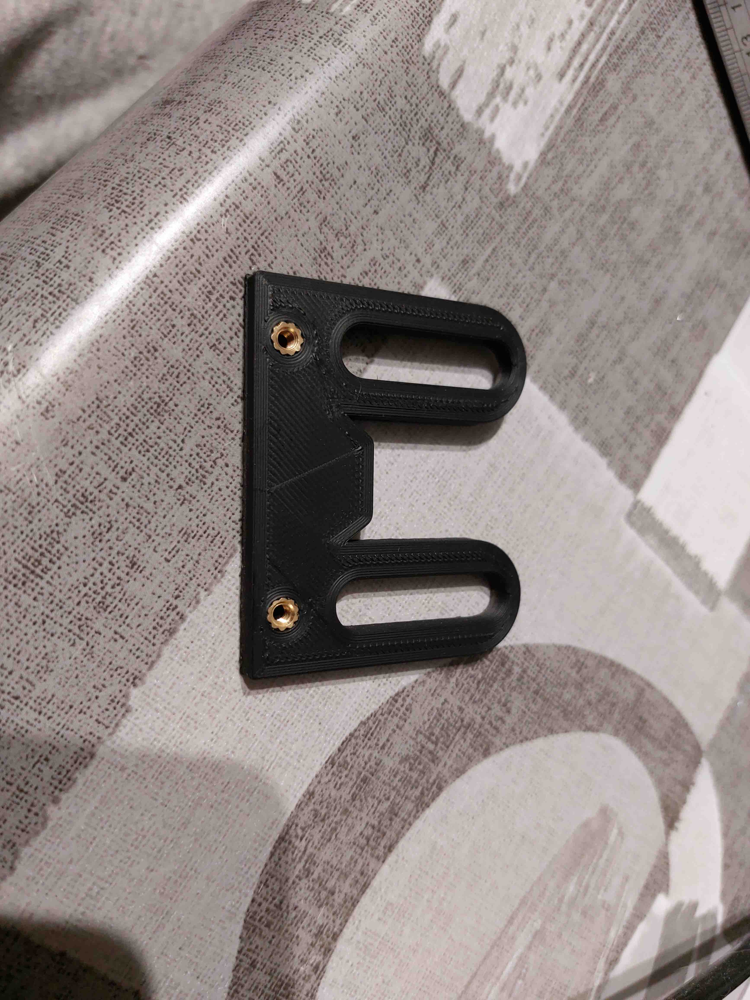
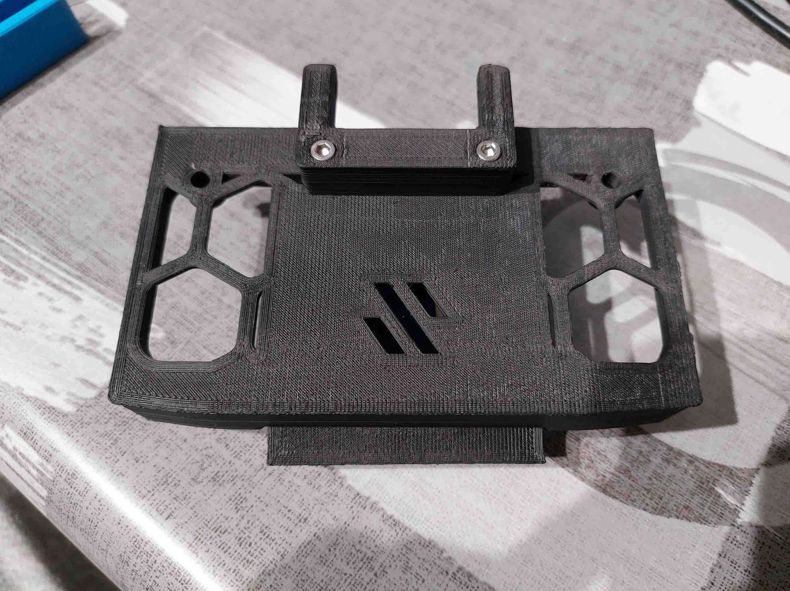
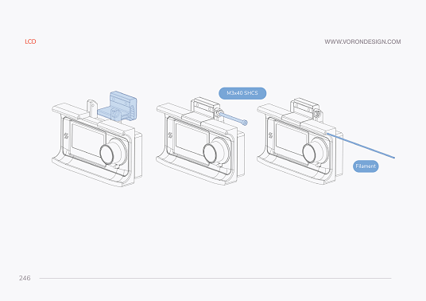

# Universal_Phone_Mount

Phone/tablet mount for the Voron 2.4. It replaces the mini12864 directly so it uses the official hinge (and mini12864_case_rear if you wish). I tried to keep the voron spirit and aesthetics.

This mount should work with the majority of smartphones out there, I also included some files to hopefully work with tablets if you wish to use one.
It consists of two claws on a slider that hold your device with the help of an elastic band. 

Check "Size and clearance" for more details and to choose what files to print for your needs.

# BOM

| Item  | Quantity | Description |
| ------------- | ------------- | ------------- |
| M3x40 SHCS | 1  | (included in the official BOM) |
| M3x8 SHCS | 2  |  |
| M3x12 SHCS | 4  | (included in the official BOM) |
| M3x6 FHCS | 4  |  |
| M3 Threaded Insert (M3x5x4) | 8  | (4 included in the official BOM) |
| M3 T-nut | 2 | (included in the official BOM)|
| Elastic Band | 1  |  |

# Printed Parts

Print the parts with the Voron recommendations.

| Preview  | Part Name | Quantity | Description |
| ------------- | ------------- | ------------- |  ------------- |
|  | case_front.stl | 1 | |
|  | case_rear.stl | 1 | If you already have the mini12864_case_rear you can use that instead |
|  | slider.stl | 1 | Choose the size for your needs, the number in the name is the maximum width it will support. (i.g. "Slider_80mm.stl" will support devices up to 80mm) |
|  | guide_x2.stl | 2 | |
|  | a_claw_top_X.Xmm.stl | 1 | Choose the size for your needs, the number in the name is the maximum thickness it will support. (i.g. "claw_top_7.5mm.stl" will support devices up to 7.5mm in thickness) |
|  | a_claw_bottom_X.Xmm.stl | 1 | Choose the size for your needs, the number in the name is the maximum thickness it will support. (i.g. "claw_bottom_6.5mm.stl" will support devices up to 6.5mm in thickness) |
|  | a_mini12864_case_hinge.stl | 1 | Original hinge from the main files|

# Size and clearance

The size of the claws and slider will dictate the compatibility with your device. If you wish to use multiple different devices, print a size that accommodates the biggest one, so you don't need to change claws when you swap devices.

The minimum supported width is around 58mm (with the slider_80mm), so if you device is smaller than that, it wont be properly secured.

The maximum device width inorder for the case_front to stay flush with the rest of the skirts is around 65mm. Larger than that and you need to pivot the mount forward. This depends largely on the surface your printer is on, if you don't have much surface infront of the printer, you won't need to pivot as much for larger devices such as tablets.

**Note:** If you wish to use multiple devices and the width changes substantially, you'll most likely need to change the slider when you want to swap devices, since the bigger slider might not close enough to hold the smaller device. The bigger claws, however, should still work with thinner devices.

If you are looking for a particular size that others can also use, give me a shout.

 
 
 

# Assembly

Exploded view:

_(Please don't mind the print quality on the photos, the parts were printed on my scuffed Ender 3 to get my 2.4 up and running :) )_

Start by inserting the M3 inserts

(insert on the far most left and right if you are using the mini12864_case_rear)

The elastic I used is around 60mm in diameter, I looped it twice on the parts. Any elastic should do as long as it's not too thick, you can cut and knot to the desired lenght/strength.

Put the elastic on the slider.

Place the slider on the case_front (M3 inserts facing up) and tighten both "guide_x2" with the M3x8 bolts. Then simply pull the elastic to it's retainer on the case_front. 

Place the claws, firmly tighten the M3x6 FHCS but not too hard.

Place the case_rear (or mini12864_case_rear) and tighten it down with the M3x12 bolts.

Follow the pages 246, 248 and 250 from the official voron assembly manual to assemble the mini18264_case_hinge and install the assembly in the machine.

Enjoy
