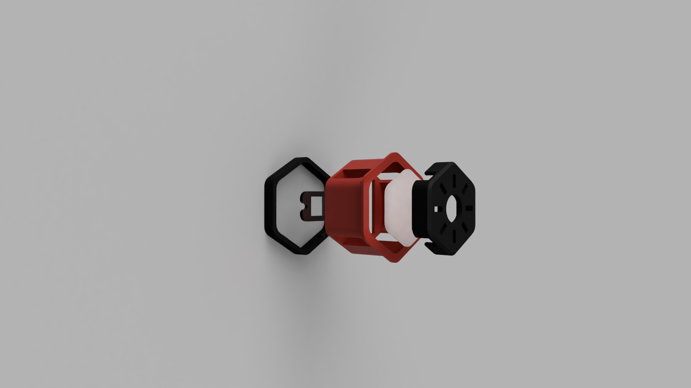

--------------------------------------------------------------------------------
Gcode Buttons
--------------------------------------------------------------------------------
I revised [Meteyou's G-Code Buttons](../../../legacy_printers/printer_mods/meteyou/gcode_buttons) because I really liked the idea but didn't like the uneven illumination.
Also I wanted them to have different colors with different status (e.g. bed temp from blue to red while heating).

--------------------------------------------------------------------------------
How to build
--------------------------------------------------------------------------------

--------------------------------------------------------------------------------
Assembly Guide
--------------------------------------------------------------------------------
- Print the base and lock with 4 Perimeters and 100% infill
- Print the shade in a light diffusing filament (choose pressfit-version or glued-version) and fit it to the button
- LED holder is designed to hold the LED on the button, just click it in place (I also glued it together because it fell off several times while assembling the skirt)
- Put everything in place like shown in the explode image
- I soldered all my LEDs in a row and connected one pin of the button to the 5V and the other one to a free pin on a skr

Furthermore:
- I revised the standard 2.4 skirts (and the ones for edwardyeeks' common Z-Drive Motor Tensioner Mod) so that the lower hexagon row also can take in buttons
- The hardcore version enlarged the lower outer hexagon, if you want to fit a button in there too (that makes it a bit more challenging to print them)
- I already added a lot of buttons which could be helpful in my opinion but I also added the step file for personal edits
--------------------------------------------------------------------------------
Configure your Firmware
--------------------------------------------------------------------------------

right now I don't have any firmware parts to share

--------------------------------------------------------------------------------
Bill of Materials
--------------------------------------------------------------------------------
- filament
- Romer-G Switch
- cables
- WS2812 on breakout board

