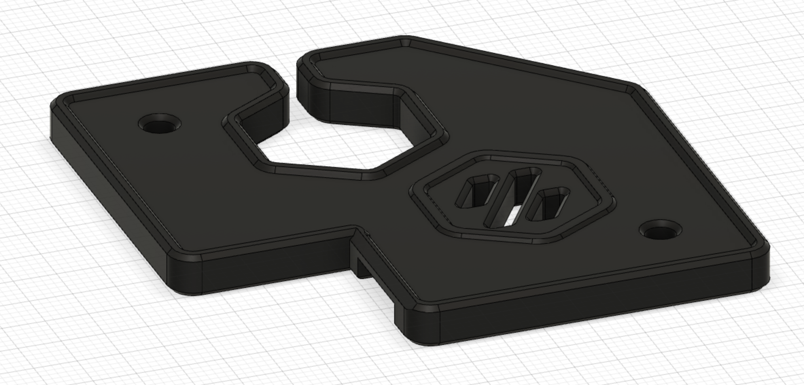
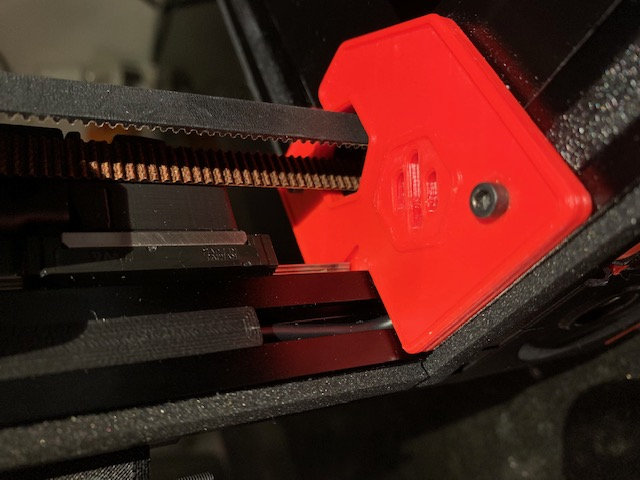
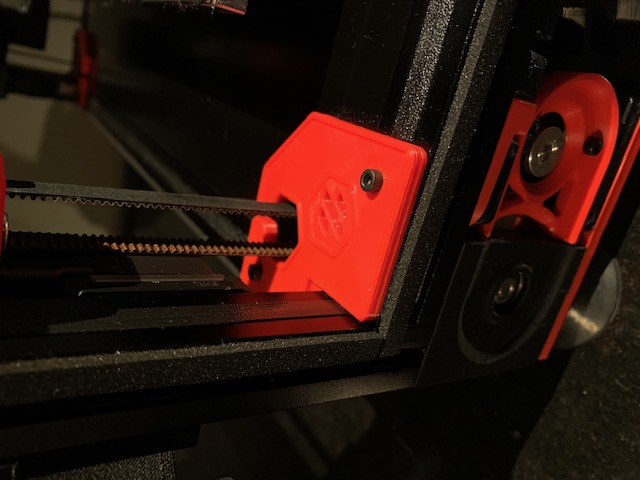

# Hidden cable routing z belt cover mod
## Credit
Mod based on the design of the Voron crew.
Thank you for your awesome work!
## Print settings
As stated in the Voron documentation:
* ABS
* 0.2mm layer hight
* 0.4mm extrusion width
* 40% infill
* wall count 4
* top/bottom layers 5
* no supports

## Bom
Only the printed file.
## Improvement
Added the possibility to route cables on the bottom of the cover.
## Description
I liked the design of the old Voron 2.2 covers more than the current design so I based my mod on them.

This mod allows to route cables that are hidden in the extrusions to the bottom compartment.
To achieve that the inner part of the z belt cover is a bit thicker and a path is cut out on the bottom where cables can be routed. The overall dimensions are the same as the stock 2.2 covers.

Note: Be careful to restrict the cable in the bottom compartment so it does not rub on your z-belts.
## Pictures
Top:

&nbsp; 
Bottom with path for routing cables:

&nbsp; 
Cable routing:

&nbsp; 

Closed:

