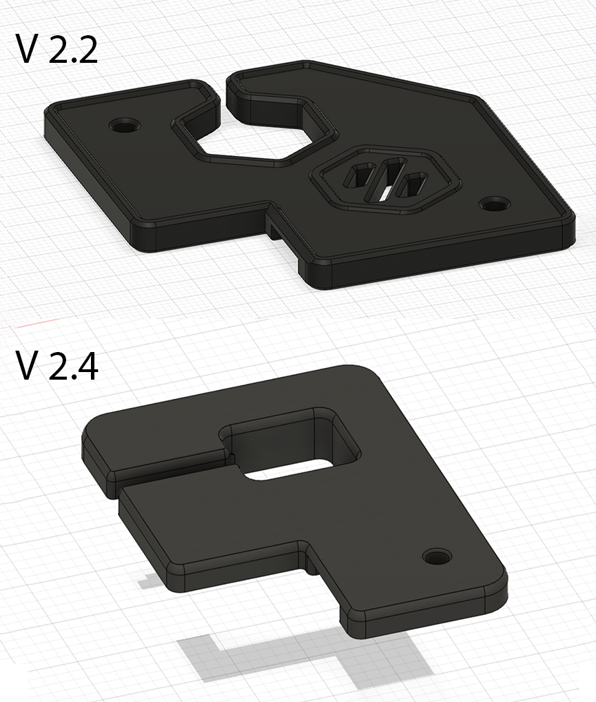
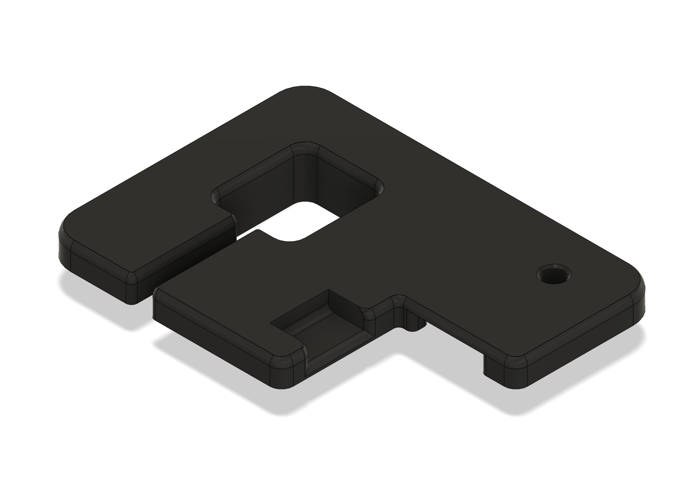
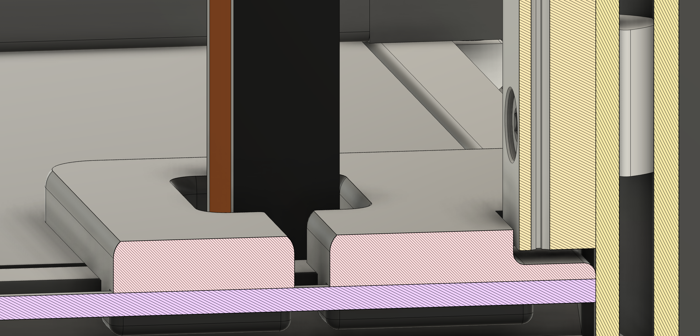

# Hidden cable routing z belt cover mod
## Credit
Mod based on the design of the Voron crew.
Thank you for your awesome work!
&nbsp; 
A big thank you goes to [Mbravorus](https://github.com/mbravorus) as well, for contributing the rail notch version.

## Print settings
As stated in the Voron documentation:
* ABS
* 0.2mm layer hight
* 0.4mm extrusion width
* 40% infill
* wall count 4
* top/bottom layers 5
* no supports

## Bom
Only the printed file.
## Improvement
Added the possibility to route cables on the bottom of the cover.
## Description
I liked the design of the old Voron 2.2 covers more than the current design so I based my mod on them. But due to several requests I also included the current 2.4 covers.

To be able to achieve a clutter-free look i hid cables in the extrusions as much as possible.
So i also wanted to have a hidden way to route the cables to the bottom compartment. To achieve that i made
the z belt cover a bit thicker and cut a path on the bottom where cables can be routed without being seen.

The files are named with v2.2 in the filename for the 2.2 version and v2.4 in the filename for the 2.4 version.

## Things to consider during installation
> The modified z belt covers are thicker than the originals. You may have to move up your z-rails, if you installed them flush to the top of the original covers. If you don't want to do this you can use the rail notch version, which has a cut-out for the rails.

> Make sure to constrain the cable you are routing through to the bottom, so it does not interfere with the z-belts. Use a zip tie or tape to hold the cable securely in position / away from your z-belts.
## Pictures

&nbsp; 
&nbsp; 

&nbsp; 
&nbsp; 

*2.2 version - top*
&nbsp; 
&nbsp; 

*2.2 version - bottom with path for routing cables*
&nbsp; 
&nbsp; 

*2.4 version - top*
&nbsp; 
&nbsp; 

*2.4 version - bottom with path for routing cables*

*2.4 version - top with rail notch*

*2.4 version - cross section view of the rail notch version*

## Wire routing

*The cable needs to be wired like this below the cover*
&nbsp; 
&nbsp; 

*Cross section view*

&nbsp; 

