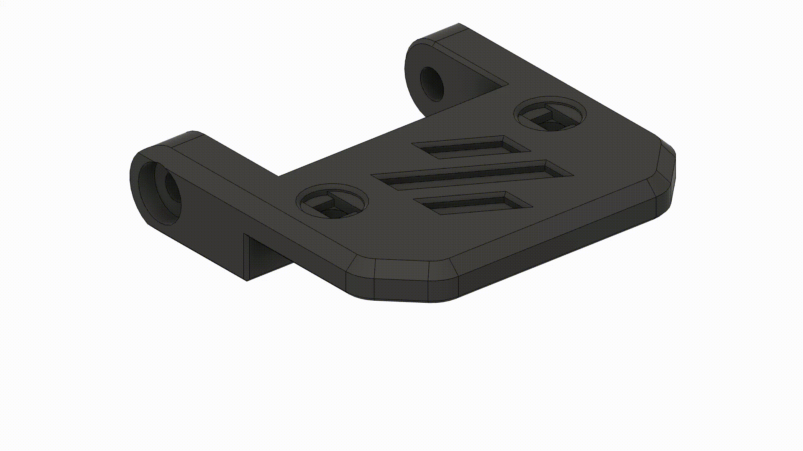

**Any questions? Hit me up on the Voron Discord!** @Alexander Þór 🇮🇸🇬🇧

**My GitHub can be found [here](https://github.com/Alexander-T-Moss) if you want more up-to-date files!**

# 270 Degree Clamping Hinges #



 This design is based on [_chrisgonzales_](https://github.com/VoronDesign/VoronUsers/tree/master/printer_mods/chrisrgonzales/270_degree_hinge) already incredible 270 degree hinges. The main goal of this remix was to have the front panels mount in a way that **didn't use any VHB tape or holes that needed to be drilled into the acrylic**.


## Update Log ##

**27.10.22** - Overhauled the github page to make stuff just make more sense. Also made slight tweaks to face_plate_x.stl to stop the bolts scratching the frame.

**11.12.21** - Made subtle changes to dimensions to hold panels closer together whilst having them fully seated in the clamps for maximum strength, also changed recommended print settings for stronger face_plate_bottom.stl.


 ## Do I Need Foam Tape? ##

 **YES**, You will need to use **3mm foam tape** with these hinges - if you wearn't using foam tape before see this as the right time to add foam tape as you should be using it anyway :)


 ## How Do I Keep The Doors Shut Without VHB? ##

 I am currently using clamps designed by [_v6cl_](https://github.com/v6cl/My-Voron2.4-Customs/tree/main/Panel_Locker) to keep my doors shut (one at the top and one at the bottom). There is also these clamps that are popular by [*Richard M*](https://www.printables.com/model/172368-voron-24-filament-latch-or-any-2020-extrusion) you may wish to use instead but both work just as well.

  ## Is The Clamping Force Strong Enough? ##

  If you print these with any half decent filament and your **panels are 3mm thick** then the clamping force is more than sufficiently strong. When printing, the panels are additionaly held in place securly by the door locking clamps linked above. You may find opening the doors quickly will make them shift slightly but the panels can be alligned again by hand quite quickly - I recommend closing the panels together at the same time to help allign them.


 ## What Do I Need For These Hinges? ##

 **Printed Parts**
 ```
 face_plate_x.stl       [x4]
 [a]_clamp.stl          [x4]
 side_mount.stl         [x4]
 ```
 **Additional Hardware**
 ```
 M3 x 8mm SHCS          [x20]
 M3 Hex Nuts            [x8]
 M3 T-Nut               [x4]
 ```


 ## Printing ##

 ```
 Layer Height       : 0.2 mm
 Extrusion Width    : 0.4 mm
 Infill             : 40 % ( 100% For face_plate_bottom.stl )
 Perimeters         : 4
 Solid Top/Bottom   : 5
 Supports           : No
 Brim               : Optional (You may wish to print side_mount_brimmed)
 ```


## Gallery

Photos Coming Soon™️
