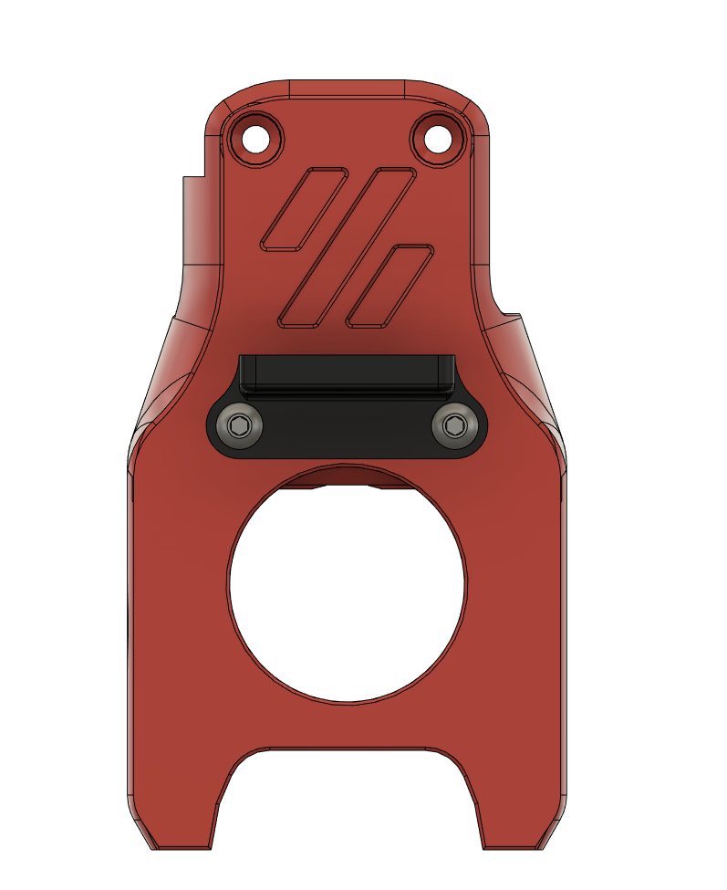
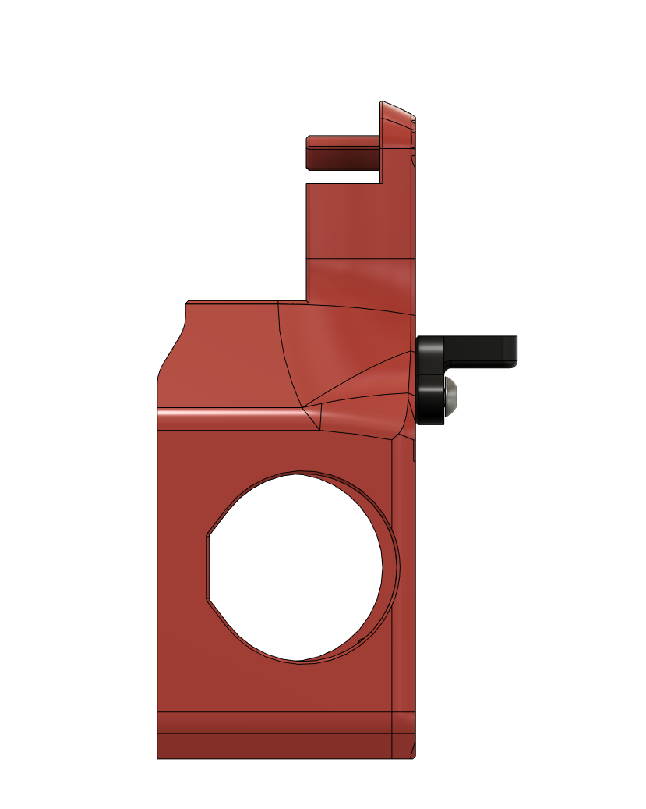
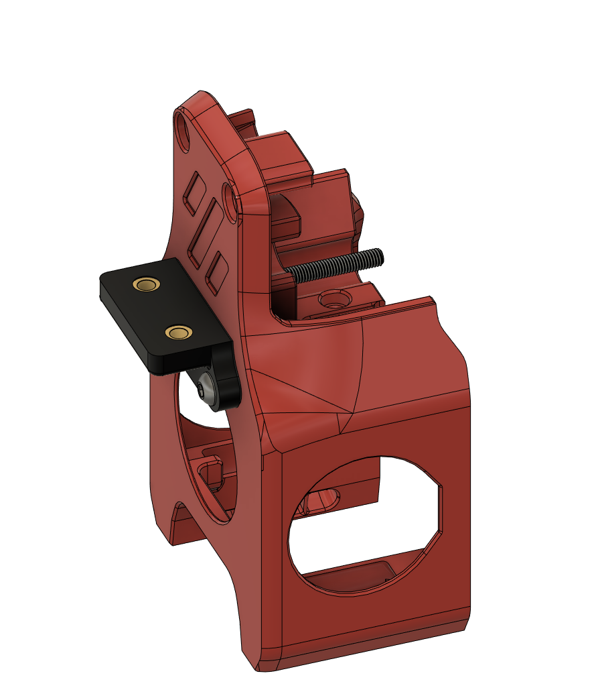
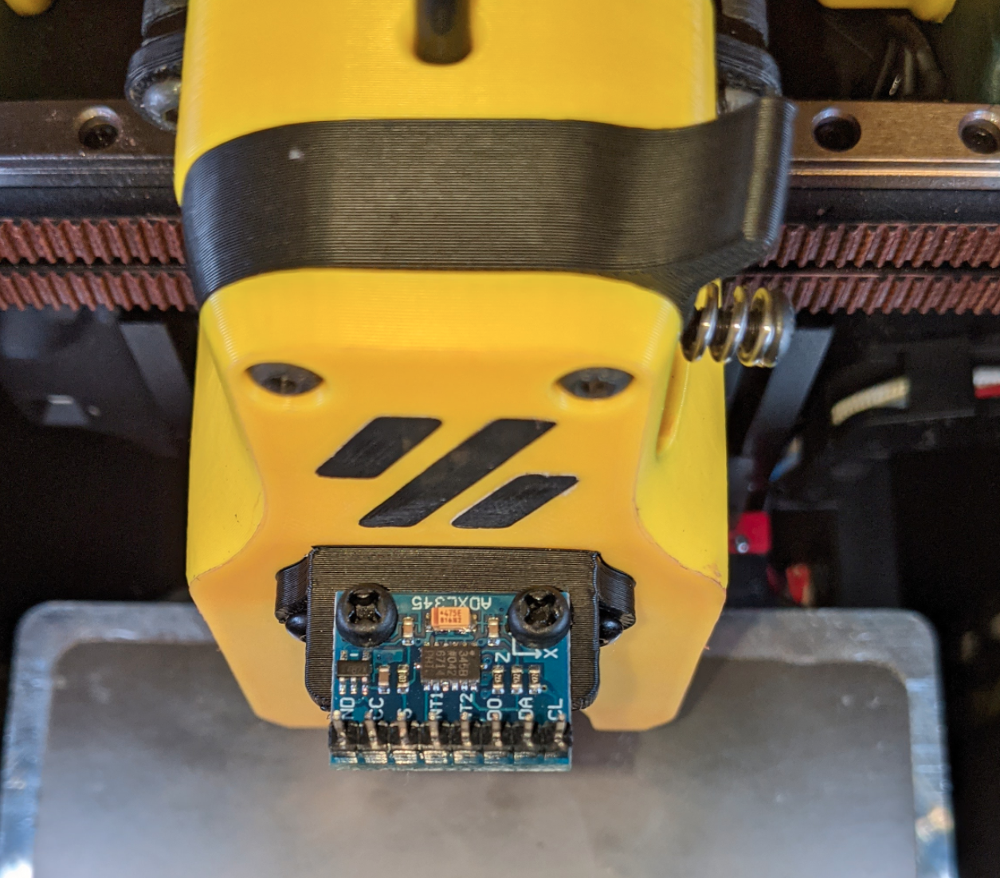

Mini Afterburner ADXL345 Mount
==============================

A mount to attach an ADXL345 sensor to the Mini-Afterburner toolhead.

BOM
---

- 2x M3x40 BHCS
- 2x M3 screws (at least 4mm, preferably nylon)
- 2x M3 heat-set insert. (3x5x4)

Instructions
------------

- Install the M3 heat-set inserts into the 2 larger holes on the part.  
- Remove the lowest 2 M3x35 screws from the front of the MiniAfterburner
- Attach the mount using 2 M3x40 screws in the same holes.
- attach the ADXL345 to the top of the mount, using m3 screws, ensure axes are oriented correctly.

Images
------

