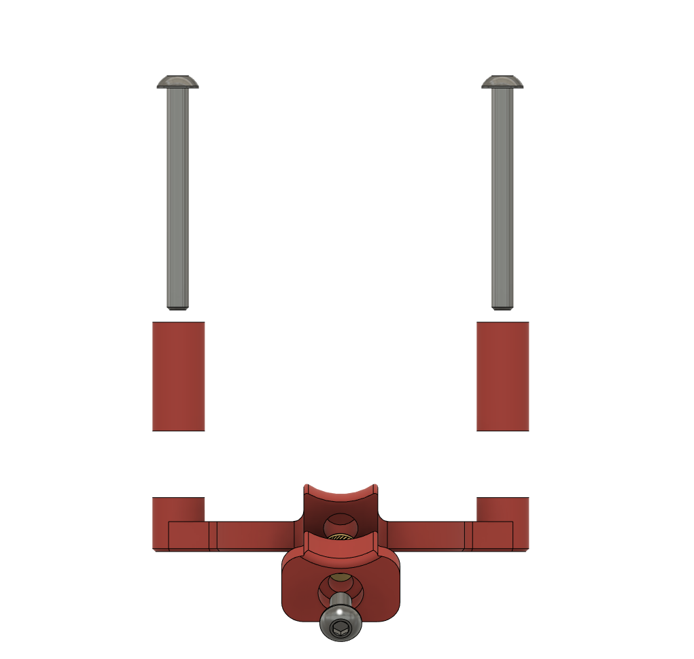

Mini Afterburner Strain Relief
==============================

Replaces the stock strain relief on the V0 Mini Afterburner toolhead.  

BOM
---

- 1x M3x6 BHCS
- 2x M3x30 BHCS
- 2x M3 Nuts
- 1x M3 heat-set insert. (3x5x4)

Instructions
------------

- Install the M3 heat-set insert into the top of `Strain_Relief_Body_x1`.  
- Use the M3x6 BHCS to attach the `Strain_Relief_Body_Top_x1` to the `Strain_Relief_Body_x1`
- Insert the 2 M3x30 screws from the front of the toolhead, through the motor, `Strain_Relief_Spacer_x2` and `Strain_Relief_Body_x1` finally securing them with M3 nuts on the back of the strain relief.
- wires can be routed between the motor and the strain relief, through the recessed area.

Images
------

