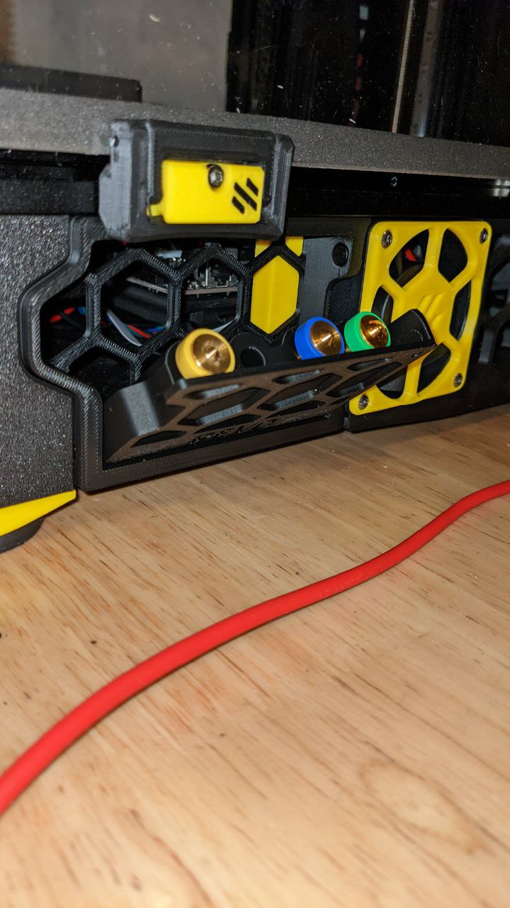

# Revo_Nozzle_Skirt

A Revo nozzle box hidden in a Voron Trident skirt.  

Compatible with 250/300/350 Tridents.  

- 250 - 2 Nozzles each
- 300 - 4 Nozzles each
- 350 - 5 Nozzles each

# Bill Of Materials

- 2x 6mm x 3mm Round Magnet
- 2x M3 Heat-set insert
- 2x M3x8 BHCS

# Instructions

- Print a Skirt and Nozzle Holder the appropriate size for your printer.  the A version is for the front-left and back-right corners. and the B version is for the other 2 corners.
- install the 2 heat-set inserts into the ends of nozzle-holder part.
- install 1 magnet in the skirt, and one in the nozzle-holder such that they attract eachother when the door is installed.
- insert the nozzle holder into the skirt and fasten with 2 M3x8 BHCS
- Remove the stock skirt piece from your trident and install the new one in it's place.

