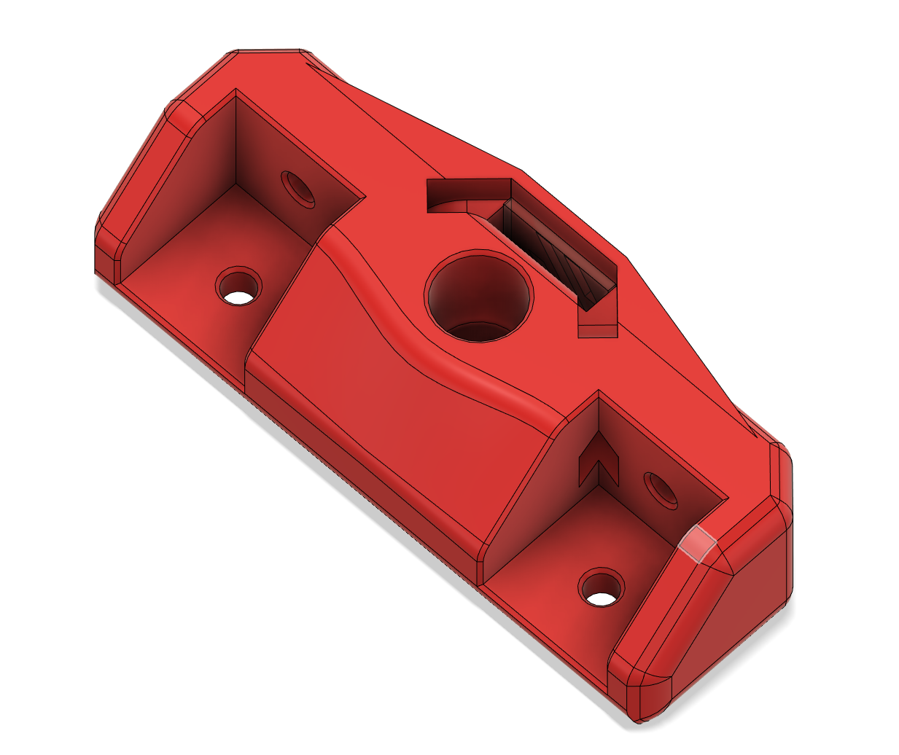
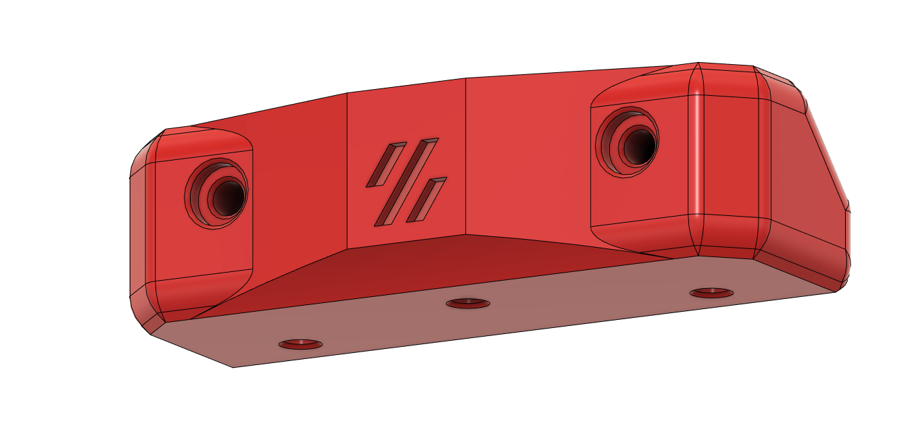
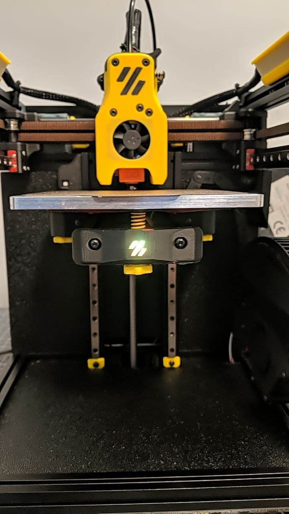
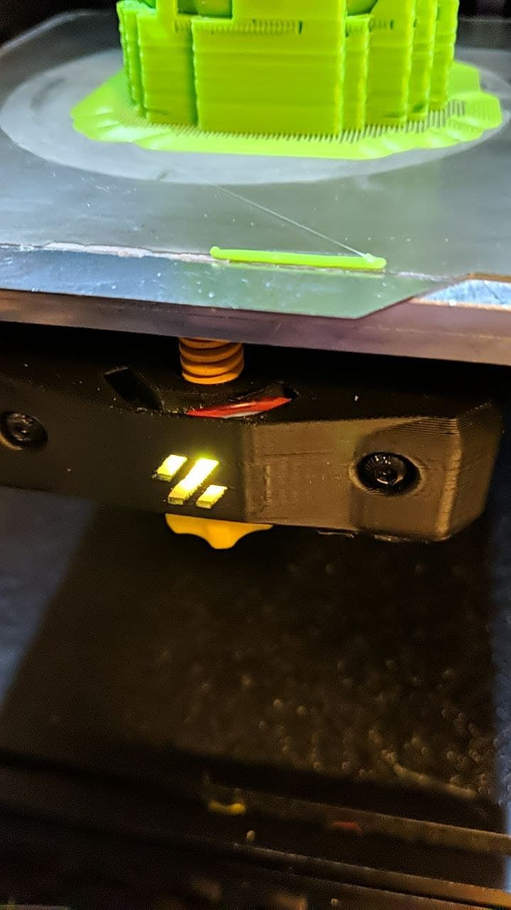

V0 Neopixel Front Bed Mount
===========================

This replaces the stock V0.1 Front Bed Mount, adding a slot for a single Neopixel or Dotstar LED from a standard 10mm strip.
There are channels to run the wires stealthily to inside of the bed frame extrusions on either side.

Instructions
------------

- Print `Diffuser_x1` with 100% infill using a transparent or white ABS, textured build surface is a bonus.
- Print `Front_Bed_Mount_x1` using standard Voron print settings
- cut a single Neopixel or Dotstar LED from a 10mm strip, and 3 (or 4 for Dotstar) equal lengths of wire, 
  long enough to reach from the front bed mount, under the bed, through the cable chain and all the way to your mainboard.

- insert the LED into the slot on the front of the bed mount, and route the wires through one or both of the channels
- insert the diffuser in the slot in front of the LED, ensure a good friction fit.  if necessary, print the diffuser slightly thicker or thinner by scaling it in your slicer.
- Install the new Bed mount, making sure the wires are not pinched by the extrusions, they should run directly into the slot, you can use zip ties to secure it.  
- route the wires through the cable chain, and around to wherever your mainboard is mounted.
- mainboard connections and klipper configuration are left as an exercise to the reader.

Images
------

