# Foldable 7-Inch Display

This design is modified from [revnull‘s rpi_7in_display_mount design](https://github.com/VoronDesign/VoronUsers/tree/732a9e28c78c44d65baffdcdb935d205e33d9897/printer_mods/revnull/rpi_7in_display_mount). Optimized the angle limit structure, and can use cheaper Chinese-made displays.

此设计修改自  [revnull‘s rpi_7in_display_mount design](https://github.com/VoronDesign/VoronUsers/tree/732a9e28c78c44d65baffdcdb935d205e33d9897/printer_mods/revnull/rpi_7in_display_mount). 优化了角度限位结构，并可以使用更便宜的国产显示器。

## Features （特点）

- foldable structure 可折叠结构

-  cheaper Chinese-made displays 更便宜的国产屏

- The maximum folding angle is limited 限制最大折叠角度

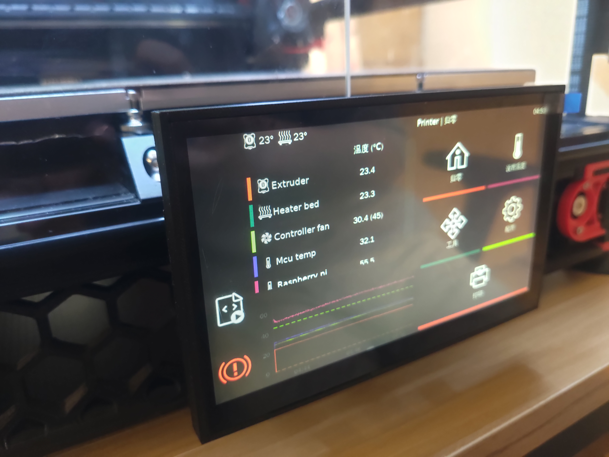

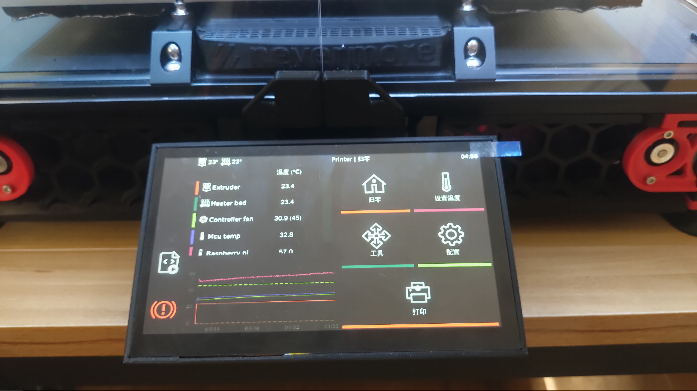

## Assembly steps （安装步骤）

1. Split display (拆分屏幕)

    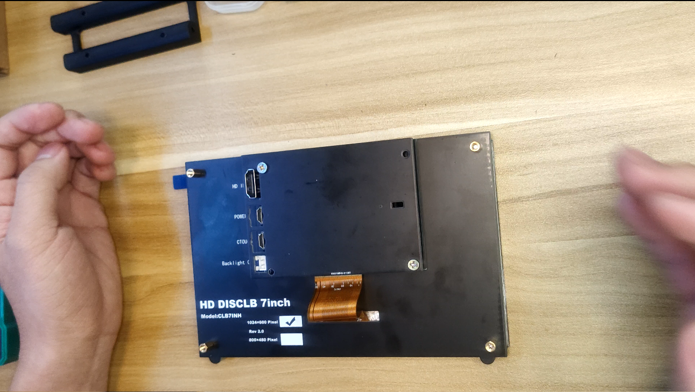

    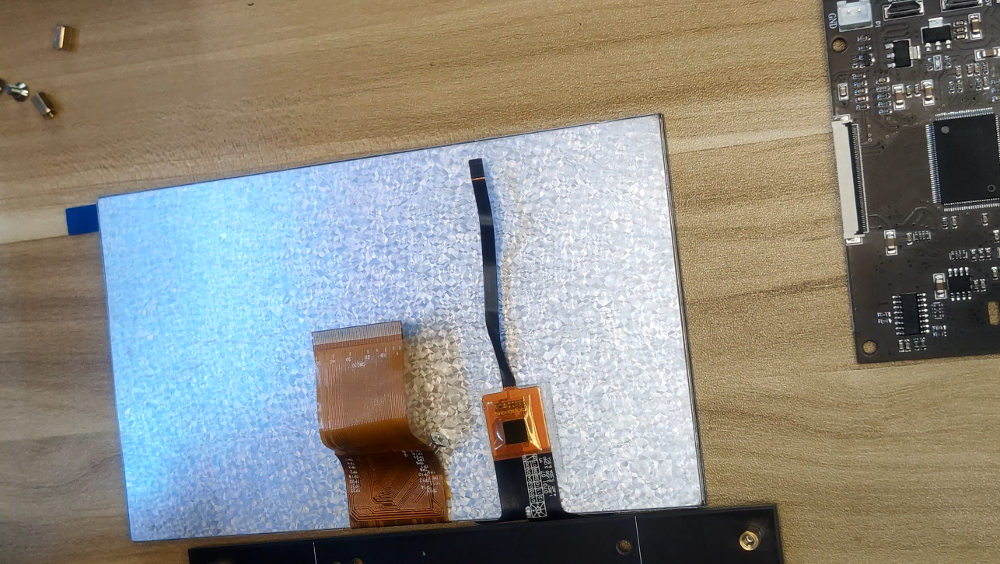

2. Assembling 3d printer parts (组装3d打印零件)

    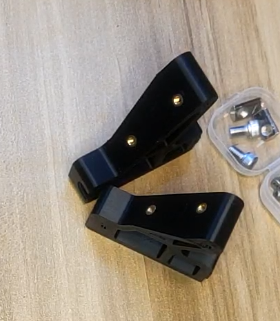

    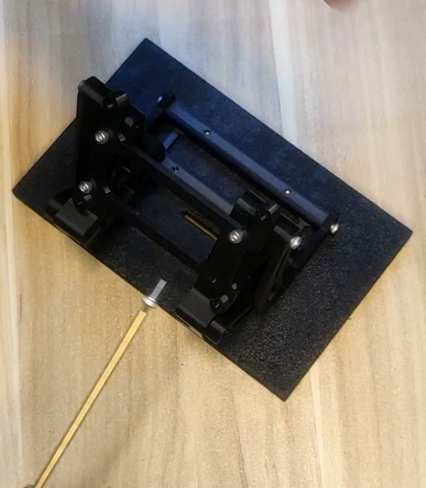

3. Paste screen (粘贴屏幕)

    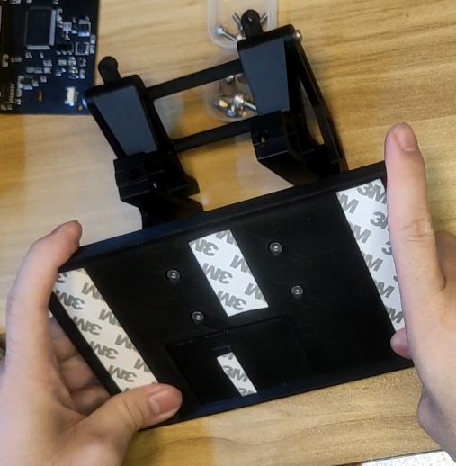

    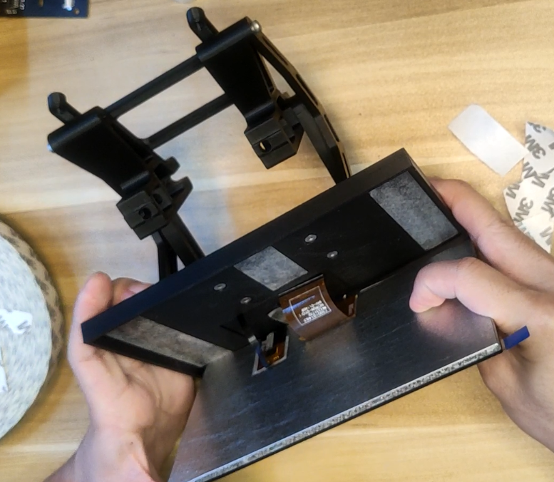

4. Install the screen driver board (安装屏幕驱动板)

    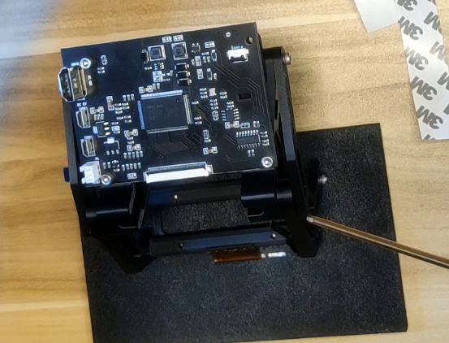

5. Connect fpc cable (连接fpc线)

    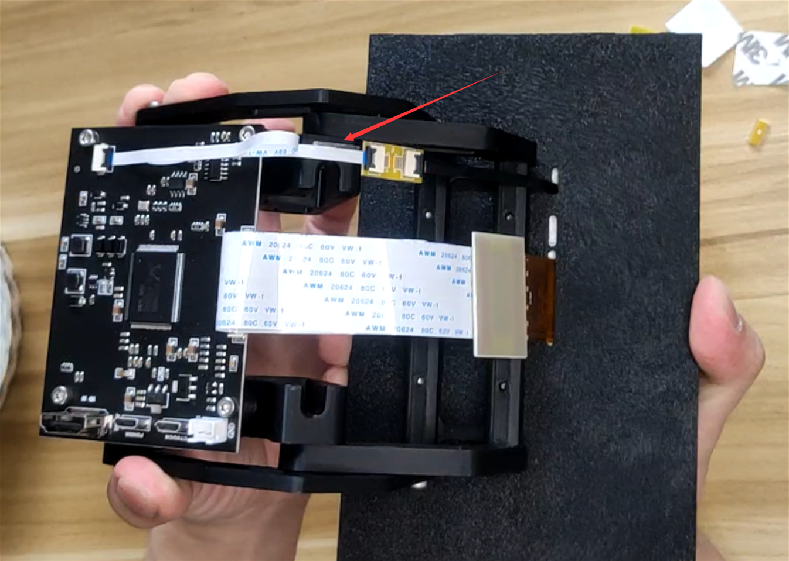

    Note: Remember to stick the 5p fpc cable on the root arm with 3m double-sided tape to prevent it from getting stuck when folded. (记得用 3m 双面胶将 5P fpc 排线粘在根部支臂上，以防折叠时卡住。)

6. Connect HDMI and touch USB cable (连接 HDMI 和触控 USB 线)

    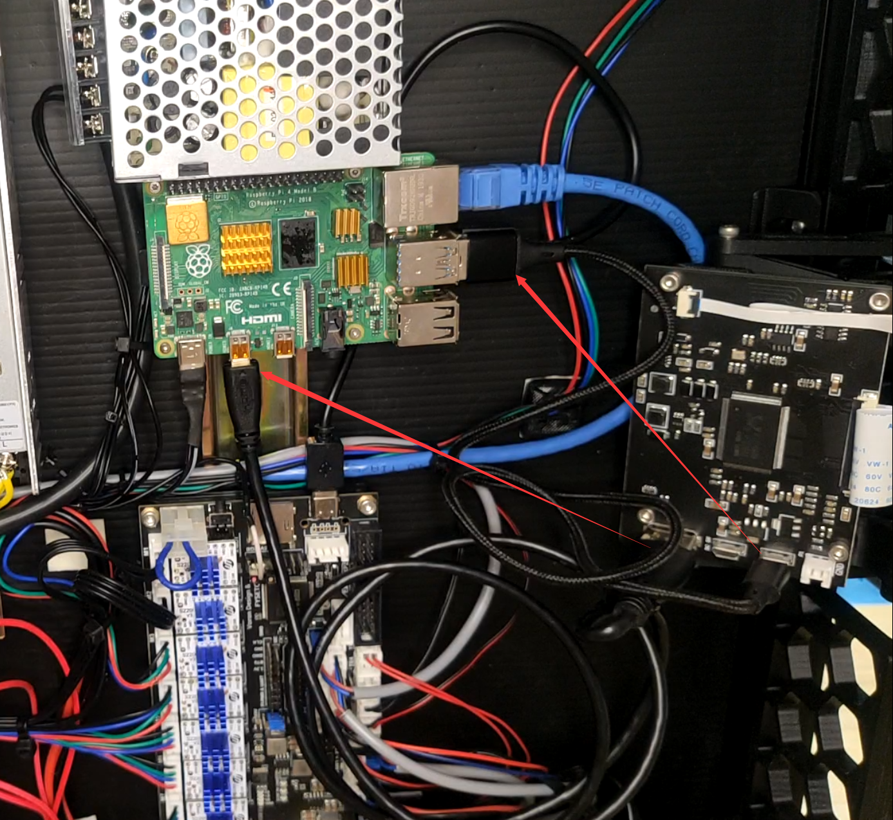

## Software configuration (软件配置)

1. Follow the introduction of klipperscreen: [https://klipperscreen.readthedocs.io/en/latest/](https://klipperscreen.readthedocs.io/en/latest/). Complete the installation steps.

    按照klipperscreen的介绍：[https://klipperscreen.readthedocs.io/en/latest/](https://klipperscreen.readthedocs.io/en/latest/)。 完成安装步骤。

2. Modify the Raspberry Pi settings , specify the screen resolution.

    修改树莓派设置,指定屏幕分辨率。

    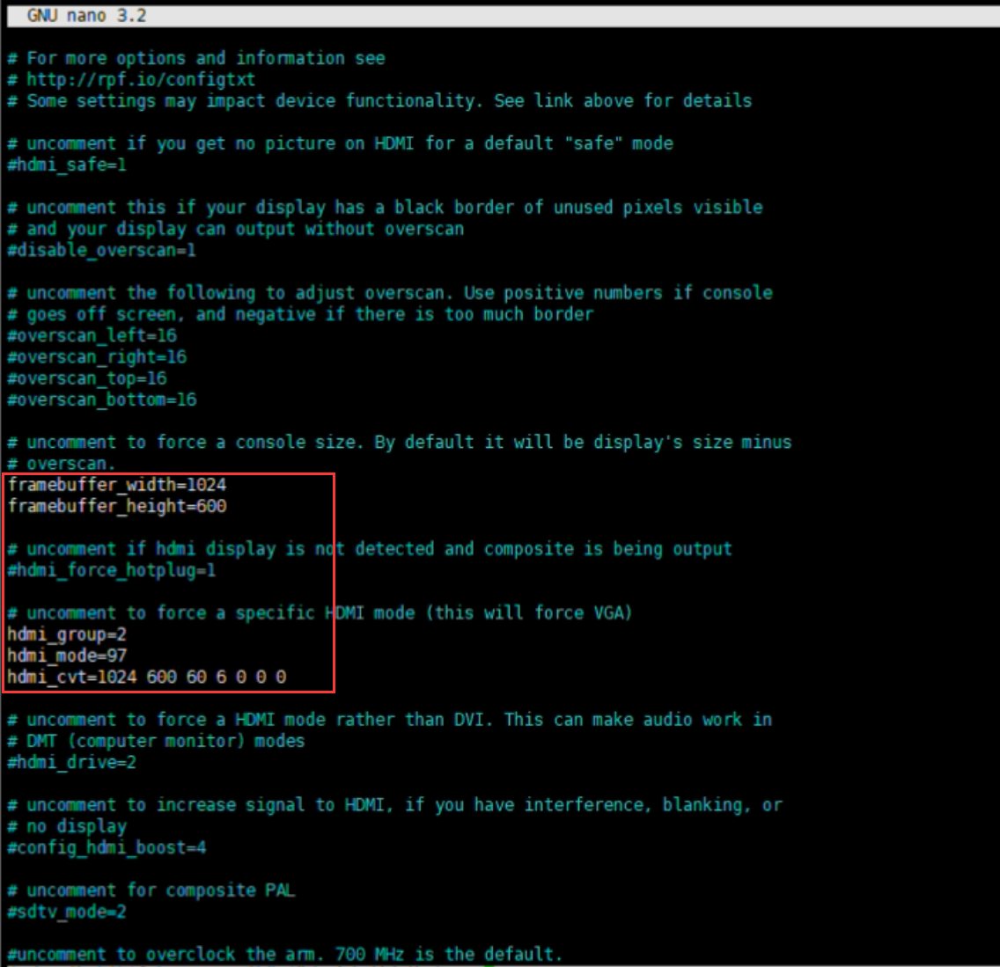

