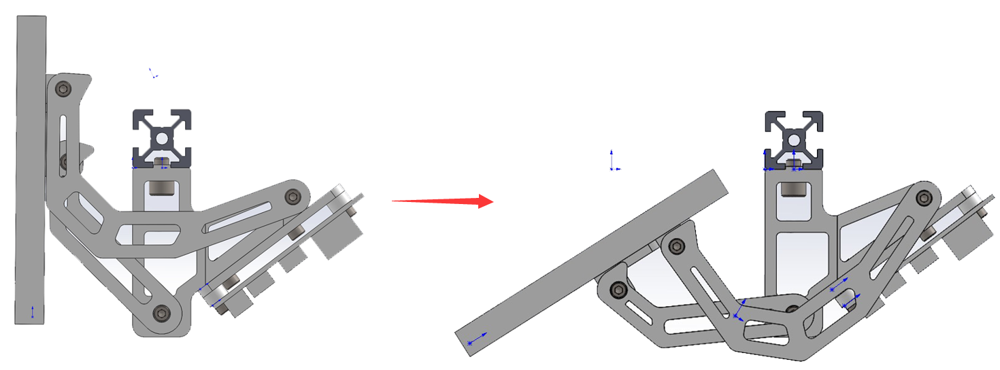

# Foldable 7-Inch Display

This design is modified from [revnull‘s rpi_7in_display_mount design](https://github.com/VoronDesign/VoronUsers/tree/master/printer_mods/revnull/rpi_7in_display_mount). Optimized the angle limit structure, and can use cheaper Chinese-made displays.

此设计修改自  [revnull‘s rpi_7in_display_mount design](https://github.com/VoronDesign/VoronUsers/tree/master/printer_mods/revnull/rpi_7in_display_mount). 优化了角度限位结构，并可以使用更便宜的国产显示器。

## Features （特点）

- Foldable structure 可折叠结构

-  Cheaper Chinese-made displays 更便宜的国产屏

- The maximum folding angle is limited 限制最大折叠角度

## BOM

| Category 目录    | Description 描述                                          | Qty 数量 | Notes                                             |
| ---------------- | --------------------------------------------------------- | -------- | ------------------------------------------------- |
| Fasteners 紧固件 | M5x8 SHCS (圆柱头内六角螺丝)                              | 2        |                                                   |
|                  | M3x8 SHCS ( 圆柱头内六角螺丝)                             | 16       |                                                   |
|                  | M3x12 FHCS (沉头内六角螺丝)                               | 4        |                                                   |
|                  | M5 T-nut HNTAJ5-5 (弹珠螺母)                              | 2        |                                                   |
|                  | M3 Threaded Insert (热熔螺母)                             | 4        |                                                   |
| Electronics 电子 | 7 inch capacitive touch screen 1024x600px                 | 1        |                                                   |
|                  | FPC Docking Board 50Pin 0.5mm (FPC对接板)                 | 1        |                                                   |
|                  | FPC Docking Board 6Pin 0.5mm (FPC对接板)                  | 1        |                                                   |
|                  | FPC Cable 50Pin 0.5mm Same-Direction 10cm (FPC 排线 同向) | 1        |                                                   |
|                  | FPC Cable 6Pin 0.5mm Same-Direction 10cm (FPC 排线 同向)  | 1        |                                                   |
|                  | Micro USB Cable (Micro USB线)                             | 1        | Usually included in the screen (通常在屏幕中附赠) |
|                  | HDMI to micro-HDMI Cable (HDMI 转 micro-HDMI 线)          | 1        | Usually included in the screen (通常在屏幕中附赠) |
| Misc 杂类        | 3M double-sided tape                                      |          |                                                   |

- 7 inch capacitive touch screen 1024x600px

    Where to buy: [https://detail.tmall.com/item.htm?id=611928398167](https://detail.tmall.com/item.htm?id=611928398167) (Model: 7寸IPS触摸屏) you can copy the model character to find the option.

    

- FPC Docking Board

- FPC Cable

## Assembly steps （安装步骤）

1. Split display (拆分屏幕)

    

    

2. Assembling 3d printer parts (组装3d打印零件)

    

    

3. Paste screen (粘贴屏幕)

    

    

4. Install the screen driver board (安装屏幕驱动板)

    

5. Connect fpc cable (连接fpc线)

    

    Note: Remember to stick the 5p fpc cable on the root arm with 3m double-sided tape to prevent it from getting stuck when folded. (记得用 3m 双面胶将 5P fpc 排线粘在根部支臂上，以防折叠时卡住。)

6. Connect HDMI and touch USB cable (连接 HDMI 和触控 USB 线)

    

## Software configuration (软件配置)

1. Follow the introduction of klipperscreen: [https://klipperscreen.readthedocs.io/en/latest/](https://klipperscreen.readthedocs.io/en/latest/). Complete the installation steps.

    按照klipperscreen的介绍：[https://klipperscreen.readthedocs.io/en/latest/](https://klipperscreen.readthedocs.io/en/latest/)。 完成安装步骤。

2. Modify the Raspberry Pi settings , specify the screen resolution.

    修改树莓派设置,指定屏幕分辨率。

    

## Assembly Video

https://www.bilibili.com/video/BV1Qu411q7kD