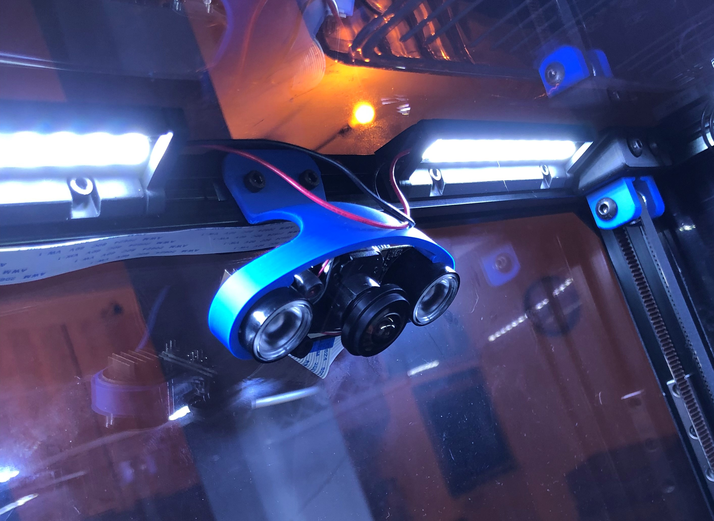

This is a simple mount for the currently popular Electreeks Camera (and the similar models of other brands).
It is supposed to be mounted on one of the top Aluminium Profiles of the Voron 2.4 (see picture) maybe it also fits on other printers with closed frame and 20x20 profiles.
You need two M3x8 Screws and two M3 slot stones to mount it.

