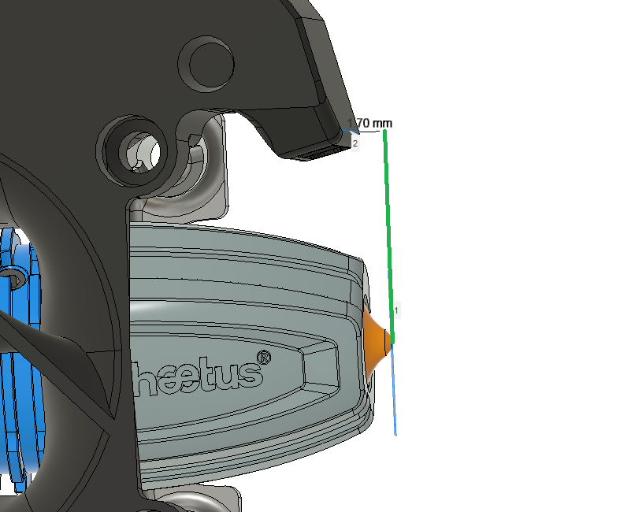

# AB-BN-30

This mod is my latest iteration on improving the afterburner hotend.  The naming convention is not hard:
**A**fter**B**urner
**B**ad**N**oob
version **30**

*Disclaimer: It is your printer. If you do this and something breaks or if someone gets hurt, it is fully your responsibility. I take no responsibility.*

## Special thanks

I want to say **Thank You** to the Voron design team. I've really enjoyed learning from you. Thank you for sharing your files, criticism, advice, and support.

Additional thanks to Yellowfish, Long, Greg3D and all the fearless people that took time to help me along the way.  

## BOM

This is replacement to the stock afterburner, the required screws are ones you will just reuse from your existing afterburner.

The main thing you will need to purchase is a 5015 blower fan.  You will then have to mutilate the fan by cutting off the mounting ears.

**If this seems daunting to you, stop now.**

\*Optional de-earing tool ("dearing tool")

* 1 M3x0.5 heat set insert
* 1 M3x0.5x16 SHCS

For the mod itself:

* 4x M3x0.5 heat set inserts
* The usual screws used in Afterburner 2.4
* 1 5015 blower fan (Sunon's 12volt MF50151VX-B00U-A99, SanAce B52, or Delta BFB0524HH 24v fan are recommended)\
  \
  *Note that sunon specifically states to NOT PWM this fan. I have been doing so for months and 10's of kilograms of pushed plastic without issue, but its important to state here.*

  for fan advice, look for a fan with a high static head (above .7 inches H2O) and a high max flow (5 CFM )\
  \
  The SoundOriginal 24v fans from Amazon also appear to do well.\
  \
  The following fans have been tested but are not as good in this application. they may work OK for abs, but not PLA or high speed abs:
* Sunon MF50152V**1** (the last digit here is "speed" and 1 is a much lower speed than the MF50151V**X**
* Winsinn
* Hondaly
* Mechatronics

## What does it do, and why should I do this mod?

This version of the afterburner fan and duct is a drop in replacement to the spec 2.4 and 1.8 afterburners. It replaces the 4020 blower with a far more powerful 5015 blower. Compared to the spec 2.4 afterburner, v24 improves the following:

\* Better part cooling for both ABS and PLA filaments

\* Fewer jams caused by heat creep

\* Very resistant to melting ducts

\* Better left-right balance

\* Cleaner airflow for better overhangs

## This duct doesn't look right!

With AB-BN-30, the nozzle should protrude approx. 1.7 mm from the lowest part of the duct.  When you look at the duct, people often think it looks like to air is pointed too high.
The aim was done empirically over many iterations.  If the nozzle sticks out 1.7mm then it's where I intended it.

### CHANGE Log
Added support for REVO Voron

Added support for Phaetus Rapido hotend

Added support for E3D REVO hotend 

Added support for Zodiac BMO and BMS hotend

Removed support for Slice.

Added step file for AB-BN-30

Added support for Phaetus BMS and Phaetus BMO hotend

Release to VoronUsers

In AB BN 28 and 29, we moved to a single piece front. This has a few advantages, but it appears there may be an issue causing hotend fan failures by stressing the 4010 fan at a weak point in its housing. The issue is fixed in AB-BN-30_fan_front.stl\

I also made some slight changes to focus the part cooling flow for the dragon toolhead only. I didn't see much difference from this, so I did not migrate these changes to Mosquito or E3DV6.

### I just did AB-BN-xx!...why should I move to the current version?

If you are using AB-BN-28 or 29, I recommend you update the fan front piece.\
\
Performance wise, ab-bn-25 is nearly identical to -30, but there are some changes.\
\
Compared to the version (AB-BN-25):

* Better wire management
* Single piece front is stiffer
* 4010 moved slightly to make it easier to remove hotend without removing fans
* Better fit (fixed the spacer to 6.6 mm)
* Fixed the back of the mosquito hotend.

Changes made since -25 by part:

* **Fan_front**- 100%redo from -25. improved printability, standardized walls at 1.2 mm or greater. visually redone to eliminate "intake duct" or "kenny" appearance. Incorporated 4010 fan into a single piece unit. lower half matched to the hotend-front profile. fixed issue in 28,29 with 4010 fan carrier.
* **Fan_back**- 100% redo from -25. changed tabs to fit with the front.
* **Spring**- reduced size to fit
* **Spacer**-reduced thickness to 6.6mm
* **Hotend-E3Dv6-front, Hotend-Dragon-front, Hotend-Mos-front**:\
  Reduced and adjusted stator to flow better with relocated 4010 fan, thickened walls at important points.
* **Hotend-E3D-Dragon-back**- NO CHANGES FROM -25
* **Hotend-Mos-back**- adjusted to line up with Mos-front better.

#### Print Settings:

I use the standard Voron print settings, but with 30% infill. I have gone as low as 0% on the hotend_front, these parts don't get a lot of stress. I also use Hilbert curve for top and bottom patterns. ABS is recommended, but these have been printed in ABS+ and PETG as well:

* 0.4 mm Nozzle
* 0.2 mm layer height
* 30% infill
* no supports
* 4 vertical shells
* 5 solid layers top and bottom

##### What files need to be printed?

Everyone will need:

* AB-BN-30_fan_front.stl
* AB-BN-30_fan_back.stl
* AB-BN-28_spring.stl
* AB-BN-28_spacer.stl

  ##### Depending on your hotend you will need:
  
    ##### E3D REVO Voron
* AB-BN-30_Hotend-E3D_REVO-voron-front.stl
* AB-BN-30_Hotend-E3D_REVO-voron-back.stl

  ##### E3D REVO Micro
* AB-BN-30_Hotend-E3D_REVO-front.stl
* AB-BN-30_Hotend-E3D_REVO-back.stl

  ##### Phaetus BMS:
* AB-BN-30_Hotend-Phaetus_BMS-front.stl
* AB-BN-30_Hotend-Phaetus_BMS-back.stl

  ##### Phaetus BMO:
* AB-BN-30_Hotend-Phaetus_BMO-front.stl
* AB-BN-30_Hotend-Phaetus_BMO-back.stl

  ##### Zodiac BMS:
* AB-BN-30_Hotend-Zodiac_BMS-front.stl
* AB-BN-30_Hotend-Zodiac_BMS-back.stl

  ##### Zodiac BMO:
* AB-BN-30_Hotend-Zodiac_BMO-front.stl
* AB-BN-30_Hotend-Zodiac_BMO-back.stl

  #####   E3DV6:
* AB-BN-28_Hotend-E3Dv6-front.stl
* AB-BN-28_Hotend-E3Dv6-back.stl

  ##### Dragon (high flow and regular):
* AB-BN-30_Hotend-Dragon-front.stl
* AB-BN-28_Hotend-Dragon-back.stl

 

# Assembly:

Step 1: Cut the ears off the 5015 fan. In order to fit, you must cut the ears (mounting tabs) off the 5015 fan, and take off the top cover. The ears can be cut with diagonal clippers, hacksaw, bread knife, belt sander...whatever you have at hand. Just make it look like the image above. If you cut too much it's probably fine, as long as you don't damage the turbine.\
\
I have included stls for an optional de-earing tool (5015-deearing-tool and 5015-deearing-tool-b). The tool is meant as a handle and guide to saw off the ears. The tool fits around the ear and its edge can be used as a saw guide to cut the mounting ear off.

Step 2: Fan test fit.\
The fan fits into AB-BN-30_fan_front. We have learned that different "5015" fans have very different shapes. AB-BN is designed to allow for adjustment for your fan. Here's how:\
\
Test fit the fan in AB-BN-30_fan_front. Looking at it from the front, move the fan around to center the turbine blades. You may need to trim your fan housing a little more. Once the fan is centered, turn this over and note where you need to add shims between AB-BN-30_fan_front and the fan. To shim this I recommend vhb tape.\
\
Step 3: Spring THEN Fan\
Once you have your shims in the right spots, remove the fan and install the printed leaf spring (AB-BN-28_spring) into fan front. The little circle tab should be cut off, it's an integral print support only.

Insert fan into 5015 front and secure with fan spring. The spring bends back to hold the fan in place.

\
Step 4: Insert the 4010 fan in the AB-BN-30_fan_front. This is a tight fit by design.\
\
Step 5: Carefully route the wires, they will exit the 5015 back.\
*tip: use a dab of hotglue on the fan housing to secure the wires to the fan housing*

Step 6: Insert the tabs from the AB-BN-30_fan_back into the front and take the wires out through the cutout.

Step 7: Assemble with the spacer as shown and secure to the extruder body.

Assemble the hotend as usual.

# ENJOY!
Please drop me a DM if you find this mod useful or you have an idea to change.
