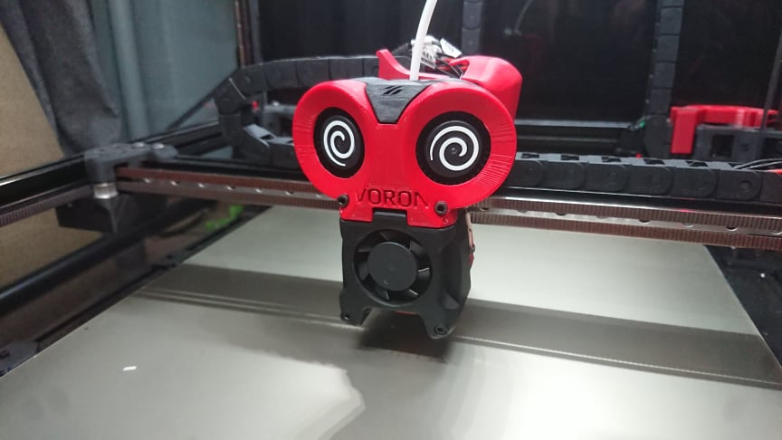
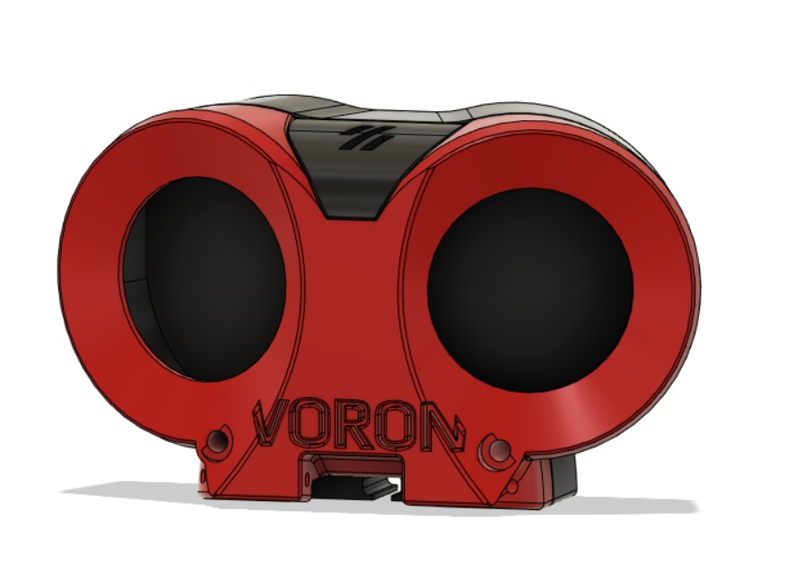
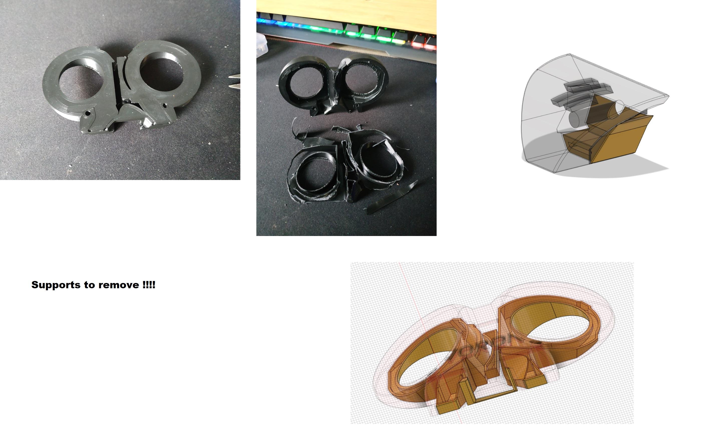
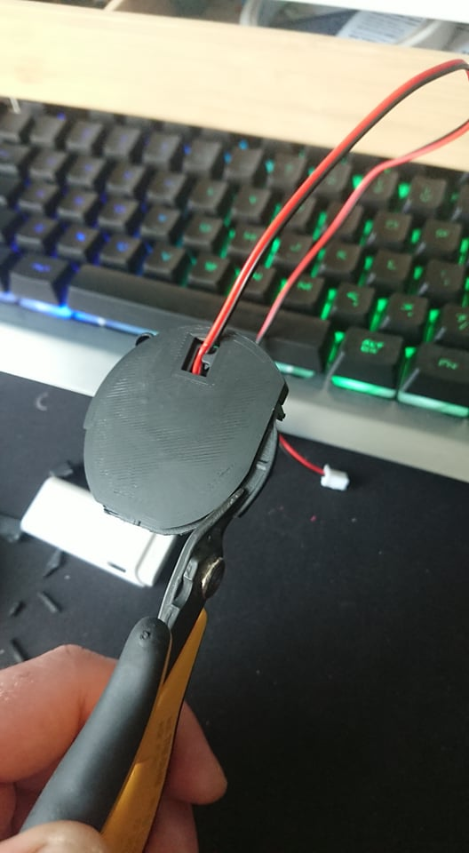
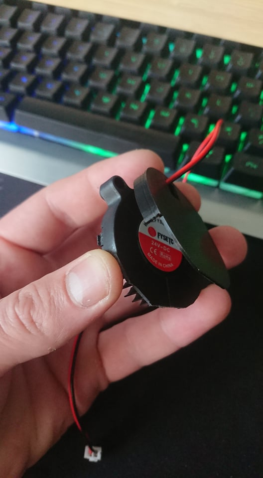
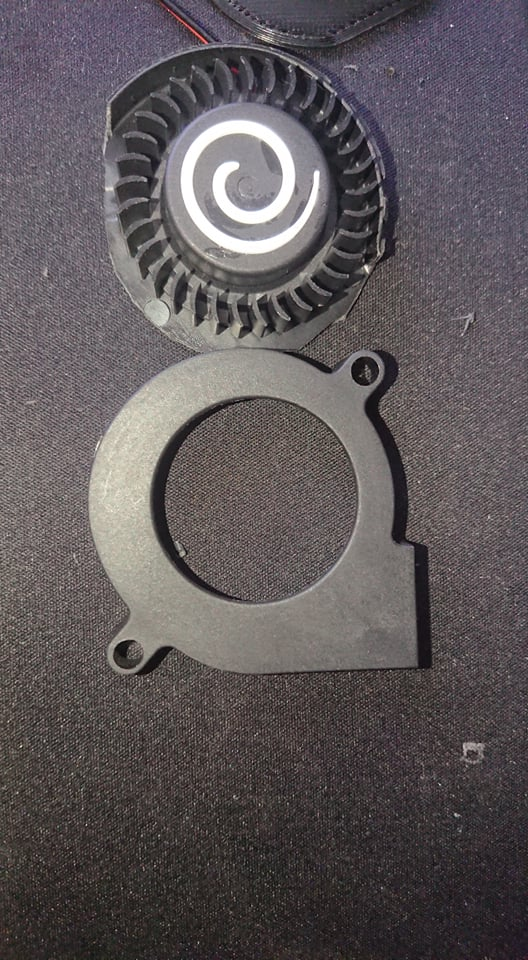
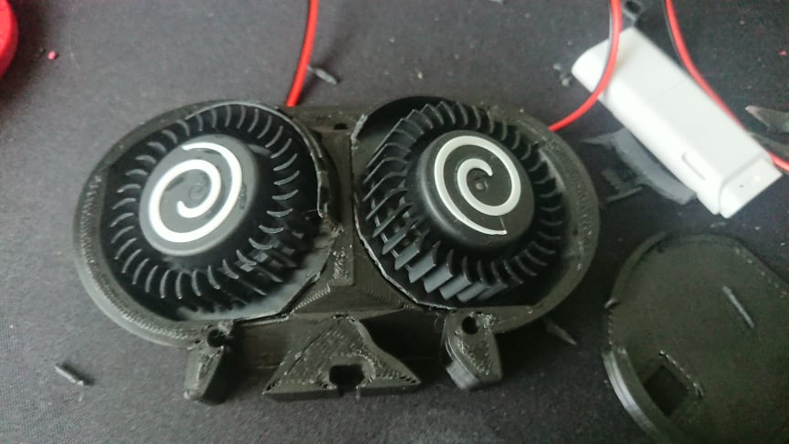
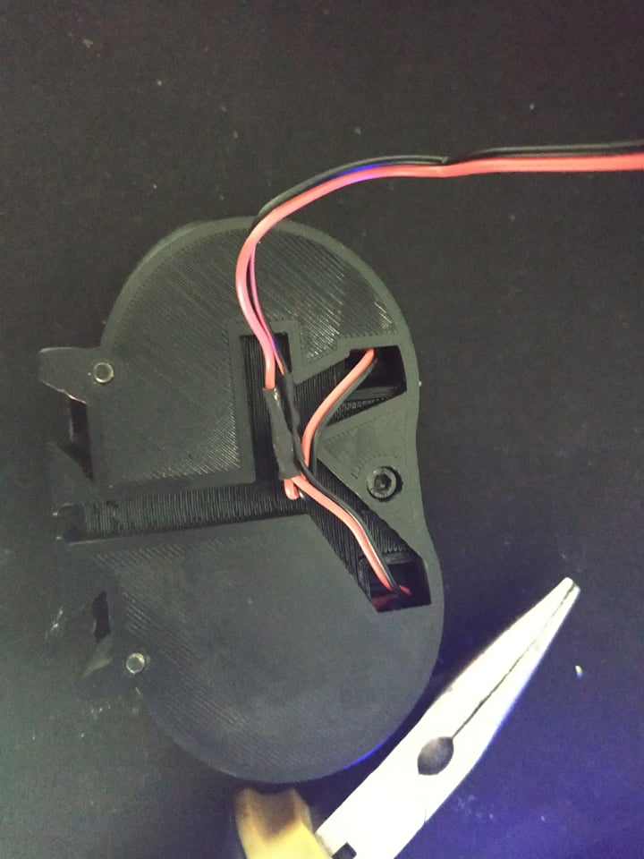

# LoudOwl aka Stabby

This is alternative part cooling fan solution which uses dual 5015 fan setup for Afterburner Toolhead. Replaces original parts that house 4020 fan or any other similar type of mod. This mod is more of situational add on for PLA or similar type filaments which might require a lot of cooling (or printing at super high speeds). It is not constant solution as it increases gantry weight.

## Hardware
* 2x 5015 24v fans
* 1x M3x20 SCHS (DIN912)

## Printing

There are two sets of STLs. One with inbuild supports and one without (for those who trust their slicers autosupports). Tested with recommended settings for Voron parts: 4 perimeters, 5 tops/bottoms, 40% infill. Though it is possible to use less plastic to reduce weight of plastic parts: 3 perimeters, 3 tops bottoms, 15-25% infill. 
Both versions of STL were tested by printing and assembling !!!

## Assembly
First print out "Cut tool", check fans compatibility, if fit is acceptable remove fans top body part and cut lower part according to “Cut tool”. Insert fans into “Back piece” (adjust fit if needed by cutting additional plastic from lower fan body). Fans should hold firmly in back part. Close them with “front piece” and secure them using “logo piece” using m3x20 SCHS screw. 

### Optional I: 
Cut excess wires and solder red to red black to black and additional wires of same color extend them up to your tool head connectors. 

### Optional II:
Print “Fan decoration” spirals as thin as possible. Model is 0.4mm height but personally suggest to lower to 0.1 or 0.05mm as weight of these parts is enough to make vibrations on fans (which can be felt and most probably will introduce artefacts on prints. Other suggestion is to use “fan decoration” to make stencil sticker and using white paint make decoration.

## Performance

These two hands came from model https://www.thingiverse.com/thing:4892173 . They are printed both in Devils Design white PLA. Visible part was directed towards bed, thus it was total overhang printed on supports with interface layers. Cooling was directed with stock Afterburners hotend shroud. Personally believe that better results can be achieved with Warbird hotend shroud. 

If you're feeling lucky !!!! 
there is CAD model of first adaptation for ABBN 30 hotend shroud. Not tested IRL.
