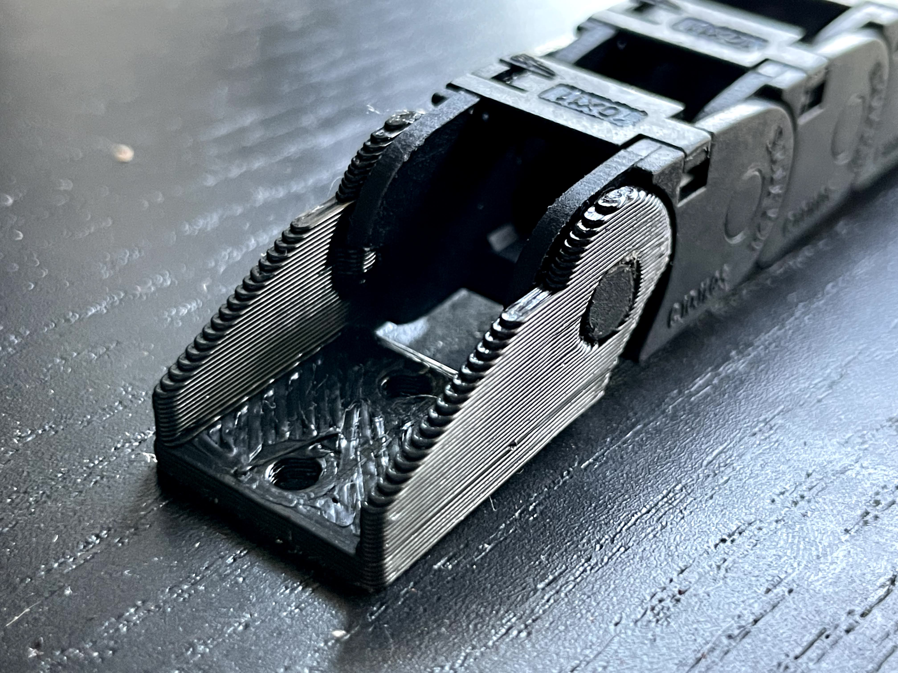
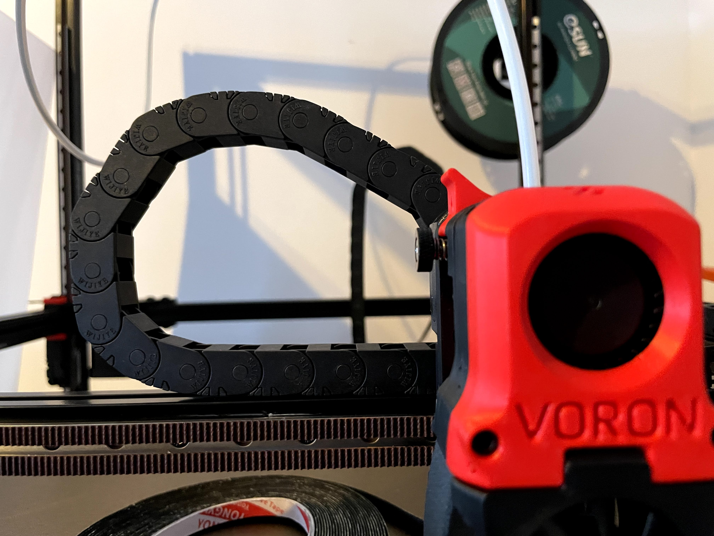
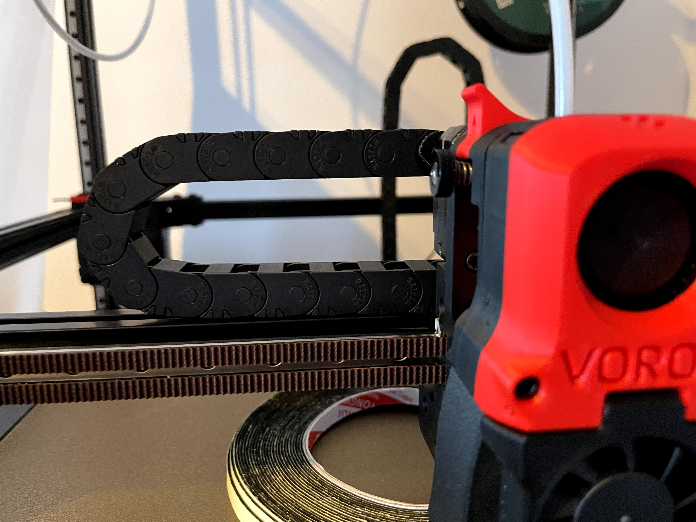
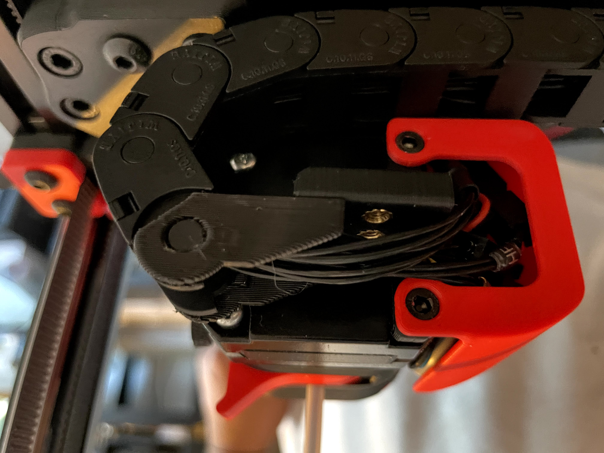

# Cable drag chain ends to fix formbot chains (and possibly other no-name wire chains)

  

## What's the problem with the stock drag chains? they work fine!!
  Yes, they work fine, but not as intended. 
  This is intended for chains that come with a fixed end on one side and a free swivel on the other end. 
  With this setup you have two options:
 1. Put the fixed end on the moving side (toolhead or xy joint). 
 2. Put the free end on the moving side. 

While they both technically work, they both have it's problems. 

### Issues with solution 1
The problem with solution 1 is that the fixed end makes the next link fixed, going in the opposite direction of the static end. In practice this means that you are using 2 to 3 links more that you need, and in consequence your cables will have to be 5-7cm length on X and Y (so 10 to 14 in total). If you're building your own wiring it's no big deal,  if you bought a pre-made harness, you might struggle to reach your electronics. One othe minor issue with solution 1 is that your chain will ride on top of the printer part on max course, I don't think it causes any issues, but causes strain in the toolhead and looks bad, so it should be avoided. 
### Issues with solution 2
The solution number 2, placing the flexible end on the moving side, will solve all the issues in the solution number 1, however, it will allow the drag chains to also go up, not just down. That will look very bad in my opinion, and it's not how drag chains are meant to be used. Also, if you print tall objects both X and Y chains will hit the top of the printer prematurely. 

  

*Disclaimer: It is your printer. If you do this and something breaks or if someone gets hurt, it is fully your responsibility. I take no responsibility.*

  ## My solution (this mod)
  My solution is to use an end link that only swivels to one side, exactly the same behavior as a normal link. This constrains the drag chain to not ride up, but does not block the next link from going down. This solves the issues with both solutions mentioned above. 
  
  
  

## Printing it and design choices
The link has a big chamfer on the bottom where the of the shelf ones are rounded, this is for printability, allows us to print it without any support. In the pictures it's printed in 0.8 width and 0.32 height, but that's just because it was what I had installed at the moment, print it however you like. I did need to file the overhand on the two holes to make it more round, that will depend on your printer and settings, just make sure the link fully snaps in place. 
  

## Special thanks

I want to say **Thank You** to the Voron design team for developing such a nice printer. 
Additional thanks to mjoaris, I used [his mod](https://github.com/VoronDesign/VoronUsers/tree/master/printer_mods/mjoaris/10x11_Cable_Chain_Endcaps) as a base for this one, just to save time on modeling. 